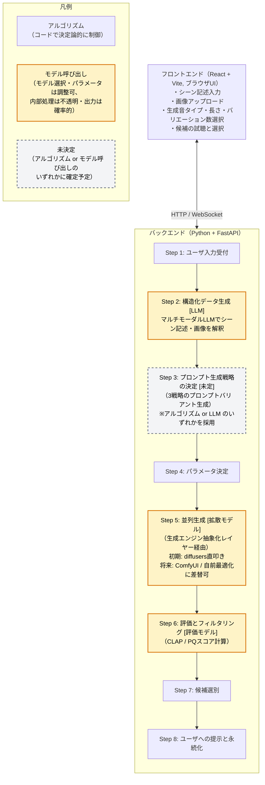

# FoleyForge 開発ドキュメント

> 作成日: 2026-05-28
> ステータス: 設計フェーズ
> プロジェクト名は仮称。今後変更の可能性あり。

---

## 1. プロジェクト概要

### 1.1 背景

作画したイラストやアニメーションシーンに合うSE（効果音）素材を、フリー素材サイトで見つけるのが難しい。シーンごとにピンポイントで欲しい音をその場で生成できる、自分用の制作支援ツールを開発する。

### 1.2 目的

- 作画シーンに合致するSEを、生成AIによって短時間で作成する
- 日本語の曖昧なシーン記述や、作画イラストから音を生成する
- 試行回数を増やし、複数バリエーションから最適な音を選べる体験を提供する

### 1.3 スコープ

| 項目 | 内容 |
|------|------|
| 対象ユーザー | 当初は開発者本人。将来的にOSSとして公開予定 |
| 想定音種別 | アニメ寄りのSE（環境音、情景音、フォーリー音） |
| 入力形式 | テキスト記述 + イラスト画像 |
| 動作環境 | ローカルマシン（GPU環境） |
| モデル | 複数のText-to-Audioモデルを切り替え可能にする |
| モデル配布 | 同梱しない。ユーザが各自ダウンロードして所定ディレクトリに配置 |

### 1.4 将来拡張

- 動画入力への対応
- FrameWeaverとの連携
- RAG（既存SE素材を活用した検索拡張生成）
- GPU最適化の高度化（後述のフェーズ分けを参照）

---

## 2. 設計思想

### 2.1 バックエンド中心の設計

このアプリの本質的な価値はバックエンドにある。フロントエンドはバックエンドを使いやすくするための殻と位置付ける。

### 2.2 バックエンド中心の開発と段階的アプローチ

このアプリの最大のポイントは生成アルゴリズム（構造化データ → プロンプト → Best-of-N → リランキング → 選別）の完成にある。GPU最適化は「速く動かす」技術であり、「良い音を出す」技術ではない。したがって、まず生成アルゴリズムを確立し、その後でGPU最適化に取り組むという順序で開発する。

| フェーズ | 生成エンジン | 開発の焦点 |
|---------|------------|----------|
| 初期 | diffusers直叩き（最小限の最適化） | 生成アルゴリズムの完成、パラメータ調整 |
| 中期 | 同上（必要なら軽い最適化） | アルゴリズムの洗練、実験 |
| 後期 | ComfyUI連携 または 自前最適化に差し替え | GPU最適化の完成 |

### 2.3 生成エンジンの抽象化

生成アルゴリズム（前処理・後処理）と生成エンジン（拡散モデルの実行）を疎結合に設計する。生成エンジンは抽象インターフェースの背後に隠し、生成アルゴリズム本体はこのインターフェースのみに依存する。

これにより、初期はdiffusers直叩きで開発し、将来GPU最適化が必要になった段階で、生成アルゴリズム本体を変更せずにエンジン実装（ComfyUI連携や自前最適化）を差し替えられる。変わりにくいもの（生成アルゴリズム）を、変わりやすいもの（エンジン実装）から隔離する。

将来のエンジン候補:
- diffusers直叩き（初期実装）
- ComfyUI連携（GPU最適化・複数モデル管理をComfyUIに委譲）
- 自前最適化実装（完璧なGPU最適化を自前で追求する場合）

### 2.4 ユーザに見せるものと隠すものの境界

技術的な調整値はバックエンドが最適化し、ユーザには見せない。ユーザが判断するのは「シーン記述」と「生成された音から耳で選ぶこと」のみ。

### 2.5 多様性を耳で選ぶアプローチ

「指示追従性 vs 音響的美しさ」のトレードオフをユーザに数値で選ばせるのではなく、異なる特性を持つ複数の候補を生成して、ユーザが耳で選ぶ設計とする。

---

## 3. アーキテクチャ

### 3.1 全体構成

本アプリは「ローカル推論Webアプリ」として構成する（基本パターンは `docs/tta_local_web_architecture.md` を参照）。ユーザPC内で完結し、UIはブラウザで提供し、推論はローカルFastAPI経由でPythonバックエンドが担う。

### 3.2 技術スタック

| レイヤー | 技術 | 対応Step | 採用理由 |
|---------|------|---------|---------|
| フロントエンド | React + Vite（ブラウザUI） | UI全体（Step 1の入力受付, Step 8の提示） | OS依存を抑え、ローカルFastAPIと組み合わせて動作。将来のクラウド版／ランチャー化にも展開しやすい |
| バックエンド | Python + FastAPI | バックエンド全体（Step 1〜8） | 拡散モデル・CLAP等のエコシステムが充実。フロントとはHTTP/WebSocketで連携 |
| 生成エンジン（初期） | diffusers直叩き | Step 5（並列生成） | 最小限の実装で生成アルゴリズム開発に集中 |
| 生成エンジン（将来） | ComfyUI連携 / 自前最適化 | Step 5（並列生成） | GPU最適化・複数モデル管理 |
| 音声生成モデル | Stable Audio Open ほか複数対応 | Step 5（並列生成） | アニメ寄り環境音に強い、複数モデル切替前提 |
| LLM（マルチモーダル） | Claude API（画像理解） | Step 2（構造化データ生成） | 画像理解の品質が高い |
| LLM（プロンプト変換） | Ollama（ローカル） | Step 3（プロンプト生成戦略の決定）※LLM採用時のみ | コスト0で使い倒せる |
| 品質評価 | LAION-CLAP, PAMスコア | Step 6（評価とフィルタリング） | 指示追従性と音響品質の評価 |

モデルは複数対応を前提とし、生成エンジン抽象化レイヤーの背後でモデルごとのアダプタを切り替える。モデル本体は同梱せず、ユーザが各自ダウンロードして所定ディレクトリに配置する。

---

## 4. 処理フロー詳細

### Step 1: ユーザ入力受付

ユーザからのリクエストを受け付け、バリデーションを行う。

入力項目:
- シーン記述（テキスト）
- 画像（オプション）
- 生成音タイプ（環境音 / 単発SE / 継続音）
- 音の長さ
- バリエーション数（最終的にユーザに見せる候補数）

### Step 2: 構造化データ生成（LLM）

マルチモーダルLLMがシーン記述と画像を解釈し、SE生成に必要な情報を構造化データとして出力する。構造化データはアプリのドメイン知識を表現する場所であり、シーンのコンテキスト、主要な音源、環境音要素、音響特性などを含む。

### Step 3: プロンプト生成戦略の決定

同じ構造化データから、3つの異なる戦略でプロンプトを生成する。各戦略は構造化データのどの要素を強調するかが異なる。

| 戦略 | 特徴 |
|------|------|
| 指示追従寄り | 具体的な音要素を中心に、CLAPが認識しやすい単語で構成 |
| バランス | 主要音と環境音を均等に扱う |
| 音響美寄り | 雰囲気や質感を中心に、cinematic/atmosphericなどの単語を活用 |

### Step 4: パラメータ決定

生成音タイプと戦略の組み合わせから、CFG値・推論ステップ数・生成数を決定する。各戦略でN個ずつ生成するためのシードも決定する。

### Step 5: 並列生成

生成エンジン抽象化レイヤーを介して、各タスクの音声を生成する。初期はdiffusers直叩きで実装し、将来GPU最適化が必要になった段階でComfyUI連携や自前最適化に差し替える。生成アルゴリズムはこのレイヤーの背後の実装に依存しない。

### Step 6: 評価とフィルタリング

各音声に対して、以下の評価を行う。

- **CLAPスコア**: プロンプトとの一致度（指示追従性）
- **PQスコア**: 音響的な品質

両スコアが極端に低い候補は除外する。

### Step 7: 候補選別

戦略ごとに分類し、各戦略の主指標で上位を選ぶ。戦略ごとの選出数の配分（例: 2:2:1）を決定し、合計がユーザ指定のバリエーション数になるよう調整する。最終的に異なる特性を持つ候補が混在する形になる。

### Step 8: ユーザへの提示と永続化

候補音声をユーザに提示する。内部メタデータ（戦略、スコア）は表示しない。同時に、セッション全体のデータを構造化ログとして永続化する。

---

## 5. 品質向上戦略

このアプリの肝となる部分。ファインチューニングなしで品質を上げるための手法を統合する。

### 5.1 LLMによるプロンプト augmentation

構造化データを介してFreesound風のプロンプトに変換する。Stable Audio Openの訓練データ分布に近づけることで、モデルの実力を引き出す。

### 5.2 戦略別のパラメータ最適化

CFG値の研究知見を活用する。

| 観点 | 値 |
|------|-----|
| CLAPスコアのピーク | CFG=3.5前後 |
| 音響品質が安定する範囲 | CFG=4〜6 |
| アーティファクトが発生する閾値 | CFG=10以上 |

戦略ごとにスイートスポット内で異なるCFG値を使い分ける。

### 5.3 Best-of-N + リランキング

複数候補を生成し、CLAPとPQの両指標でフィルタ・選別する。Foley音生成のSOTAシステム（DCASE2023優勝システム）も同様の手法を採用している。

### 5.4 多様性のある候補提示

3つの戦略から候補を混ぜて提示することで、ユーザは異なる特性の音を聞き比べて選べる。これにより「指示追従性 vs 音響的美しさ」のトレードオフを耳での選択として吸収する。

---

## 6. 構造化データの位置付け

構造化データはアプリの中核データ構造であり、以下の役割を持つ。

| 役割 | 説明 |
|------|------|
| プロンプト品質の底上げ | LLMに構造化された解釈を強制することで、Freesound風プロンプトへの変換品質を担保 |
| 戦略の差し替え容易性 | 同じ構造化データから複数戦略のプロンプトを生成可能 |
| デバッグ可能性 | 品質低下の原因が解釈ミスかプロンプト変換ミスかモデルの限界かを切り分け可能 |
| 実験基盤 | 構造化データを保存することで、後からプロンプトビルダーだけ改善して再生成できる |
| ドメイン知識の蓄積場所 | スキーマ自体がアニメSE生成のドメイン知識を表現する |

### 6.1 構造化データに含める情報領域

- シーン全体のコンテキスト（場所、雰囲気、時間帯、空間感）
- 主要な音源（対象、動作、素材、強度）
- 環境音・背景要素（背景音、リバーブ、密度）
- 音響特性のヒント（周波数強調、ダイナミックレンジ、品質キーワード）
- 避けたい要素（ネガティブプロンプト用）

---

## 7. 永続化されるデータ

実験的調整を可能にするため、全セッションのデータを構造化ログとして保存する。保存対象は以下。

- ユーザ入力
- 構造化データ
- 生成されたプロンプトバリアント
- 生成タスクの全パラメータ
- 生成結果（音声ファイルパス）
- 各候補のCLAP/PQスコア
- 最終選別結果
- ユーザのアクション（採用した候補、評価など）

このログを蓄積することで、「どんな構造化データがどんなプロンプトを生んで、どんな結果になったか」を追跡可能にし、継続的な品質改善の基盤とする。

---

## 8. 主要な設計決定の根拠

| 決定 | 根拠 |
|------|------|
| Python採用 | 拡散モデル・CLAP等のエコシステム活用 |
| ブラウザUI採用（Tauri不採用） | Pythonバックエンドが必須のためTauri化しても結局FastAPIをラップする構成になる。ブラウザUI + ローカルFastAPIの自然な構成で開発を高速化し、将来のクラウド版／ランチャー化への余地も残す |
| 生成アルゴリズム優先・GPU最適化後回し | 良い音を出すロジックが差別化要因。速度は後から最適化すればよい |
| 生成エンジンの抽象化 | 初期のシンプルさと将来のエンジン差し替え（ComfyUI/自前最適化）を両立 |
| 初期はdiffusers直叩き | 初期段階ではGPU最適化が不要なため、ComfyUIを使う理由がない |
| 複数モデル対応 | アダプタを抽象化レイヤー背後で切り替え |
| モデルを同梱しない | ライセンスの複雑さを回避、ユーザが各自配置 |
| 構造化データを中間表現に | 品質向上 + 実験基盤の両面で価値 |
| 3戦略の候補生成 | トレードオフを耳での選択に吸収するため |
| 技術的パラメータを隠蔽 | ユーザの認知負荷低減、創作集中の確保 |

---

## 9. 未決定事項

- 構造化データの具体的スキーマ定義
- 各ステップの入出力データ構造
- 生成エンジン抽象化レイヤーのインターフェース定義
- 対応する音声生成モデルの具体的なラインナップ（モデルごとのライセンス確認含む）
- Step 3のプロンプト生成をLLMで行うかテンプレートで行うか
- 内部生成数（N=15程度を想定中）と戦略ごとの配分
- PQスコアの実装方法（PAMスコアから始める想定）
- 生成進捗の通知方式（WebSocket / SSE / ポーリングのいずれか）
- ブラウザからのローカルファイルアクセス方針（File System Access API か、`outputs/` 固定 + APIダウンロードか）
- 永続化のデータ形式（SQLite / JSON / etc）
- 採用音声の保存フォルダ構造
- 後期フェーズで採用するGPU最適化の方式（ComfyUI連携 or 自前最適化）

---

## 10. 用語

| 用語 | 説明 |
|------|------|
| SE | Sound Effect（効果音） |
| フォーリー音 | 映像作品で人や物の動作に合わせて作る効果音 |
| Stable Audio Open | Stability AI製のOSS音声生成モデル |
| CFGスケール | Classifier-Free Guidance、プロンプト追従度を制御するパラメータ |
| CLAP | Contrastive Language-Audio Pretraining、音声とテキストの類似度を測るモデル |
| CLAPスコア | プロンプトと生成音声のセマンティック類似度 |
| PQスコア | Perceptual Quality、知覚的な音響品質スコア |
| PAMスコア | Prompting Audio-Language Modelsで提案されたCLAPベースの品質指標 |
| Best-of-N | 複数生成して最良のものを選ぶ手法 |
| リランキング | 生成済み候補を評価指標で並び替え・選別すること |
| Freesound | 音声共有プラットフォーム、Stable Audioの訓練データに含まれる |
