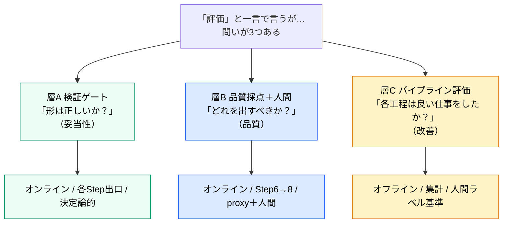
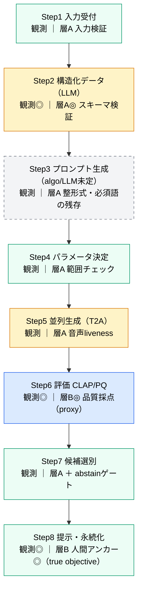
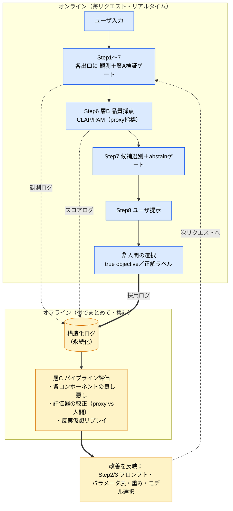

# FoleyForge 観測ポイント・評価ポイント設計

> 作成日: 2026-06-01
> ステータス: 設計フェーズ（議論まとめ。一部未決 → 末尾「13. 未決事項」参照）
> 用途: 開発者本人の**理解用**かつ**開発用**
> 関連: [foley-forge-dev.md](./foley-forge-dev.md) / [research/llm-application-eval/llm_observation_evaluation_points.md](../research/llm-application-eval/llm_observation_evaluation_points.md) / [research/llm-performance/approach-3-best-of-n-reranking.md](../research/llm-performance/approach-3-best-of-n-reranking.md) / [research/llm-performance/evaluation-models-clap-pam.md](../research/llm-performance/evaluation-models-clap-pam.md)

---

## 0. このドキュメントの狙い

FoleyForge は LLM と生成モデルを多段でつないだパイプライン（Step 1〜8）である。確率的な出力が混ざるため、**「どこで品質が落ちたか」を切り分けられる作り**にしておく必要がある。

そのために必要なのが **観測ポイント** と **評価ポイント** の設計である。

- **観測ポイントの置き場所は単純**：各 Step の出口に置けばよい。
- **難しいのは評価ポイントの置き場所**：これがアプリの品質を左右する最重要の設計判断の一つ。

本ドキュメントの結論を一言で言うと——

> **「評価」を1種類と思うから難しい。評価を3つの層（検証ゲート / 品質採点＋人間 / オフライン評価）に分けると、置き場所はほぼ自動的に決まる。**

このドキュメントは、**前半で専門用語をすべて定義**し、**後半でFoleyForgeへの採用方針**を述べる二部構成とする。

---

# 第I部　用語の定義

専門用語が多いので、まず言葉をそろえる。各用語は「一言で → もう少し詳しく → 本アプリでの関係」の順で説明する。

## 1. 観測と評価の基本用語

### 用語早見表

| 用語 | 一言で | 本アプリでの登場箇所 |
|---|---|---|
| 観測ポイント | 途中状態を**記録**する地点 | 各 Step の出口 |
| 評価ポイント | 記録された内容の**良し悪し/妥当性を判定**する地点 | 後述（3層に分ける） |
| 品質ゲート | 次工程に**進めてよいか**を判定する条件 | 層A・層B が担う |
| 妥当性（well-formedness） | **形が正しい**か（≠中身が良いか） | 層A の判定軸 |
| 品質 | **中身が良い**か | 層B・層C の判定軸 |
| オンライン評価 | 本番処理中・毎リクエストに走る評価 | 層A・層B |
| オフライン評価 | フローの外で後からまとめて走る評価 | 層C |
| guardrail（ガードレール） | フロー内で判断・ポリシー強制するオンライン評価 | 層A、Step6 のフロア |

### 1.1 観測ポイント

LLMパイプラインの**途中状態を記録・確認できるようにする地点**。目的は、後から処理を追跡し、品質低下や不具合の原因を調査できるようにすること。

記録する例：入力 / 実際に投げたプロンプト / モデル設定 / 生出力 / 後処理結果 / token数・処理時間・retry回数 / エラー。

**観測は「品質を判定する地点」とは限らない**。あくまで記録する地点。

### 1.2 評価ポイント

観測された入力・出力・中間データに対して、**品質や妥当性を判定する地点**。

FoleyForge では、この「評価」を1種類にせず、後述の**3層**に分ける。これが本ドキュメントの中心。

### 1.3 妥当性（well-formedness）— 「品質」との違いが重要

**妥当性 ≠ 品質**。ここが最重要の区別。

- **妥当性（well-formedness）** ＝ 形式・構造・整合が、**機械が次に処理できる条件**を満たしているか。
- **品質** ＝ 中身が良いか（良い解釈か、効くプロンプトか、良い音か）。

| | 見るもの | 例（OK/NG） |
|---|---|---|
| **妥当性** | 形 | 「JSONとして壊れていない」「必須欄が埋まっている」「音声ファイルが復号できる」 |
| **品質** | 中身 | 「そのシーン解釈は的確か」「その音は良い音か」 |

アナロジー：

- **妥当性** ＝ 「日本語の文として**文法的に正しい**か」
- **品質** ＝ 「主張として**説得力がある**か」

→ 文法的に正しいが中身が空の文はあるし、逆もある。**妥当性チェックは文法だけを見る**。

> 補足（用語の出自）：XML/JSON では「整形式（well-formed＝構文が壊れていない）」と「valid（スキーマに適合）」を区別する。本ドキュメントの「妥当性」は、その両方＋軽い制約充足（非空・enum範囲・必須語の残存など）を含む、**決定論的に pass/fail が出るものの総称**として使う。

---

## 2. 「いつ評価するか」の用語：オンライン評価とオフライン評価

「**いつ・何に対して・結果を何に使うか**」が違う。

| 軸 | オンライン評価 | オフライン評価 |
|---|---|---|
| いつ走るか | 本番稼働中、**ユーザのリクエストを処理しているその瞬間** | フローの**外**で、**後からまとめて** |
| 何に対して | その1リクエストの中間/最終出力 | **蓄積したログ**（多数のリクエスト） |
| 結果の使い道 | **そのリクエストの処理を分岐**（通す/リトライ/出す候補を選ぶ） | **開発判断**（次にどこを直すか）。個々のリクエストには影響しない |
| 速度・コスト | 速く・安くないと困る（ユーザを待たせる） | 時間をかけてよい |
| 単位 | 1件ごと | 集計 |
| 近い概念 | guardrail | ユニットテスト / リグレッション検出 |

**橋渡し**：Step 8 で得る「人間がどの候補を選んだか」というラベルは、**オンラインで収集し、オフラインで評価に使う**。両者をつなぐ最重要データ。

---

## 3. 「どこまで評価するか」の用語：outcome supervision と process supervision

多段パイプラインで「どの工程の手柄/責任か」を見極める方式の対比。LLM推論研究で確立した用語。

| 用語 | 中身 | 長所 | 短所 |
|---|---|---|---|
| **outcome supervision**（結果監督） | **最終結果だけ**で評価する | 安い・実装が楽 | どの中間Stepが良かった/悪かったか分からない（credit assignment が曖昧） |
| **process supervision**（過程監督） | **各中間Step**に評価/正解ラベルを与える | 精密。早期にミスを発見できる | **Stepごとに正解ラベルが必要でコスト高** |

> 補足：これを実装するモデルをそれぞれ ORM（Outcome Reward Model）/ PRM（Process Reward Model）と呼ぶ。本アプリで「モデル」を作る必要はないが、考え方を借りる。

### 3.1 なぜこの用語が効くのか：遅延報酬と credit assignment

| 用語 | 意味 | FoleyForge での現れ方 |
|---|---|---|
| **遅延報酬（delayed reward）** | 行動の良し悪しが、**ずっと後にならないと分からない**状況 | Step2 の構造化データが良いかは、**音を生成して聴くまで分からない** |
| **credit assignment（信用割り当て）** | 最終結果の良し悪しを、**どの中間Stepの手柄/責任に帰属させるか**の問題 | 音が悪いとき、解釈ミス（Step2）かプロンプト変換ミス（Step3）かモデルの限界（Step5）か |

→ **中間ステップの品質は、その場（オンライン）では原理的に測れない。** これが「評価ポイントの置き場所」が難しい根本原因。

---

## 4. 「指標の罠」の用語：proxy・Goodhart・reward hacking

| 用語 | 意味 | FoleyForge での関係 |
|---|---|---|
| **proxy指標（代理指標）** | 本当に測りたいもの（true objective）の代わりに使う、**測りやすい指標** | CLAP/PAM は proxy。**true objective は「人間が良いと感じるか」** |
| **true objective（真の目的）** | 本当に最適化したい対象 | ユーザが耳で選ぶ良い音 |
| **Goodhart の法則** | 「**指標が目標になると、良い指標でなくなる**」 | CLAP を上げること自体が目的化すると壊れる |
| **reward hacking / verifier hacking** | proxy を最大化すると、その**抜け穴を突いた質の低いもの**が選ばれる | CLAP だけで選ぶと「指示には合うが汚い音」が選ばれる（approach-3 の最重要の落とし穴） |

対策の定石：**proxy を単独で最適化しない。対立する複数指標を組み合わせる（multi-objective）。**

---

## 5. 評価モデルの用語：CLAP・PAM・分布指標

| 用語 | 意味 | 性質 |
|---|---|---|
| **CLAP** | 音声とテキストの一致度（**指示追従性**）を測る埋め込みモデル | **決定論的**・**per-sample**（個別候補に値が出る） |
| **PAM（PQ）** | CLAP を転用した**音響品質**指標（対立プロンプトで品質軸を作る） | **決定論的**・**per-sample** |
| **per-sample 指標** | **1サンプルごと**にスコアが出る指標 | 候補のランキングに使える（CLAP/PAM） |
| **分布指標（FAD・IS 等）** | サンプル**集合の分布**を評価する指標 | **個別候補のランキングには使えない** → モデル比較などオフライン用 |

> 詳細は [evaluation-models-clap-pam.md](../research/llm-performance/evaluation-models-clap-pam.md)。CLAP/PAM は LLM ではなく対比学習ベースの埋め込みモデルで、同じ入力なら必ず同じスコアを返す（決定論的）。

---

## 6. 人間と回収の用語

| 用語 | 意味 | FoleyForge での関係 |
|---|---|---|
| **human-in-the-loop / 人間アンカー** | 最終的な良し悪しの基準を**人間が与える**こと | Step8 でユーザが耳で選ぶ＝最終審判 |
| **正解ラベル（ground truth）** | 評価の基準となる「正解」 | 「ユーザがどの候補を採用したか」 |
| **abstain（棄権）** | 良い候補が無いとき、無理に出さず**正直に降りる/再試行する**判断 | Step7 で最良候補すらフロア以下なら発動 |
| **反実仮想リプレイ（counterfactual replay）** | 保存した中間データから、**別の設定で後段を再実行**して比較すること | 保存済み構造化データで Step3 のプロンプト案を作り直して比較 |

---

# 第II部　FoleyForge での採用方針

ここからが本題。上の用語を使って「どこに何を置くか」を決める。

## 7. 全体像：評価は「3つの層」に分ける

「評価」を1種類と思うと置き場所が決まらない。**問いが違う3層**に分けると、責務が被らずに決まる。

### 3層の責務（何を確認するためのものか）

| 層 | 答える問い（責務） | 守っているもの | 失敗したら | 比喩 |
|---|---|---|---|---|
| **層A 検証ゲート** | この出力は、次工程が**処理できる"形"か**？ | パイプラインが**壊れない**こと | 通さない（リトライ/修復/打切り） | 書類の**不備チェック** |
| **層B 品質採点＋人間** | 候補のうち**どれをユーザに出すべきか**？ | ユーザに届く**音の良さ** | フロア以下なら降りる（abstain） | **オーディション** |
| **層C パイプライン評価** | **各コンポーネントは良い仕事をしているか**？ | 開発の**方向性**（生成アルゴリズム改善） | 直す対象を決める | シーズン後の**成績分析** |

> 重要：**層A は実は「評価」ですらなく「ゲート（検問）」**。良し悪し（品質）を一切見ず、形だけを見る。だから層B（品質）と責務が被らない。「評価」と呼べるのは層B と層C の2つだけ、と整理すると綺麗。

---

## 8. なぜこの配置になるのか（中間ステップにオンライン品質評価を置けない理由）

- 中間ステップ（Step2/3）の品質は **遅延報酬／credit assignment** のため、**オンラインでは原理的に測れない**（§3.1）。
- だから「各Stepに品質評価を置く（＝process supervision）」は、**コストが高いうえに測定不能**。
- 代わりに「最終結果で評価する（＝outcome supervision）」をオンラインで採用する。
- process supervision が本来くれるはずだった「各Stepの良し悪し」は、**捨てずにオフライン（層C）で人間ラベルから回収**する。

| 概念 | 中身 | FoleyForge での扱い |
|---|---|---|
| **process supervision** | 各中間Stepに**品質**評価を置く | オンラインでは**やらない**（高コスト＋測定不能）。意図はオフライン層Cで回収 |
| **outcome supervision** | **最終結果**で評価 | オンラインで**採用**（Step6 採点＋Step8 人間） |
| **層A 検証ゲート** | 各Stepで**妥当性**だけチェック | supervision とは**別軸**。安いので**各Stepに置いてよい** |

> ポイント：**各Stepに置いても高コストにならないのは層A（妥当性）。各Stepに置くと高コスト＆測定不能になるのが層B（品質）＝process supervision。** だから「層Aは各Stepに、層Bは要点だけに」となる。

---

## 9. Step ごとの配置

### パイプライン図（各Stepに置く層）

> 層C（オフライン）はパイプライン上ではなく別ループ。次節 §10 の二重ループ図を参照。

### 配置の詳細（凡例：◎=主役 / ○=置く / △=軽量のみ / —=不要）

| Step | 観測（出口で必ず） | 層A 検証ゲート（妥当性） | 層B 品質採点 | 層C オフライン評価 |
|---|---|---|---|---|
| **1 入力受付** | 入力一式 | ○ 必須項目/長さ/画像形式・サイズ → 拒否＋通知 | — | △ 入力分布（どんな要求が多いか） |
| **2 構造化（LLM）** | 入力・**プロンプト・生出力**・JSON・retry・error | ◎ **スキーマ検証**＋必須非空/enum/矛盾なし → 段階リトライ→降格→打切り | —（主観品質は測らない） | ◎ 構造化データの忠実性・網羅性（LLM-judge＋採用率相関、画像ハルシ検出） |
| **3 プロンプト** | 構造化データ・3案・採用ビルダー | ○ 非空/トークン長/**主要音源が残存（トレーサビリティ）**/3案が相違 → 再構築 | — | ◎ 戦略別の効き（採用率・反実仮想リプレイ） |
| **4 パラメータ** | CFG/steps/N/seed | △ models.yaml の範囲内（決定論的） | — | ○ パラメータ掃引（CFG×タイプ×採用率） |
| **5 生成（T2A）** | seed/params/file/時間/error/NaN | ○ **音声 liveness**（復号可/長さ・SR一致/無音でない/飽和でない/NaN無）→ 当該seed再生成 | —（品質判定はStep6） | ○ モデル/エンジン比較 |
| **6 評価 CLAP/PQ** | 各候補のCLAP・PAM・正規化値・合算・除外理由 | ○ 絶対フロアで下限割れ除外 | ◎ **オンライン品質採点の中核**（多指標・正規化・戦略別重み） | ◎ **評価器の較正**（スコア順位 vs 人間採用の相関監視） |
| **7 候補選別** | 配分（例2:2:1）・最終集合・abstain | ○ 件数=要求数/多様性保持 | ○ **abstain/フロアゲート**（最良候補すら閾値以下→再試行 or 正直に降りる） | ○ 配分ポリシー調整 |
| **8 提示・永続化** | 提示内容・順序・内部メタ | — | ◎ **人間の正解ラベル捕捉**（試聴/反復再生/採用/全却下/評価） | ◎ 全層Cの join key |

> 観測の補足：Step 2/3/5/6 のような黒箱の出口では、最終値だけでなく**入力・実際のプロンプト・生出力・後処理・retry/error まで**残す。これが credit assignment（原因の切り分け）の材料になる。

---

## 10. 二重ループ：オンラインとオフラインのつながり

FoleyForge の評価は、**速い内ループ（オンライン）**と**遅い外ループ（オフライン）**の二重構造になる。両者をつなぐのが**ログ＋人間採用ラベル**。

**読み方**：オンラインは「壊れず・良い候補を選んで・出す」だけ。**生成アルゴリズムを良くしていく仕事はオフラインの外ループ**で、人間採用ラベルを正解にして回す。これが design philosophy「まず生成アルゴリズムを確立」を定量的に駆動する本体。

---

## 11. 評価軸の整理（層ごとに別物・混ぜない）

| 層 | 評価軸 | 判定の形 |
|---|---|---|
| **層A 検証ゲート** | 形式妥当性 / 制約充足 / 情報欠落 / 次工程適性 / トレーサビリティ / liveness | pass-fail（決定論的） |
| **層B 品質（オンライン）** | 指示追従性＝CLAP / 音響品質＝PAM(PQ) | 相対ランキング＋絶対フロア |
| **層B 品質（人間／真の軸）** | 採用 / 不採用 / 試聴回数 / 明示評価 | 人間の選択 |
| **層C オフライン** | 採用率 / **スコアと採用の相関（＝評価器の妥当性）** / 戦略別採用率 / 構造化データのrichnessと採用率 / モデル別採用率 | 集計・相関 |

---

## 12. 設計原則（ここを外すと事故る）

1. **中間ステップ（2/3）に「主観品質」ゲートを置かない。** 置けるのは妥当性ゲート（層A）だけ。「この構造化データは良い音になるか？」をオンラインで当てる手段は存在しない。
2. **LLM-judge は層C（オフライン）の道具に限定。** Step2出口に毎回 LLM-judge を挟むのは、コスト・遅延・"新たな確率的黒箱"を増やすだけで下流の音質を予測できない。構造化データの忠実性採点などはオフラインで。
3. **Step6 は proxy、Step8（人間）が true objective。両者を必ずオフラインで突き合わせる（Goodhart 対策）。** 「Step6 のスコア順位が人間の採用とどれだけ一致するか」を継続監視し、ズレたら CLAP モデル・PAM の対立プロンプト・重みを較正する＝**評価器のメタ評価**。これが「評価点を Step6 に置く」ことの完成形。
4. **per-sample 指標で選別する。** 候補ランキングは CLAP/PAM（個別に値が出る）。FAD/IS（分布指標）は個別候補の優劣に使えない → 層Cのモデル比較に回す。
5. **abstain（正直に降りる）ゲートを Step7 に置く。** 最良候補すらフロア以下なら、自信ありげにゴミを出さず再試行 or「良いものが作れなかった、言い換えを」。
6. **人間の採用ログ（Step8）こそ最重要の観測対象。** これは層C全体の join key（正解ラベル）。ここの設計が甘いと、永続化ログが「分析できないログ」になる。

---

## 13. プロトタイプ段階での順序（一気に作らない）

design philosophy「まず生成アルゴリズムを確立 → GPU最適化は後」に合わせ、評価系も段階導入する。

| 段階 | 作るもの | 理由 |
|---|---|---|
| **MVP（最初）** | ①各Step出口の観測ログ ②Step6 品質採点 ③**Step8 人間採用ラベルの捕捉** | この3つが無いと層Cの分析が一切回らない。逆にこれだけで改善ループが始まる |
| **次** | 層A 検証ゲート（Step2スキーマ検証→Step5音声liveness→Step3トレーサビリティ） | パイプラインの安定化 |
| **その後** | 層C オフライン分析（スコアvs採用の相関監視、戦略別採用率、反実仮想リプレイ） | ここで初めて生成アルゴリズムの洗練が定量駆動される |

---

## 14. 未決事項

> 本ドキュメントは方針の理解用。以下は**まだ決めていない**。厳密化は今後の議論／Issue化で行う。

- **Step3 が algo か LLM か**：層Aゲートの作り（決定論的修復 vs リトライ）が変わる。
- **絶対フロア閾値（Step6/7）の決め方**：CLAP/PAM の妥当な下限はデータ依存。初期はログを見て手で決める前提。
- **評価器較正の頻度・具体手順（層C常設タスク）**：何サンプル貯まったら相関を見るか、どの相関係数を使うか。
- **人間ラベルのスキーマ**：採用/試聴回数/明示評価をどう記録するか（永続化項目に追加）。
- **画像入力時の音源ハルシネーション検出**：オンラインでの妥当性チェックは難しく、当面はオフライン＋人間で捕捉。

---

## 15. 参考

### 内部ドキュメント
- [foley-forge-dev.md](./foley-forge-dev.md) — 全体像・処理フロー（Step1〜8）
- [research/llm-application-eval/llm_observation_evaluation_points.md](../research/llm-application-eval/llm_observation_evaluation_points.md) — 観測点・評価点の一般方針
- [research/llm-performance/approach-3-best-of-n-reranking.md](../research/llm-performance/approach-3-best-of-n-reranking.md) — Best-of-N・verifier hacking
- [research/llm-performance/evaluation-models-clap-pam.md](../research/llm-performance/evaluation-models-clap-pam.md) — CLAP/PAM の決定論性

### 外部（裏取りに使った概念）
- オンライン/オフライン評価・guardrail：[LangSmith Evaluation](https://www.langchain.com/langsmith/evaluation) / [LangWatch: Evaluations & Guardrails](https://langwatch.ai/docs/integration/python/tutorials/capturing-evaluations-guardrails)
- process vs outcome supervision：[Emergent Mind](https://www.emergentmind.com/topics/process-vs-outcome-supervision) / [A Survey of Process Reward Models (arXiv 2510.08049)](https://arxiv.org/pdf/2510.08049)
- T2A 評価指標と人手評価：[Aligning Text-to-Music Evaluation with Human Preferences (arXiv 2503.16669)](https://arxiv.org/html/2503.16669v1)
- Goodhart / reward hacking：[Goodhart's Law](https://grokipedia.com/page/Goodhart%27s_law) / [Reward Hacking in RL — Lil'Log](https://lilianweng.github.io/posts/2024-11-28-reward-hacking/)
