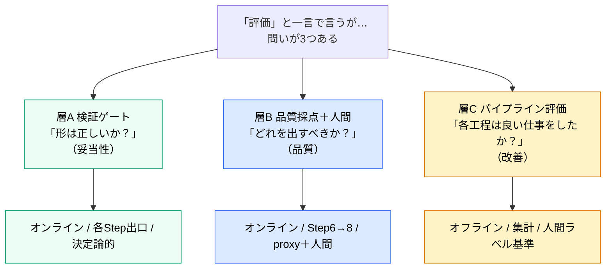
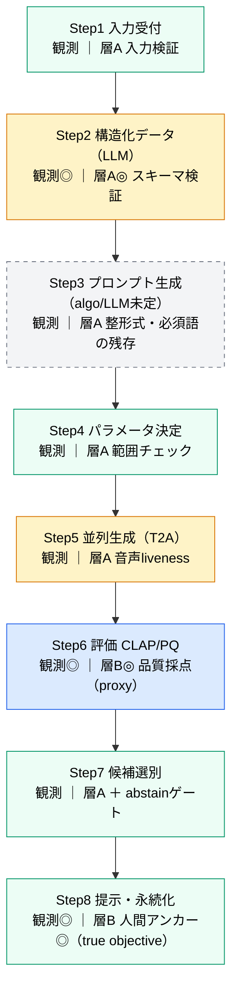
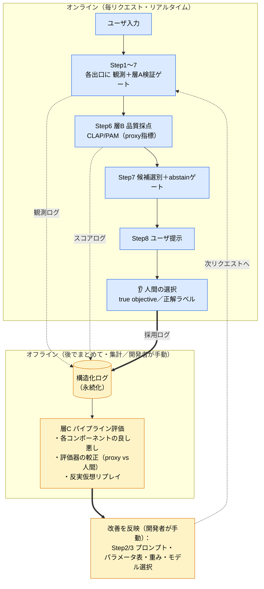
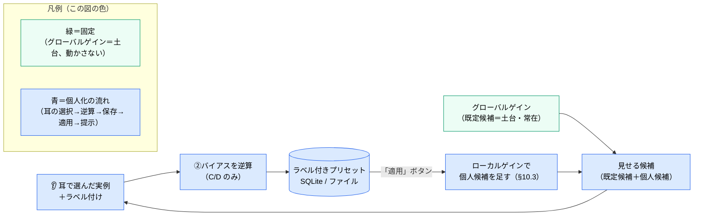

# FoleyForge 観測ポイント・評価ポイント設計

> 作成日: 2026-06-01
> ステータス: 設計フェーズ（議論まとめ。一部未決 → 末尾「13. 未決事項」参照）
> 用途: 開発者本人の**理解用**かつ**開発用**
> 関連: [foley-forge-dev.md](./foley-forge-dev.md) / [research/llm-application-eval/llm_observation_evaluation_points.md](../research/llm-application-eval/llm_observation_evaluation_points.md) / [research/llm-performance/approach-3-best-of-n-reranking.md](../research/llm-performance/approach-3-best-of-n-reranking.md) / [research/llm-performance/evaluation-models-clap-pam.md](../research/llm-performance/evaluation-models-clap-pam.md)

---

## 0. このドキュメントの狙い

FoleyForge は LLM と生成モデルを多段でつないだパイプライン（Step 1〜8）である。確率的な出力が混ざるため、**「どこで品質が落ちたか」を切り分けられる作り**にしておく必要がある。

そのために必要なのが **観測ポイント** と **評価ポイント** の設計である。

- **観測ポイントの置き場所は単純**：各 Step の出口に置けばよい。
- **難しいのは評価ポイントの置き場所**：これがアプリの品質を左右する最重要の設計判断の一つ。

本ドキュメントの結論を一言で言うと——

> **「評価」を1種類と思うから難しい。評価を3つの層（検証ゲート / 品質採点＋人間 / オフライン評価）に分けると、置き場所はほぼ自動的に決まる。**

このドキュメントは、**前半で専門用語をすべて定義**し、**後半でFoleyForgeへの採用方針**を述べる二部構成とする。

---

# 第I部　用語の定義

専門用語が多いので、まず言葉をそろえる。各用語は「一言で → もう少し詳しく → 本アプリでの関係」の順で説明する。

## 1. 観測と評価の基本用語

### 用語早見表

| 用語 | 一言で | 本アプリでの登場箇所 |
|---|---|---|
| 観測ポイント | 途中状態を**記録**する地点 | 各 Step の出口 |
| 評価ポイント | 記録された内容の**良し悪し/妥当性を判定**する地点 | 後述（3層に分ける） |
| 品質ゲート | 次工程に**進めてよいか**を判定する条件 | 層A・層B が担う |
| 妥当性（well-formedness） | **形が正しい**か（≠中身が良いか） | 層A の判定軸 |
| 品質 | **中身が良い**か | 層B・層C の判定軸 |
| オンライン評価 | 本番処理中・毎リクエストに走る評価 | 層A・層B |
| オフライン評価 | フローの外で後からまとめて走る評価 | 層C |
| guardrail（ガードレール） | フロー内で判断・ポリシー強制するオンライン評価 | 層A、Step6 のフロア |
| training-free（訓練不要） | モデルの**重みを作り変えない**。改善は推論時の工夫＋開発者の手による設定調整 | §2.1 / 全体方針 |

### 1.1 観測ポイント

LLMパイプラインの**途中状態を記録・確認できるようにする地点**。目的は、後から処理を追跡し、品質低下や不具合の原因を調査できるようにすること。

記録する例：入力 / 実際に投げたプロンプト / モデル設定 / 生出力 / 後処理結果 / token数・処理時間・retry回数 / エラー。

**観測は「品質を判定する地点」とは限らない**。あくまで記録する地点。

### 1.2 評価ポイント

観測された入力・出力・中間データに対して、**品質や妥当性を判定する地点**。

FoleyForge では、この「評価」を1種類にせず、後述の**3層**に分ける。これが本ドキュメントの中心。

### 1.3 妥当性（well-formedness）— 「品質」との違いが重要

**妥当性 ≠ 品質**。ここが最重要の区別。

- **妥当性（well-formedness）** ＝ 形式・構造・整合が、**機械が次に処理できる条件**を満たしているか。
- **品質** ＝ 中身が良いか（良い解釈か、効くプロンプトか、良い音か）。

| | 見るもの | 例（OK/NG） |
|---|---|---|
| **妥当性** | 形 | 「JSONとして壊れていない」「必須欄が埋まっている」「音声ファイルが復号できる」 |
| **品質** | 中身 | 「そのシーン解釈は的確か」「その音は良い音か」 |

アナロジー：

- **妥当性** ＝ 「日本語の文として**文法的に正しい**か」
- **品質** ＝ 「主張として**説得力がある**か」

→ 文法的に正しいが中身が空の文はあるし、逆もある。**妥当性チェックは文法だけを見る**。

> 補足（用語の出自）：XML/JSON では「整形式（well-formed＝構文が壊れていない）」と「valid（スキーマに適合）」を区別する。本ドキュメントの「妥当性」は、その両方＋軽い制約充足（非空・enum範囲・必須語の残存など）を含む、**決定論的に pass/fail が出るものの総称**として使う。

> 補足（層A の正体）：妥当性を判定する層A は、**LLM や生成モデルを使わない決定論的なバリデーション**（コードのルールで pass/fail）。JSONスキーマ検証・必須欄・enum範囲・文字列長・音声のDSPチェック（無音判定・サンプルレート一致・NaN無し）など。**確率的な LLM-judge は層A に入れない**（それは層C＝オフライン用の道具）。＝いわゆる通常ソフトウェアの「バリデーション」と同じ。

---

## 2. 「いつ評価するか」の用語：オンライン評価とオフライン評価

「**いつ・何に対して・結果を何に使うか**」が違う。

| 軸 | オンライン評価 | オフライン評価 |
|---|---|---|
| いつ走るか | 本番稼働中、**ユーザのリクエストを処理しているその瞬間** | フローの**外**で、**後からまとめて** |
| 何に対して | その1リクエストの中間/最終出力 | **蓄積したログ**（多数のリクエスト） |
| 結果の使い道 | **そのリクエストの処理を分岐**（通す/リトライ/出す候補を選ぶ） | **開発判断**（次にどこを直すか）。個々のリクエストには影響しない |
| 速度・コスト | 速く・安くないと困る（ユーザを待たせる） | 時間をかけてよい |
| 単位 | 1件ごと | 集計 |
| 近い概念 | guardrail | ユニットテスト / リグレッション検出 |

> **重要な含意（training-free）**：本アプリはモデルを学習させない（training-free）。だから **オンラインがやるのは「このリクエストをどう捌くか（判定・選別）」だけで、システム自体は賢くならない**。システムを良くする「最適化」（プロンプト・パラメータ・重みの調整）は **すべてオフライン＝開発者が手で**行う。
>
> ※「動作中に生成物を最適化していく」イメージは、正確には **オフライン側（バックエンドの最適化）** に対応する。オンラインは“その瞬間の判定”であって“継続的な改善”ではない。

**橋渡し**：Step 8 で得る「人間がどの候補を選んだか」というラベルは、**オンラインで収集し、オフラインで評価に使う**。両者をつなぐ最重要データ。

### 2.1 関連用語：training-free（学習しない）

**training-free（訓練不要）＝ モデルの重み（学習で得た内部パラメータ）を一切作り変えないこと。** 事前学習済みモデルを**凍結したまま**使い、品質は「推論時の工夫」（プロンプト・パラメータ・Best-of-N）と「開発者によるオフラインの設定調整」で上げる。本アプリの品質向上策（approach-1〜3）はすべてこれにあたる。

2つの「パラメータ」を分けると正確になる：

| パラメータの種類 | 中身 | 誰がいつ変えるか |
|---|---|---|
| **① モデルの重み** | 学習で得た内部の数値（数百万〜数十億個） | **training-free では一切変えない**（処理中でも開発中でも） |
| **② システムの設定値** | CFG・ステップ数・CLAP/PQ の重み・プロンプト | 開発者が**オフラインで手で**調整（＝「学習」ではない） |

> **用語の対応**：本ドキュメントで「**ゲイン**」と呼ぶのは、この **②（システムの設定値）** を制御工学のアナロジーで言い換えたもの（philosophy §3.1）。§10 以降の「グローバル／ローカルゲイン」はいずれも②を指す。ただし②の中で実際に動かすのは C/D で、A＝操作量の制約（飽和）・B＝安定余裕は固定する（§10.2）。

- **「学習するシステム」との対比**：重み①をデータで作り変えるのがファインチューニング／RLHF／継続学習。FoleyForge は design philosophy「ファインチューニングなしで品質を上げる」により、これを採らない。
- **誤解しやすい点**：training-free でもシステムは時間とともに良くなる。ただし「モデルが学習して」ではなく、**設定②を改善する**から（§10 の外ループ）。改善は **グローバルゲインを開発者が手で（恒久）／個人のローカルゲインは Tier0→1→2 で段階導入**（§10.1。自動＝Tier2 は FF-D008 で初期保留）。**いずれも②だけ・①は不変＝training-free は保たれる**のが肝。

| | 学習しない（training-free＝本アプリ） | 学習する（fine-tuning 等） |
|---|---|---|
| コスト/データ | 軽い・少量で可（個人開発向き） | 重い・大量データが要る |
| 品質の上限 | ベースモデルに縛られる | 上限を上げられる（ドメイン特化） |
| モデル差し替え | 容易（重み不変＝抽象化と相性◎） | 困難（特定モデルに固着） |
| 安定性・再現性 | 高い（挙動がブレない） | 退行リスク（reward hacking・再現性低下） |
| 自動で賢くなるか | 手動チューニングでは自動では賢くならない（開発者が手で）／**将来 Tier2 でローカル自動化（②のみ・FF-D008 で初期保留）** | 設計次第で可能 |

→ 個人開発・モデル差し替え前提（FF-D003）の本アプリには **training-free が適合**する。

---

## 3. 「どこまで評価するか」の用語：outcome supervision と process supervision

多段パイプラインで「どの工程の手柄/責任か」を見極める方式の対比。LLM推論研究で確立した用語。

| 用語 | 中身 | 長所 | 短所 |
|---|---|---|---|
| **outcome supervision**（結果監督） | **最終結果だけ**で評価する | 安い・実装が楽 | どの中間Stepが良かった/悪かったか分からない（credit assignment が曖昧） |
| **process supervision**（過程監督） | **各中間Step**に評価/正解ラベルを与える | 精密。早期にミスを発見できる | **Stepごとに正解ラベルが必要でコスト高** |

> 補足：これを実装するモデルをそれぞれ ORM（Outcome Reward Model）/ PRM（Process Reward Model）と呼ぶ。本アプリで「モデル」を作る必要はないが、考え方を借りる。

### 3.1 なぜこの用語が効くのか：遅延報酬と credit assignment

| 用語 | 意味 | FoleyForge での現れ方 |
|---|---|---|
| **遅延報酬（delayed reward）** | 行動の良し悪しが、**ずっと後にならないと分からない**状況 | Step2 の構造化データが良いかは、**音を生成して聴くまで分からない** |
| **credit assignment（信用割り当て）** | 最終結果の良し悪しを、**どの中間Stepの手柄/責任に帰属させるか**の問題 | 音が悪いとき、解釈ミス（Step2）かプロンプト変換ミス（Step3）かモデルの限界（Step5）か |

→ **中間ステップの品質は、その場（オンライン）では原理的に測れない。** これが「評価ポイントの置き場所」が難しい根本原因。

---

## 4. 「指標の罠」の用語：proxy・Goodhart・reward hacking

| 用語 | 意味 | FoleyForge での関係 |
|---|---|---|
| **proxy指標（代理指標）** | 本当に測りたいもの（true objective）の代わりに使う、**測りやすい指標** | CLAP/PAM は proxy。**true objective は「人間が良いと感じるか」** |
| **true objective（真の目的）** | 本当に最適化したい対象 | ユーザが耳で選ぶ良い音 |
| **Goodhart の法則** | 「**指標が目標になると、良い指標でなくなる**」 | CLAP を上げること自体が目的化すると壊れる |
| **reward hacking / verifier hacking** | proxy を最大化すると、その**抜け穴を突いた質の低いもの**が選ばれる | CLAP だけで選ぶと「指示には合うが汚い音」が選ばれる（approach-3 の最重要の落とし穴） |

対策の定石：**proxy を単独で最適化しない。対立する複数指標を組み合わせる（multi-objective）。**

---

## 5. 評価モデルの用語：CLAP・PAM・分布指標

| 用語 | 意味 | 性質 |
|---|---|---|
| **CLAP** | 音声とテキストの一致度（**指示追従性**）を測る埋め込みモデル | **決定論的**・**per-sample**（個別候補に値が出る） |
| **PAM（PQ）** | CLAP を転用した**音響品質**指標（対立プロンプトで品質軸を作る） | **決定論的**・**per-sample** |
| **per-sample 指標** | **1サンプルごと**にスコアが出る指標 | 候補のランキングに使える（CLAP/PAM） |
| **分布指標（FAD・IS 等）** | サンプル**集合の分布**を評価する指標 | **個別候補のランキングには使えない** → モデル比較などオフライン用 |

> 詳細は [evaluation-models-clap-pam.md](../research/llm-performance/evaluation-models-clap-pam.md)。CLAP/PAM は LLM ではなく対比学習ベースの埋め込みモデルで、同じ入力なら必ず同じスコアを返す（決定論的）。

---

## 6. 人間と回収の用語

| 用語 | 意味 | FoleyForge での関係 |
|---|---|---|
| **human-in-the-loop / 人間アンカー** | 最終的な良し悪しの基準を**人間が与える**こと | Step8 でユーザが耳で選ぶ＝最終審判 |
| **正解ラベル（ground truth）** | 評価の基準となる「正解」 | 「ユーザがどの候補を採用したか」 |
| **abstain（棄権）** | 機械学習の**選択予測（selective prediction / reject option, Chow 1957）**：良い選択肢が無いとき、無理に答えを出さず**棄権する**判断。「カバレッジ（出す率）を下げてでもエラー（質）を抑える」発想 | Step7 で最良候補すら品質フロア以下なら発動（アプリでの解釈は §9・§12-5。**層A=妥当性の失敗とは別の、層B=品質側の判断**） |
| **反実仮想リプレイ（counterfactual replay）** | 保存した中間データから、**別の設定で後段を再実行**して比較すること | 保存済み構造化データで Step3 のプロンプト案を作り直して比較 |

---

## 6.5 生成戦略（3戦略）

本ドキュメントで頻出する「**戦略**」の定義（dev §5「品質向上戦略」＝全体の品質プログラムとは別物。こちらは**プロンプト生成の3戦略**）。FoleyForge は同じ構造化データから、**3つの異なるプロンプト生成戦略**で候補を作る。これは「**指示追従性 ↔ 音響的美しさ**」のトレードオフ軸上に**両極＋中間の3点**を置き、ユーザが耳で選べるようにする**多様性（探索）の装置**（dev §2.5/§5.4・philosophy §6）。

| 戦略 | 軸上の位置 | 特徴（何を強調するか） |
|---|---|---|
| **指示追従** | 指示追従寄り | 具体的な音要素を中心に、CLAP が認識しやすい単語で構成 |
| **バランス** | 中間 | 主要音と環境音を均等に扱う |
| **音響美** | 音響美寄り | 雰囲気や質感を中心に、cinematic/atmospheric などの語を活用 |

> ラベルは短い対称形「指示追従／バランス／音響美」で統一。各々はトレードオフ軸上の**寄り（leaning）**を表す。プロンプトの実装・定義は dev Step3。

**パイプライン横断での役割**（戦略は1ステップの話ではなく、フロー全体を貫く軸）

| Step | 戦略の効き方 |
|---|---|
| **Step3 プロンプト** | 戦略ごとにプロンプト変種を作る（強調点が違う） |
| **Step4 パラメータ** | 戦略ごとに CFG・ステップ数等を変える（dev §5.2） |
| **Step6 評価** | 戦略別の重み（CLAP vs PQ の配分）で採点（§9・§10.2 C） |
| **Step7 選別** | 戦略ごとに上位を選び、**配分**で既定候補に割り振る |
| **Step8 提示** | 戦略名は内部メタ＝ユーザには非表示（dev Step8） |

**F・配分・パーソナライズとの関係**

- **既定候補 F** は当面「各戦略1個ずつ＝3個（配分1:1:1）」（§10.3）。「戦略数=3」と「F」は別概念。
- **パーソナライズの C** ＝「**配分の重心**（どの戦略を厚くするか）」（§10.2）。個人化は**戦略の配分を動かす**こととして表れる。一方、**戦略の多様性そのものは B（探索下限）として不変**（§10.2）。

> **暫定性**：戦略の「数（3）」と「中身（この3つ）」は当面の既定で、見直し可。差し替え時はゲイン②・proxy 較正の再調整を伴う（FF-D003／§14）。

---

# 第II部　FoleyForge での採用方針

ここからが本題。上の用語を使って「どこに何を置くか」を決める。

## 7. 全体像：評価は「3つの層」に分ける

「評価」を1種類と思うと置き場所が決まらない。**問いが違う3層**に分けると、責務が被らずに決まる。

### 3層の責務（何を確認するためのものか）

| 層 | **目的（なぜ存在するか＝守るもの）** | 答える問い（責務） | 失敗したら | 比喩 |
|---|---|---|---|---|
| **層A 検証ゲート** | **パイプラインを壊さない**（システムの堅牢性） | 次工程が**処理できる"形"か**？ | 通さない（リトライ/修復/打切り） | 書類の**不備チェック** |
| **層B 品質採点＋人間** | **毎リクエストで最良の候補をユーザに届ける**（プロダクト価値） | 候補のうち**どれを出すべきか**？ | フロア以下なら降りる（abstain） | **オーディション** |
| **層C パイプライン評価** | **生成アルゴリズムを継続的に改善する**（開発の駆動） | **各工程は良い仕事をしたか**？ | 直す対象を決める | シーズン後の**成績分析** |

> 重要：**層A も評価ポイントの一部**。ただし判定するのは「品質」ではなく「**妥当性**（形が正しいか）」。良し悪し（品質）は一切見ず、形だけを見て「次工程に進めてよいか」を判定する（＝品質ゲートとして機能する）。だから層B（品質）と責務が被らない。
>
> 評価ポイント（品質 *または* 妥当性を判定する地点）＝ { **層A：妥当性を評価**, **層B：品質を評価** }。層C も評価だが、フローの外で行う（＝オフライン）。

---

## 8. なぜこの配置になるのか（中間ステップにオンライン品質評価を置けない理由）

- 中間ステップ（Step2/3）の品質は **遅延報酬／credit assignment** のため、**オンラインでは原理的に測れない**（§3.1）。
- だから「各Stepに品質評価を置く（＝process supervision）」は、**コストが高いうえに測定不能**。
- 代わりに「最終結果で評価する（＝outcome supervision）」をオンラインで採用する。
- process supervision が本来くれるはずだった「各Stepの良し悪し」は、**捨てずにオフライン（層C）で人間ラベルから回収**する。

| 概念 | 中身 | FoleyForge での扱い |
|---|---|---|
| **process supervision** | 各中間Stepに**品質**評価を置く | オンラインでは**やらない**（高コスト＋測定不能）。意図はオフライン層Cで回収 |
| **outcome supervision** | **最終結果**で評価 | オンラインで**採用**（Step6 採点＋Step8 人間） |
| **層A 検証ゲート** | 各Stepで**妥当性**だけチェック | supervision とは**別軸**。安いので**各Stepに置いてよい** |

> ポイント：**各Stepに置いても高コストにならないのは層A（妥当性）。各Stepに置くと高コスト＆測定不能になるのが層B（品質）＝process supervision。** だから「層Aは各Stepに、層Bは要点だけに」となる。

---

## 9. Step ごとの配置

### パイプライン図（各Stepに置く層）

> 図中の **◎** は「**中心的な仕事（最優先で作る）**」を示す強調（下の詳細表の「作り込み優先度」に対応）。記号なしは「置くが補助的」。
> 層C（オフライン）はパイプライン上ではなく別ループ。次節 §10 の二重ループ図を参照。

### 配置の詳細（凡例：✓=置く / —=置かない）

> この表は **置く/置かない の2択** のみを示す。「どれくらい力を入れて作り込むか（優先度）」は別軸なので、表の下に分けて示す。

| Step | 観測（出口で必ず） | 層A 検証ゲート（妥当性） | 層B 品質採点 | 層C オフライン評価 |
|---|---|---|---|---|
| **1 入力受付** | 入力一式 | ✓ 必須項目/長さ/画像形式・サイズ → 拒否＋通知 | — | ✓ 入力分布（どんな要求が多いか） |
| **2 構造化（LLM）** | 入力・**プロンプト・生出力**・JSON・retry・error | ✓ **スキーマ検証**＋必須非空/enum/矛盾なし → 段階リトライ→降格→打切り | —（主観品質は測らない） | ✓ 構造化データの忠実性・網羅性（LLM-judge＋採用率相関、画像ハルシ検出） |
| **3 プロンプト** | 構造化データ・3案・採用ビルダー | ✓ 非空/トークン長/**主要音源が残存（トレーサビリティ）**/3案が相違 → 再構築 | — | ✓ 戦略別の効き（採用率・反実仮想リプレイ） |
| **4 パラメータ** | CFG/steps/N/seed | ✓ models.yaml の範囲内（決定論的） | — | ✓ パラメータ掃引（CFG×タイプ×採用率） |
| **5 生成（T2A）** | seed/params/file/時間/error/NaN | ✓ **音声 liveness**（復号可/長さ・SR一致/無音でない/飽和でない/NaN無）→ 当該seed再生成 | —（品質判定はStep6） | ✓ モデル/エンジン比較 |
| **6 評価 CLAP/PQ** | 各候補のCLAP・PAM・正規化値・合算・除外理由 | ✓ 絶対フロアで下限割れ除外 | ✓ **オンライン品質採点の中核**（多指標・正規化・戦略別重み） | ✓ **評価器の較正**（スコア順位 vs 人間採用の相関監視） |
| **7 候補選別** | 配分（戦略別。MVPは1:1:1）・最終集合・abstain | ✓ 件数=要求数/多様性保持 | ✓ **abstain/フロアゲート**（最良候補すら閾値以下→再試行 or 正直に降りる） | ✓ 配分ポリシー調整 |
| **8 提示・永続化** | 提示内容・順序・内部メタ | — | ✓ **人間の正解ラベル捕捉**（試聴/反復再生/採用/全却下/評価） | ✓ 全層Cの join key |

**作り込み優先度（どこに力を入れるか＝別軸）**：上表の「✓」の中でも、**そのStepの中心的な仕事**で最優先に作るのは次の3つ（§13 の MVP と対応）。

| 最優先で作るもの | 層 | なぜ中心か |
|---|---|---|
| **Step2 スキーマ検証** | 層A | 構造化データの妥当性の要。ここが崩れると全工程が崩れる |
| **Step6 品質採点** | 層B | オンライン品質評価の中核（CLAP/PAM） |
| **Step8 人間採用ラベルの捕捉** | 層B | 層C 全体の正解ラベル。ここが甘いと改善が回らない |

> 観測の補足：Step 2/3/5/6 のような黒箱の出口では、最終値だけでなく**入力・実際のプロンプト・生出力・後処理・retry/error まで**残す。これが credit assignment（原因の切り分け）の材料になる。

---

## 10. 二重ループ：オンラインとオフラインのつながり

FoleyForge の評価は、**速い内ループ（オンライン）**と**遅い外ループ（オフライン）**の二重構造になる。両者をつなぐのが**ログ＋人間採用ラベル**。

**読み方**：この図は**1枚に2種類のフローを重ねている**点に注意。

| ループ | 何のフローか | 誰が回すか |
|---|---|---|
| **内ループ（オンライン）** | システムの**実処理フロー**（実行時・自動・毎リクエスト） | システムが自動で |
| **外ループ（オフライン）** | **開発／改善のフロー**（ログを見て生成アルゴリズムを良くする） | **グローバルゲインは開発者が手で・恒久**／個人の**ローカルゲインは Tier0→1→2 で段階導入**（§10.1。自動＝Tier2 は FF-D008 で初期保留）。重み①は不変＝training-free |

つまり「純粋な処理フロー」でも「純粋な設計フロー」でもなく、**実行時の処理（内）＋開発時の改善（外）を重ねた図**。「設計フロー」と捉えてよいのは**外ループに着目したとき**で、内ループは実処理フロー。**生成アルゴリズムを良くしていく本体は外ループ**で、人間採用ラベルを正解にして回す。これが design philosophy「まず生成アルゴリズムを確立」を定量的に駆動する。

### 10.1 改善の2軸：グローバルゲイン（恒久・手動）と 個人パーソナライズ（Tier0/1/2）

外ループ（改善）には**2つの調整対象**がある。これを混ぜると「自動調整は危ないのでは」という議論が空回りするので、軸を分ける。背景の思想（人間の感性が正解／制御工学からの発想の借用）は [app-design-philosophy.md](../research/design-philosophy/app-design-philosophy.md) を参照。

| 軸 | 対象 | 誰が・いつ | 性質 |
|---|---|---|---|
| **軸1：グローバルゲイン** | 共通の良さ（全ユーザ共通の②） | **開発者が手で・恒久**（§10 の外ループそのもの） | **終わらない**：特定フェーズで完了せず、アプリが使われる限り回り続ける（「Phase2 で役目を終える」ものではない） |
| **軸2：ローカルゲイン＝個人パーソナライズ** | その個人の好み（②バイアス） | **段階導入**（下の Tier0→1→2） | 加算的探索（§10.3）で足す |

> 旧版は「Phase1（開発者手動）→ Phase2（自動）」と一括りにしていたが、これは2軸を混同していた。**軸1（グローバルの手動チューニング）は恒久**で「Phase2 で終わる」ものではない。**軸2（個人のローカルゲイン）だけ**が Tier で段階導入される。

**個人パーソナライズ（軸2）の3段はしご**（採否の根拠は [FF-D008](./decisions.md)）：

| 段 | 中身 | パーソナライズ | トリガー | 位置づけ |
|---|---|---|---|---|
| **Tier0（現在 / MVP）** | グローバルゲインの固定既定値のみ。ローカルゲインなし | なし | — | §13 MVP と一致。**初期はここ** |
| **Tier1（次）** | **例ベースのプリセット**：耳で選んだ実例→ラベル保存→呼び出し | ユーザ主導・明示 | **「適用」ボタン** | 安全（可逆・再現的） |
| **Tier2（将来）** | ローカルゲインを推論し**加算的に自動**で足す（既定候補は土台として常在） | 自動・推論 | 自動（加算的なので土台は不変） | **FF-D008 で初期保留**。手動が頭打ちの証拠が出てから |

**Tier1：例ベースのプリセット（数値を見せない）**。ユーザは②（CFG 等）を数値で触らない（dev §2.4/§2.5）。代わりに**気に入った音を耳で選び、「この傾向を『夜の静かなシーン』として保存」とラベルだけ付ける**。システムはその採用音／勝った戦略から②バイアス（§10.2 の **C/D のみ**）を逆算してラベルに紐付ける。次回そのラベルを選んで生成。推論は**1回・ユーザ起動・明示・可逆**なので、Tier2 の自動連続適応とは別物（FF-D008 の懸念に当たらない）。

- **データは外に出ない** → サーバー不要・**OSS可**・プライバシー◎。
- **training-free 維持**：触るのは②（C/D）だけ、モデル重み①は不変。
- **サーバーが要るのは「複数ユーザ横断の学習」だけ**で、それは本アプリの思想ではない（目的は**個人**最適化）。

**Tier1/Tier2 共通の課題（アーキではなく運用）**：

| 課題 | 対策の方向 |
|---|---|
| コールドスタート（最初はデータ0） | **Tier0 の出荷時デフォルト**から開始、使うほど個人に寄る |
| 安定性／Goodhart（無難な音に収束） | 加算的探索で土台を維持・調整幅に上限・**探索（多様性）の下限を守る**・変更を残して戻せる |
| 個人別ゆえ他人の知見を借りない | プライバシーとのトレードオフ（許容） |
| Tier1→Tier2 に上げる合図 | 音種別で好みが割れ単一既定値で満たせない／同種プリセットを何度も手作りしている／(OSS) 既定値が「誰のものでもない平均」に堕ちている |

### 10.2 調整してよい「設定値②（CFG・ステップ数・重み・プロンプト等）」の分類

設定値②（[learning-vs-training-free](../research/llm-performance/learning-vs-training-free.md) の「②システムの設定値」）は一括りにできない。**手動チューニング（軸1：グローバルゲイン）でも、プリセット保存でも、将来のパーソナライズでも**、「動かしてよい②」と「不変条件として守る②」を区別する。これを4つに分ける。

| 分類 | 中身 | 調整／パーソナライズの可否 | 守る理由 |
|---|---|---|---|
| **A. 生成の安全領域** | CFG レンジ・推論ステップ数・サンプルレート・モデル固有の安全範囲（models.yaml） | **不可**（動かすならハード安全域の内側のみ） | 動かすと**バックエンドの最適化（音質・GPU速度）を壊す**。CFGスイートスポット（dev §5.2）はモデル物理＝開発者の領分 |
| **B. 探索・多様性の確保** | 候補数 N・戦略の多様性・配分の**下限** | **不可**（下限は不変条件） | 潰すと**AIの創造性（探索）が死ぬ**（philosophy §6「多様性は守るべき目標」／degenerate feedback loop 対策） |
| **C. 嗜好の重み** | CLAP vs PQ の重み・配分の**重心**（どの戦略を厚くするか） | **可**（パーソナライズの本来の対象） | 制御アナロジーで**実際に動かすつまみ**にあたる部分。個人の好みに追従させてよい |
| **D. 既定値・利便** | デフォルトの長さ・音タイプ等 | **可**（低リスク） | 好みでも破綻でもない単なる初期値 |

**一行原則**：パーソナライズ／調整してよいのは「**好み（taste＝C/D）**」だけ。「**能力（competence＝破綻しない生成A・探索の確保B）**」はパーソナライズしない。制御の言葉では「**②（ゲイン）のうち動かすのは嗜好の重み（C）。操作量の上下限（A＝飽和制約）と安定余裕（B＝探索下限）は固定する**」。

**粒度（単位）**：好みはシーン／音種別に条件付き（爆発音の好み ≠ 雨環境音の好み）。グローバルな単一ゲインに混ぜると「誰の好みでもない平均」に堕ちる（philosophy §9 の個人内バージョン）。当面パーソナライズするなら粒度は**粗く（音タイプ別まで）**に留める。

> この分類は**パーソナライズ機構の採否とは独立**に効く。軸1 の手動チューニング（グローバルゲイン）や、ユーザがラベル付きで②を保存／呼び出すプリセット（§14）でも、A はハード安全域内・B は探索下限を守り、ユーザに開放するのは C/D に限る。

### 10.3 パーソナライズの適用形態：既定候補＋個人候補（加算的探索）

パーソナライズを導入するときの**形**。グローバルなゲインを動かす（＝全出力が変わる）のではなく、**固定の既定候補（＝土台）の上に、個人候補（＝上積み）を“足す”**。イメージは「土台＋上積み」。

**記号の定義**（F/K/M が本文に出てくる前にそろえる）

| 記号 | 意味 |
|---|---|
| **F** | **既定候補（土台）の表示数**。当面 **固定3（3戦略〔§6.5〕を各1個ずつ）** |
| **K** | **個人候補（上積み）の表示数**。**0〜M**（Tier0 は K=0） |
| **M** | 個人候補の上限（未決。生成時間 vs 多様性で決める） |
| **F＋K** | ユーザに見える**総表示数** |

| 部分 | 中身 | 数 | 役割 |
|---|---|---|---|
| **既定候補**（土台） | 開発者調整の共通②で作る（3戦略：指示追従/バランス/音響美） | F | 常に全部出す。品質の土台 |
| **個人候補**（上積み） | その個人の選好に寄せた②バイアスで作る | K | 既定候補の上に足す追加分 |

- 総数 ＝ **F ＋ K**（Tier0 は K=0＝ちょうど F。個人候補が付くほど増え、上限 F＋M）。
- 動かすのは②の C/D のみ。A（安全領域）・B（探索下限）は不変（§10.2）。

**「戦略数」と「F」は別概念**（ここを混同しやすい）

- **戦略数**（指示追従/バランス/音響美＝3）＝候補の“味”の種類。
- **F**＝実際に見せる既定候補の数。**MVPは F=3（各戦略1個ずつ＝配分1:1:1）**。「戦略数が3だからF=3」ではなく、**3は当面の既定値**。
- F を増やしたいときは配分を変える（例 2:2:1 で F=5。dev Step7）。ユーザが数を選ぶ（Step1 のバリエーション数を可変にする）のも将来。

**「表示数」と「生成数」は別物**（ここも混同しやすい）

- **表示数 ＝ F＋K**（ユーザが見る数。小さい）。
- **生成数**＝裏で Best-of-N が多めに作る数（dev §5.3）。各戦略 N 本生成 → 評価 → 勝者を選別、で表示数まで絞る。
- 例：F=3・各戦略 Best-of-N=8本 → **生成 3×8=24本／表示3個**。生成は多いが、F・M・Best-of-N 本数で**有界**（突発的に増えない）。

**なぜ安全か**

| 性質 | 効果 |
|---|---|
| 既定候補 F は常に満額・常在＋グローバルゲインを動かさない | **既定の品質は常に満点**。昨日良かった音に今日も到達でき、発振・ドリフトしない |
| 個人候補は既定候補を削らず“足す”だけ | パーソナライズは**増やす方向だけ**（奪わない）。外した日は個人候補を無視し既定候補から選べる＝**探索（多様性）が構造的に保たれる** |

**生成時間に上限がある**：時間を決めるのは表示数ではなく**生成数**（Best-of-N で裏で多めに生成。dev §5.3/§6/§7）。総生成数は **F・個人候補の上限 M・Best-of-N 本数**で上から抑えられ、**最悪時間が決まり突発的に増えない**。M を上げると時間が伸びるため、M は「生成時間 vs 多様性」で決める設定値（プロトタイプは小さく、実測して調整。具体値は未決）。

> 「既定候補（土台）＝開発者が決める共通の良さ／個人候補（上積み）＝個人の好み」と分け、**動かすのは個人候補の足し引きだけ**＝「setpoint ドリフト（ゲイン適応）ではなく加算的探索」。グローバルゲインを置き換える（生成物が丸ごと差し替わる）のではなく、別ゲインの候補を“足す”だけ。*いつ*足すか（Tier1＝プリセット適用／Tier2＝将来の自動）と導入可否は §10.1 の Tier はしご・[FF-D008](./decisions.md) に従う（初期は Tier0＝既定候補のみ）。

---

## 11. 評価軸の整理（層ごとに別物・混ぜない）

| 層 | 評価軸 | 判定の形 |
|---|---|---|
| **層A 検証ゲート** | 形式妥当性 / 制約充足 / 情報欠落 / 次工程適性 / トレーサビリティ / liveness | pass-fail（決定論的） |
| **層B 品質（オンライン）** | 指示追従性＝CLAP / 音響品質＝PAM(PQ) | 相対ランキング＋絶対フロア |
| **層B 品質（人間／真の軸）** | 採用 / 不採用 / 試聴回数 / 明示評価 | 人間の選択 |
| **層C オフライン** | 採用率 / **スコアと採用の相関（＝評価器の妥当性）** / 戦略別採用率 / 構造化データのrichnessと採用率 / モデル別採用率 | 集計・相関 |

> 補足（誰のものか）：層A（定量・欠陥）と層C（仕組み）は**開発者**が担う。だが層B人間軸（定性・感性＝「なんとなくいい」）は**ユーザのもの**で、開発者は定性の良し悪しを判定しない（§12-原則7）。

---

## 12. 設計原則（ここを外すと事故る）

1. **中間ステップ（2/3）に「主観品質」ゲートを置かない。** 置けるのは妥当性ゲート（層A）だけ。「この構造化データは良い音になるか？」をオンラインで当てる手段は存在しない。
2. **LLM-judge は層C（オフライン）の道具に限定。** Step2出口に毎回 LLM-judge を挟むのは、コスト・遅延・"新たな確率的黒箱"を増やすだけで下流の音質を予測できない。構造化データの忠実性採点などはオフラインで。
3. **Step6 は proxy、Step8（人間）が true objective。両者を必ずオフラインで突き合わせる（Goodhart 対策）。** 「Step6 のスコア順位が人間の採用とどれだけ一致するか」を継続監視し、ズレたら CLAP モデル・PAM の対立プロンプト・重みを較正する＝**評価器のメタ評価**。これが「評価点を Step6 に置く」ことの完成形。
4. **per-sample 指標で選別する。** 候補ランキングは CLAP/PAM（個別に値が出る）。FAD/IS（分布指標）は個別候補の優劣に使えない → 層Cのモデル比較に回す。
5. **abstain（正直に降りる）ゲートを Step7 に置く。** 最良候補すらフロア以下なら、自信ありげにゴミを出さず再試行 or「良いものが作れなかった、言い換えを」。これは**層A（妥当性）の失敗とは別の、層B（品質）側の判断**（形は正しいが中身が物足りない、という別種の事象なのでログも別フィールドで残す）。判定は proxy（CLAP/PQ フロア）で行うため、開発者の感性でユーザの選択肢を奪わないよう**フロアは保守的に低く**置く——abstain は「欠陥レベルの足切り」であって「good/great の選別」ではない（原則7と整合）。フロア値の決め方は §14 未決と連動。
6. **人間の採用ログ（Step8）こそ最重要の観測対象。** これは層C全体の join key（正解ラベル）。ここの設計が甘いと、永続化ログが「分析できないログ」になる。
7. **開発者は「定性品質」を評価しない。** 定量（無音・クリップ等の欠陥）と「品質を生む仕組み」（proxy較正・多様性・選好捕捉）は開発者の仕事。だが**定性の良し悪し（感性）はユーザのもの**。開発者の感性で評価すると、ユーザの感性を汚染する（→ 中間ステップに主観品質ゲートを置かない、の倫理的な裏づけ）。
8. **Step6 は"最大化器"ではなく"絞り込み＋多様性確保"。** proxy（CLAP/PQ）を最大化しにいくと Goodhart＋多様性崩壊（＝AIの創造性＝探索を潰す）。Step6 の役割は「人間がN個に溺れないよう、欠陥のない多様な候補に絞る」ことで、最終品質の判定ではない。**多様性は守るべき目標**として残す。

---

## 13. プロトタイプ段階での順序（一気に作らない）

design philosophy「まず生成アルゴリズムを確立 → GPU最適化は後」に合わせ、評価系も段階導入する。

| 段階 | 作るもの | 理由 |
|---|---|---|
| **MVP（最初）** | ①各Step出口の観測ログ ②Step6 品質採点 ③**Step8 人間採用ラベルの捕捉** | この3つが無いと層Cの分析が一切回らない。逆にこれだけで改善ループが始まる |
| **次** | 層A 検証ゲート（Step2スキーマ検証→Step5音声liveness→Step3トレーサビリティ） | パイプラインの安定化 |
| **その後** | 層C オフライン分析（スコアvs採用の相関監視、戦略別採用率、反実仮想リプレイ） | ここで初めて生成アルゴリズムの洗練が定量駆動される |

---

## 14. 未決事項

> 本ドキュメントは方針の理解用。以下は**まだ決めていない**。厳密化は今後の議論／Issue化で行う。

- **Step3 が algo か LLM か**：層Aゲートの作り（決定論的修復 vs リトライ）が変わる。
- **絶対フロア閾値（Step6/7）の決め方**：CLAP/PAM の妥当な下限はデータ依存。初期はログを見て手で決める前提。
- **評価器較正の頻度・具体手順（層C常設タスク）**：何サンプル貯まったら相関を見るか、どの相関係数を使うか。
- **人間ラベルのスキーマ**：採用/試聴回数/明示評価をどう記録するか（永続化項目に追加）。
- **画像入力時の音源ハルシネーション検出**：オンラインでの妥当性チェックは難しく、当面はオフライン＋人間で捕捉。
- **個人パーソナライズの段階と自動化の保留 → [FF-D008](./decisions.md) で決定**：初期は Tier0（固定既定値）。Tier1（例ベースのプリセット＝ユーザ主導・可逆）→ Tier2（加算的に自動）の順で段階導入し、自動は手動が頭打ちの証拠が出てから。可変範囲は §10.2 の **C/D 限定**（A=安全領域・B=探索下限は不変）。形態は §10.3 の加算的探索。ローカル完結・サーバー不要・OSS可（§10.1）。
- **Tier1 の②バイアス逆算の具体手順（未決）**：耳で選んだ実例（採用音／勝った戦略）から C/D バイアスをどう導くか。プロトタイプではログを見て手で初期値を決める前提。Issue 化候補。
- **Tier1→Tier2 の昇格条件（未決）**：「手動が頭打ち」の定量的な合図（音種別で好みが割れる／同種プリセットの反復作成／OSS で既定値が平均に堕ちる）の閾値・判定手順。
- **Tier1/2 共通の運用課題**：コールドスタート（Tier0 デフォルトから）／安定性・Goodhart（加算的探索で土台を維持・調整幅上限・探索下限・戻せる）／個人別ゆえ他人の知見を借りない。
- **個人候補（上積み）の上限 M と生成時間（未決）**：M を上げるほど生成数（＝生成時間）が増える。F・M・Best-of-N 本数で最悪時間は有界。M の具体値は生成時間 vs 多様性で実測調整（§10.3）。
- **モデル差し替え時の再較正**：ゲイン②・proxy較正・フロア閾値はモデル依存。差し替え＝再較正が要る（FF-D003 と連動）。
- **スコープ外（将来）**：複数ユーザ横断の学習・コメントの外部送信（telemetry）は、ローカル/プライバシー方針と衝突。本アプリの思想は**個人ローカル最適化**であり、横断学習は OSS 段階で別途検討。

---

## 15. 参考

### 内部ドキュメント
- [foley-forge-dev.md](./foley-forge-dev.md) — 全体像・処理フロー（Step1〜8）
- [research/design-philosophy/app-design-philosophy.md](../research/design-philosophy/app-design-philosophy.md) — 本設計の背景思想（人間の感性が正解／制御工学からの発想の借用／個人パーソナライズ）
- [research/llm-performance/learning-vs-training-free.md](../research/llm-performance/learning-vs-training-free.md) — 「②の自動調整 ≠ 学習」の根拠（training-free）
- [research/llm-application-eval/llm_observation_evaluation_points.md](../research/llm-application-eval/llm_observation_evaluation_points.md) — 観測点・評価点の一般方針
- [research/llm-performance/approach-3-best-of-n-reranking.md](../research/llm-performance/approach-3-best-of-n-reranking.md) — Best-of-N・verifier hacking
- [research/llm-performance/evaluation-models-clap-pam.md](../research/llm-performance/evaluation-models-clap-pam.md) — CLAP/PAM の決定論性

### 外部（裏取りに使った概念）
- オンライン/オフライン評価・guardrail：[LangSmith Evaluation](https://www.langchain.com/langsmith/evaluation) / [LangWatch: Evaluations & Guardrails](https://langwatch.ai/docs/integration/python/tutorials/capturing-evaluations-guardrails)
- process vs outcome supervision：[Emergent Mind](https://www.emergentmind.com/topics/process-vs-outcome-supervision) / [A Survey of Process Reward Models (arXiv 2510.08049)](https://arxiv.org/pdf/2510.08049)
- T2A 評価指標と人手評価：[Aligning Text-to-Music Evaluation with Human Preferences (arXiv 2503.16669)](https://arxiv.org/html/2503.16669v1)
- Goodhart / reward hacking：[Goodhart's Law](https://grokipedia.com/page/Goodhart%27s_law) / [Reward Hacking in RL — Lil'Log](https://lilianweng.github.io/posts/2024-11-28-reward-hacking/)
