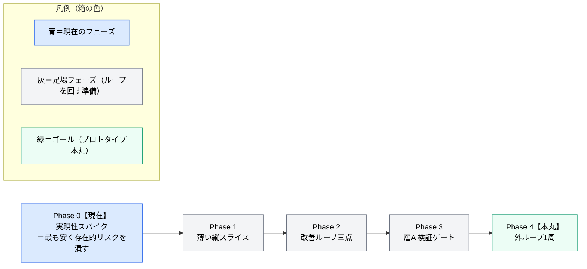
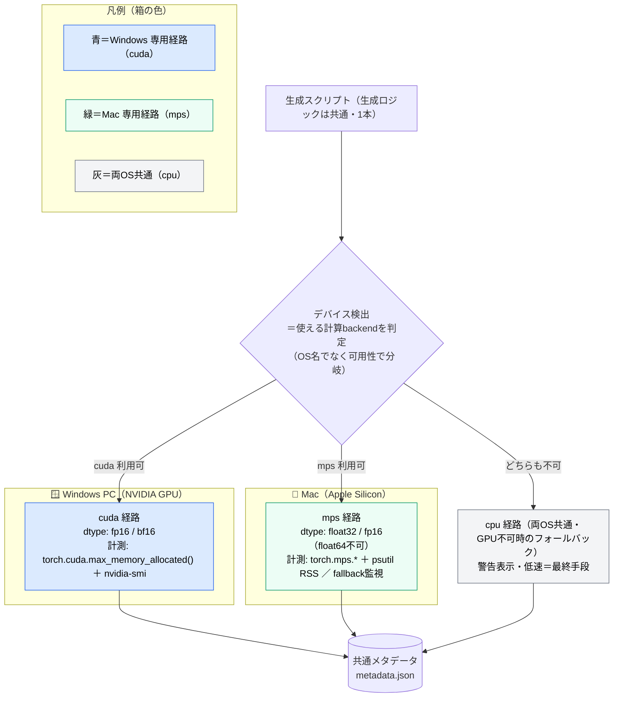
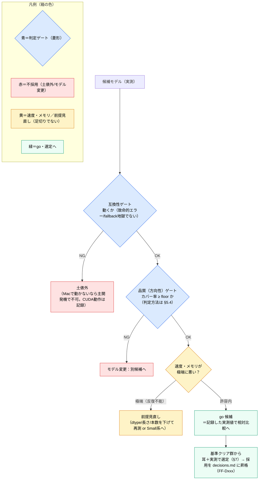
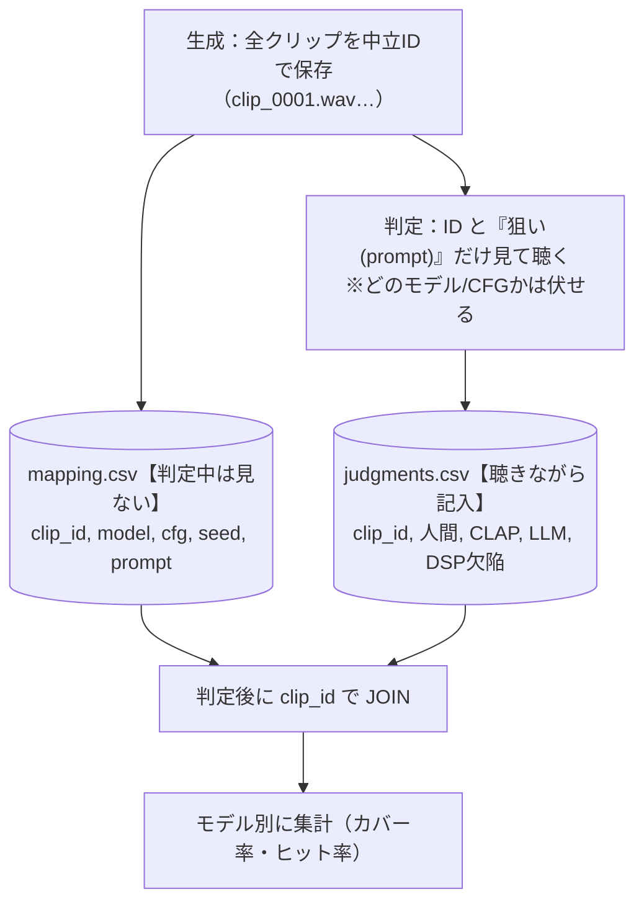
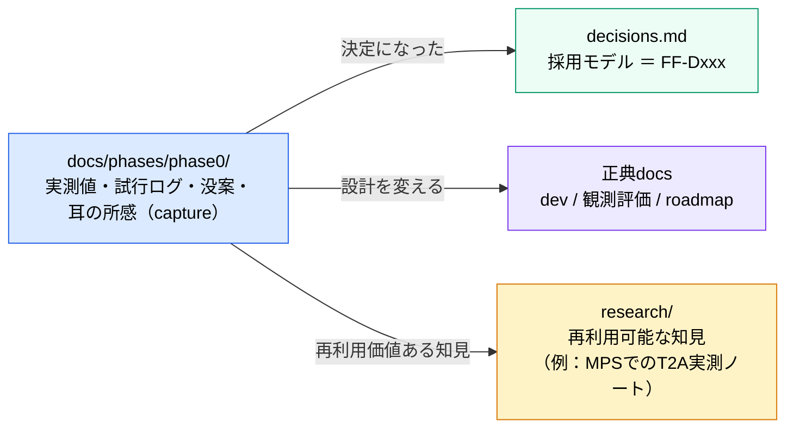

# Phase 0 進め方の方針 — モデル実現性スパイク（アプリ外）

> 作成日: 2026-06-04
> ステータス: 計画（**ドラフト・着手前**）。合格ラインの具体値・モデル最終決定・Small の diffusers 対応可否は **未確定**（→ §11）
> 用途: Phase 0 を「どの順で・何を測り・どこで go/no-go を切るか」を定める実行計画
> 関連: [prototype-roadmap.md](../../prototype-roadmap.md)（Phase 0 の問い・完了条件・範囲外の出典）/ [phases/README.md](../README.md)（生ログ→昇格の運用）/ [foley-forge-dev.md](../../foley-forge-dev.md)（§2.2 エンジン段階・§5.1/§5.2 プロンプト・CFG）/ [decisions.md](../../decisions.md)（FF-D003/D004/D010/D011）/ [app-design-philosophy.md](../../../research/design-philosophy/app-design-philosophy.md)（§5 定量/定性の分担）/ [local-inference-optimization-strategy.md](../../../research/gpu-optimization/local-inference-optimization-strategy.md)（最適化は Phase 4+）

---

## 0. このドキュメントの位置づけ

[roadmap](../../prototype-roadmap.md) の **Phase 0「モデル実現性スパイク」** を、実際に手を動かせる粒度まで具体化した計画書。ここは [phases/README](../README.md) の言う **「捕獲（capture）」の場**であり、ここで確定した事実（採用モデル・実測値）は decisions.md や正典 docs へ **昇格（promote）** させる（→ §10）。

### Phase 0 の North Star 上の位置

> Phase 0 は足場の最初の一段。**「No なら前提が崩れる」存在的リスク（モデルがそもそも使えるか）を、アプリを作る前に最安で潰す**のが狙い（roadmap 背骨原則1：リスク先行）。

---

## 1. Phase 0 が答えるべき問い（roadmap より）

| # | 問い | この計画での確認手段 |
|---|---|---|
| Q1 | 選んだ T2A は、手書きプロンプトで **アニメ寄りSE** を実用レベルで作れるか？ | 代表プロンプト集（§7）× 候補モデル（§6）を生成し、**方向性の到達可否**を耳で判定（§5） |
| Q2 | ローカルGPUでの **生成時間・メモリ** は許容内か？ | 環境別の計測（§4）＝速度(RTF)・メモリ・安定性 |
| Q3 | **CFG のスイートスポット**はどこか？ | 固定プロンプト × CFGスイープ（dev §5.2：CLAPピーク~3.5／安定4–6／破綻10+ を実機で確認） |

**完了条件**：「このモデルでいける／モデルを変える」の判断＋生成1本あたりの**時間・メモリの実測値**（2環境分）。

---

## 2. 前提：2つの計測環境

本スパイクは **2台**で計測する。数字は環境ごとに別物として記録する（転移しない）。

| 項目 | Mac（主開発機） | Windows（第2計測機） |
|---|---|---|
| マシン | MacBook Air | （デスクトップ／ノート） |
| チップ/GPU | Apple **M5**（10コア 4P+6E） | NVIDIA **GeForce RTX 30シリーズ**（型番要確認 ※1） |
| メモリ | **24GB ユニファイドメモリ**（CPU/GPU共有・VRAM分離なし） | システムRAM＋**VRAM 10GB**（独立） |
| 計算バックエンド | **MPS**（Metal）。CUDAなし | **CUDA** |
| 冷却 | **ファンレス**（連続生成でサーマルスロットリングの恐れ） | ファンあり（影響小） |
| OS | macOS 26.5 | Windows |

> ※1：ユーザ申告「RTX 300 10G VRAM」は型番の表記揺れ。**10GB VRAM** から RTX 3080(10GB) 等と推定だが、**正確な型番は手順0で確認**して本表に確定する。

### この2環境がスパイクに与える価値

- **Mac の数字** … 「自分の主開発機で反復作業（生成→聴く→調整）が回る速度か」の go/no-go。roadmap 上 Phase 0–3 の対象は開発者本人なので、これが一次判断。
- **Windows の数字** … 将来のNVIDIAユーザー（OSS公開時）向けの参考値を**安く先取り**。MPS固有の落とし穴の切り分け（「遅いのはMac/MPSのせいか、モデルのせいか」）にも使える対照群。

---

## 3. クロスプラットフォーム方針：1スクリプト＋デバイス分岐

**2本に分けず、1つのスクリプト内でデバイスを検出して分岐**する（生成ロジックは共通、計測アダプタだけ環境別）。理由：コードの二重化＝ドリフトを避ける／dev §2.3・FF-D003 の「エンジン抽象化」を Phase 0 スケールで先取りできる。

分岐は **OS名ではなく「torch が使える計算バックエンドの可用性」** で行う（`torch.cuda.is_available()` → 不可なら `torch.backends.mps.is_available()` → どちらも不可なら cpu）。今回の2台構成では **バックエンドと OS が 1 対 1 で対応**する（cuda＝Windows、mps＝Mac、cpu＝両方）ので、下図は OS で囲んで示す。

> **「cpu経路」と「MPS内部のCPUフォールバック」は別物**（混同注意）：上図の cpu 経路は **デバイス全体が CPU**（GPUが一切使えない時の最終手段）。一方、Mac には **mps は使うが未対応 op だけ CPU に落ちる**現象があり（§4 の `PYTORCH_ENABLE_MPS_FALLBACK`）、これは mps 経路の中での部分的な落下。後者が多発すると激遅になり実用性のシグナルになる。

> **スコープ境界（重要）**：Phase 0 のデバイス分岐は **「計測のため」**であって、最適化ではない。`local-inference-optimization-strategy.md` の **VRAMティア自動検出・OOMフォールバックは Phase 4** の仕事であり、ここでは作らない。Phase 0 は **環境ごとに dtype 等をハードコード**でよい（roadmap 原則4：scopeを切る／同ドキュメント §6.1「Phase 1〜3 はハードコード」）。

---

## 4. 計測対象の再定義（VRAM → 環境別の実リスク）

当初案の「VRAM使用率」は **Apple Silicon では成立しない**（VRAMという独立領域がなく24GBを共有、`torch.cuda` 系API不可）。計測対象を**環境別**かつ**本当に効くリスク**へ組み替える。

| 計測軸 | Mac（MPS） | Windows（CUDA） | 記録する値 |
|---|---|---|---|
| **メモリ** | `torch.mps.*` ＋ `psutil` RSS（→ 定義は §4.1） | `torch.cuda.max_memory_allocated()` ＋ `nvidia-smi`（→ 定義は §4.1） | **ピークメモリ**（モデル~3GB級なので24GB/10GBに対し縛りになりにくい＝優先度は速度より下） |
| **速度** | `time.perf_counter`（cold/warm 別） | 同上（または `torch.cuda.Event`） | **cold**（初回＝ロード＋カーネルコンパイル含む）と **warm**（定常）を分離。**RTF＝生成時間 ÷ 音長**（RTF<1 で実時間より速い） |
| **安定性（サーマル）** | **ファンレス**：warm連続 N 本で速度が落ちないか監視 | ファンあり：影響小 | 連続生成時の生成時間の推移 |
| **op互換** | MPS未対応op → CPUフォールバック警告（`PYTORCH_ENABLE_MPS_FALLBACK=1`で可視化） | 基本問題なし | **fallback の有無・頻度**（多いと激遅＝実用不可のシグナル） |
| **dtype** | **float32必須**（float64不可）。fp16/bf16の可否も確認 | fp16/bf16 | 実際に使えたdtype |

> **Mac で本当に怖いのはVRAMではなく**：(a) MPSで素直に動くか（fallback地獄でないか）、(b) warm時の実速度、(c) ファンレスのスロットリング、の3つ。計測はここに重心を置く。

### 4.1 メモリ計測に使う関数（何を測るか）

メモリは複数のAPIで「異なる切り口」を測る。値の意味を取り違えないよう、各関数の役割を明示する（定義は PyTorch 公式に準拠）。

**Mac（MPS）— `torch.mps.*` ＋ `psutil`**

- `current_allocated_memory()` … 現在 **テンソルが占有**しているGPUメモリ（バイト）。**キャッシュ済みプール分は含まない** ＝ 純粋なテンソル使用量。
- `driver_allocated_memory()` … Metal ドライバがプロセス用に確保した **GPUメモリ総量**（バイト）。キャッシュ込み ＝ **実フットプリントに近い**。
- `recommended_max_memory()` … システムが推奨する **上限ワーキングセットサイズ**（バイト）。これを超えると圧迫／スワップの恐れ ＝ **予算の目安**。
- `empty_cache()`（補助）… キャッシュ済みの未使用メモリを解放。**計測の前後で呼んでノイズを減らす**。
- `psutil` の RSS（Resident Set Size）… プロセスが確保している **実メモリ（OS視点）**。ユニファイドメモリでは GPU 確保分も RAM に乗るため、**プロセス全体のフットプリント**把握に有用。

**Windows（CUDA）— `torch.cuda.*` ＋ `nvidia-smi`**

- `max_memory_allocated()` … プログラム開始（または `reset_peak_memory_stats()` 以降）の **テンソル占有メモリのピーク**（バイト）。
- `reset_peak_memory_stats()` … ピーク計測の **起点をリセット** ＝ 生成区間ごとにピークを測れる（生成直前に呼ぶ）。
- `nvidia-smi`（補助）… プロセス／GPU単位の **VRAM使用量（OS視点）**。ドライバ・他プロセス込みの総量を確認。

---

## 5. 合格基準の事前登録（go/no-go）— **生成して聴く前に決める**

Phase 0 の肝。**結果を見てから基準を作ると後付け正当化になる**。粗くてよいので着手前に登録し、実測後に値だけ較正する（roadmap §4「初期は手で決める」と整合）。

### 5.1 ライン設計の大原則：「全滅」には2種類ある

ガチガチに決めると「どれも採用できない」になりかねない。だが「全部落ちる」には**意味の違う2種類**がある。ここを分けるのがライン設計の肝。

| 「全部落ちた」 | 意味 | 評価 |
|---|---|---|
| ① **基準が厳しすぎて**落ちた | 設計ミス。使えるモデルを技術的な細かさで弾いた | **避けるべき** |
| ② **本当にどれも使い物にならない**ので落ちた | 正当な発見。「T2Aはこのタスク/このマシンにまだ早い」 | **Phase 0 の価値ある結論** |

> **方針**：floor は ① が起きないよう **低く・根拠を持って**置く。そうすれば、もし全滅したらそれは ②＝意味のある結論になる。**合格ラインで優劣を競わせない**ことで、ラインを低く保つ（→ §5.3 の (E)）。

### 5.2 何を判定するか：competence であって taste ではない

philosophy §5・観測評価 §12原則7 の線引きを Phase 0 にも適用する。

| 見るもの | Phase 0 で判定する | 判定者 |
|---|---|---|
| **方向性の到達可否**（「雨の森」と言って雨/森系の音の方向に行くか、破綻・無音・無関係でないか）＝ competence | **する** | 開発者（仕組みの責任者） |
| **綺麗さの優劣**（どちらの雨がより美しいか）＝ taste | **しない**（過適合を招く） | 本来ユーザーのもの。Phase 0 では踏み込まない |

> たまたま当たった1サンプルの美しさで1モデルに肩入れしない。**「代表プロンプト集の何割で“素材として使える方向性”に届くか」**という再現性ベースで見る。

### 5.3 判定の全体像（構造と出口フロー）

ガチガチを避ける仕掛け。**落ちたら土俵外（hard gate）は2つに絞り**、残りは足切りにせず比較材料にする。**数値（floor）は次ステップで軸ごとに確定**（ここでは扱いの構造のみ合意）。

| 軸 | 扱い | 問い／指標 | 仮の合格ライン（**数値は要確定**・floorは低く） |
|---|---|---|---|
| **互換性** | 🔴 **hard gate** | その環境で動くか／致命的エラー・CPUフォールバック頻度 | 致命的エラー無し・fallback限定的 |
| **品質（方向性）** | 🔴 **hard gate（低い床）** | 破綻/無音/無関係でない方向に届くか／代表プロンプト N 本中のカバー率（**判定方法は §5.4 の多角判定**） | 例：?割以上（**未確定**） |
| **速度** | 🟡 **記録＆比較** | warm時の生成時間／RTF（極端時のみ足切り） | 数値は記録し比較に使用。"反復不能"レベルのみ足切り |
| **メモリ・安定** | 🟡 **記録＆比較** | ピークメモリ／連続生成の破綻（実破綻時のみ足切り） | Mac:24GB内・Win:10GB内／連続で破綻しない |

→ 通すべき関門は「**動くか？ → 方向に届くか？**」の2つの低い床だけ。速度・メモリは**門番ではなく優劣比較の材料**。

**(D) 2環境の扱い** — go/no-go の一次判断は主開発機の Mac。

- **Mac（主開発機）** … **一次判断**。「自分の Mac で反復作業が回るか」。
- **Windows** … **参考値として記録**（将来のNVIDIAユーザー向け＋MPS切り分け）。**Win の数字で go を覆さない**。
- 注意：**Mac で動かない（MPS非対応）モデルは、Win で動いても (C) の互換 gate で土俵外**（主開発機で使えないため）。ただし「CUDA では動く」事実は将来用に記録。

**(E) 合格ライン＝足切り、優劣は別** — ラインは最低生存線であって良し悪しの物差しではない。

- 3候補の**どれを採るか（選定）は、基準クリア群の中で**、耳＋記録した実測値（速度・メモリ）で相対比較（§7）。
- floor に識別力を持たせる必要がない（比較が識別を担う）ので、**floor を低く保てる**。

**全体フロー**（まず全体像。各菱形＝ゲートの中身は §5.4 以降で詳述）

> 読み方：上2つの菱形（互換・品質）が hard gate（落ちたら不採用）。3つ目（速度・メモリ）は足切りでなく**比較材料**で、極端な時だけ前提見直し。**この図の「品質（方向性）ゲート」の中身が次の §5.4**。

### 5.4 品質（方向性）ゲートの判定方法【多角判定】

**この節は §5.3 フロー図の「品質（方向性）ゲート（G2）」の中身**＝どう判定して OK/NG を出すか、を詳述する。

品質（方向性）の hard gate を **開発者1人の主観に委ねない**。客観性は「**独立した複数判定の一致**」から生まれる（どれか1つを"正解の神"にしない＝原則8）。**taste（綺麗さ）は誰も判定しない**（§5.2・原則7）。判定するのは competence（方向に届くか）と欠陥（壊れていないか）だけ。

**(1) 判定者：3+1 層**

| 層 | 判定者 | 何を見る | 役割 |
|---|---|---|---|
| **L0 DSP欠陥** | プログラム（決定論・librosa/pyloudnorm 等） | 無音・クリップ(飽和)・NaN・極端SNR・ほぼ無音 | 耳で**聞き逃す欠陥を客観NG化**。観測評価 層A「liveness」の最小前倒し |
| **L1 人間の耳** | 開発者（ブラインド） | 方向に届くか（§5.2 の境界ルール） | **最終ラベルのアンカー** |
| **L2 CLAP** | LAION-CLAP（ローカル・数値） | プロンプトとの意味的類似 | 第2意見。※人間相関は低い→単独信頼せず記録・相対比較に留める |
| **L3 audio-LLM** | クラウドの高性能LLM（音声対応） | 「この音は『狙い』に聞こえるか？ yes/部分/no＋何に聞こえるか」 | 第3意見（独立性を上げる）。LLM-as-judge は高性能モデルほど有効 |

**(2) クリップ1本のラベル決定ルール**（L0〜L3 を OK/部分/NG の1つに畳む）

1. **L0(DSP) が欠陥検出 → 即 NG**（耳に依らず・客観）。
2. 欠陥なし → **L1(人間ブラインド) の判定をそのクリップのラベルに採用**（L1 がアンカー）。
3. **L2(CLAP)・L3(LLM) が L1 と食い違うクリップだけ聴き直して L1 を確定**（見落とし・甘さの補正。L2/L3 はラベルを上書きしない＝第2/第3意見）。
4. **到達 ＝ OK または 部分**（NG は未到達）。

→ 「開発者1人＝主観的」を、客観DSP（自動NG）＋独立した第2/第3意見（不一致の炙り出し）で構造的に緩和する。

**(3) 各判定者への OK/部分/NG の翻訳**（§5.2 の定義を、判定者ごとの形に）

- 人間（L1）：耳＋§5.2 の境界（汚いが分かる=OK／一部・材質ズレ=部分／無音・別物=NG）
- DSP（L0）：客観閾値（無音 < x dB、クリップ率 > y、NaN 有 → 自動 NG）
- CLAP（L2）：類似スコア（**閾値は未較正**なので Phase 0 では絶対判定に使わず、記録・相対比較）
- audio-LLM（L3）：固定プロンプトで yes/部分/no を返させる

**(4) 出口：クリップのラベルを集計して G2 の OK/NG を出す**（ラベル付けは1回、3単位で数える）

クリップのラベル(2)を集計し、**モデルの G2 判定**を確定する：

- プロンプト＝**カバー**（Best-of-N に到達が1本でもあれば）
- モデル＝**カバー率 ≥ floor なら G2＝OK（方向性ゲート通過）／ floor 未満なら G2＝NG（モデル変更）**

| 集計単位 | 定義 | 使い道 |
|---|---|---|
| クリップ単位＝**ヒット率** | 到達(OK+部分) ÷ 全クリップ | 1本ずつの当たり率 → **比較（選定）** |
| プロンプト単位＝**カバー率** | Best-of-N に到達が1本でもあるプロンプト ÷ 全プロンプト | 数回試せば届くか → **★G2 の判定** |
| モデル単位 | 上記＋速度・メモリ | gate＝カバー率／比較＝ヒット率ほか |

> 例：3プロンプト × Best-of-N=4本 ＝ 12クリップ。A[OK,OK,部分,NG]／B[部分,NG,NG,NG]／C[NG,NG,NG,NG] → **ヒット率=5/12≈42%**（比較用）、**カバー率=2/3≈67%**（gate用）。仮に floor=50% なら 67%≥50% で **G2＝OK**。gate は甘いカバー率、優劣は厳しいヒット率。

**(5) 記録（ブラインド）** — 2つの表で「どのモデルが作ったか伏せて聴く」を実現する。

> **狙い(prompt)は見せ、作り手(model/CFG)は伏せる** ＝「勝ってほしいモデルに甘くなる」確証バイアスを断つ。判定後の JOIN で初めてモデルが分かる。

**(6) クラウド audio-LLM の注意（L3）**

- **音声を直接入力できるモデルを選ぶ**：GPT-4o系・Gemini は可、**Claude は生音声に非対応**（テキスト/画像/PDFのみ）。
- これは **Phase 0 限定の「開発時のオフライン道具」**で、製品（Step2 のLLM・FF-D002）とは別物。ローカル/オフライン志向と衝突しない（原則2：LLM-judge はオフライン用）。
- **再現性**：クラウドモデルは更新で挙動が変わるため、**モデル名・バージョン・実行日**を記録。
- **Goodhart 注意**：これらのスコアを**最大化しにいかない**。competence の第2意見であって最適化目標ではない（原則8）。
- コスト/プライバシー：送るのは生成SEクリップのみ（個人情報なし）。スパイクの一回限りなので許容。

---

## 6. 進め方の手順（修正版・リスク先行）

「3モデル分の環境を組んでから生成」ではなく、**まず1モデルを端から端まで通して存在的リスクを潰し**、通ってから横展開する（roadmap 原則2：縦スライス優先）。

| 手順 | 内容 | 要点・前のやり取りからの修正 |
|---|---|---|
| **0** | 環境構築＋事前登録 | venv（**Python 3.11+**。システムの3.9.6は使わない）。Mac=既定wheel（MPS同梱）／Win=CUDA対応wheel。**合格基準(§5)と代表プロンプト(§7)をここで確定** |
| **1** | モデル＆ライブラリ調査 | 「良いモデル」ではなく**「その環境で動く経路があるモデル」**でフィルタ（＝当初手順3を前倒しし手順1と一体化）。候補は §6 |
| **2** | DL・配置 | Stable Audio系は **HFゲート（ライセンス同意＋トークン）**。配置は `src/models/`（FF-D004：同梱しない／FF-D011：gitignore対象） |
| **3** | 生成スクリプト | デバイス分岐(§3)＋**メタデータ保存を最初から**(§8)。安く、後フェーズの習慣になる |
| **4** | プロンプト用意 | §7。**Freesound風の構造**（源＋動作＋特性＋品質＋ネガティブ）で手書き（dev §5.1／FF-D010） |
| **5** | 生成実行 | 単発でなく **固定プロンプト × CFGスイープ × 数seed** のグリッド（Q3のスイートスポット確認） |
| **6** | 計測 | §4。**cold/warm分離**・2環境 |
| **7** | 評価・選定 | §5の基準で判定。**CLAP/PQは作らない**（範囲外）。耳＋実測値のみ |

---

## 7. モデル候補（3つ）

Web調査を踏まえた作業候補。**最終決定は手順1**（特に Apple Silicon で動く経路の確認後）。

| 候補 | 規模/特徴 | Phase 0 での役割 | 確認事項 |
|---|---|---|---|
| **Stable Audio Open 1.0** | ~1.2B / 最長47s / 44.1kHz stereo。Freesound+FMAのCC学習。SE/field recordingで AudioLDM2/AudioGen を上回る報告。dev のリファレンス | **基準線**。diffusers `StableAudioPipeline` | MPSでの実速度・fallback |
| **Stable Audio Open Small** | 341M / ~11s / ARC後訓練。Arm/オンデバイス最適化（スマホで11秒を8秒未満） | **実用速度の本命候補**（M5 Airに最も適合しうる） | **diffusersで動くか／`stable-audio-tools`必須か要確認** |
| **対照群（TangoFlux or AudioLDM2 等）** | 別系統（rectified flow / LDM）。diffuersに `AudioLDM2Pipeline` あり | **1系統に賭けない保険**。異なる失敗モードを見る | SE用途での方向性 |

> 構成意図：**同一ファミリー2つ（1.0 / Small）＋他系統1つ**＝「3モデル比較」の自然な形。1.0で品質基準、Smallで速度、対照群で系統リスクの分散。

---

## 8. スクリプト／メタデータ設計

品質調整の鉄則（docker比較ドキュメント §15）に従い、**音声と生成条件を必ずペアで保存**する。Phase 0 から始めれば Phase 2 以降の永続化（dev §7）の素地になる。

保存先：`src/outputs/`（gitignore・FF-D011）。1生成＝1ディレクトリ（音声＋metadata）。

| metadata に残す項目 | 例/備考 |
|---|---|
| model / model_version | `stable-audio-open-1.0` |
| device / dtype | `mps`+`float32` ／ `cuda`+`float16` |
| prompt / negative_prompt | Freesound風（§7） |
| seed / cfg(guidance_scale) / steps / duration_sec / sample_rate | スイープ条件 |
| **gen_time_cold_sec / gen_time_warm_sec** | §4：分離して記録 |
| **rtf** | 生成時間 ÷ 音長（RTF<1 で実時間より速い・§4/§12） |
| **peak_memory**（環境別API値＋RSS） | §4 |
| **mps_cpu_fallback**（有無・該当op） | Mac のみ。実用性のシグナル |
| created_at / notes | 自由メモ |

> **方向性の判定（人間/CLAP/LLM/DSP欠陥）は、こことは別に §5.4 のブラインド記録（`judgments.csv`）に持つ**。両者は `clip_id` で結合する（判定中はモデル名を伏せるため、生成条件の metadata と判定結果を分離して保存する）。

---

## 9. スコープ（Phase 0 でやらないこと）

roadmap Phase 0「範囲外」に沿う。**やらないことを明示してスコープ膨張を防ぐ**（原則4）。

| やらない | いつやるか |
|---|---|
| **オンラインの Step6 採点器**（製品パイプライン内の CLAP/PQ） | Phase 2。Phase 0 ではパイプラインには組まない（※下記の通り**オフライン判定**としては §5.4 で使う） |
| LLM / 構造化データ / Step3 プロンプトビルダー | Phase 1–2 |
| FastAPI / React / アプリ化 | Phase 1以降 |
| VRAMティア自動検出・OOMフォールバック・量子化・最適化 | **Phase 4+**（local-inference-optimization §6.1） |
| 複数モデルの抽象化レイヤー本実装 | Phase 1以降（Phase 0 は分岐の最小版のみ） |

> **例外的に Phase 0 から入れる**：
> 1. **metadata保存**(§8)。安く、後の習慣になるため。
> 2. **品質（方向性）判定のオフライン道具**＝DSP欠陥検出・CLAP・audio-LLM（§5.4 の多角判定）。「最大リスク＝品質判定の客観性」を潰すための前倒し。**あくまでオフラインの判定専用**で、オンライン採点器（Step6＝Phase 2）とは別物。観測評価 層A liveness の最小版もここに含む。スコープ拡大だが、開発者の合意のうえで採用（最小から作り込みすぎない）。

---

## 10. 成果物と昇格

- **生ログ**（実測CSV/表・没プロンプト・所感）は本ディレクトリ `docs/phases/phase0/` に貯める。
- **採用モデルが決まったら** decisions.md に **FF-Dxxx** として昇格（roadmap §4「どのモデルを候補にするか」の決着）。
- **2環境の実測値**で `local-inference-optimization-strategy.md`（CUDA/VRAM前提）に **Apple Silicon の章**が必要と判明したら research へ昇格。

---

## 11. 未決事項（着手前 or 着手中に確定）

- **合格ラインの具体値**（§5.3）：方向性OKの割合・速度の足切り値。**着手前に仮値→実測後に較正**（判定の構造と方法は §5.1〜§5.4 で確定済み・数値が未確定）。
- **多角判定の具体パラメータ**（§5.4）：DSP欠陥の閾値（無音dB・クリップ率）／CLAP の扱い／**採用するクラウド audio-LLM（音声対応・モデル名/版）**／L1〜L3 の不一致をどう扱うか。
- **モデル最終決定**（§6・§7）：特に **Stable Audio Open Small が diffusers で動くか**（`stable-audio-tools` 必須なら手間が変わる）。対照群を TangoFlux / AudioLDM2 のどちらにするか。
- **Windows GPU の正確な型番**（§2 ※1）。
- **代表プロンプト集の確定**（§7・別途 §で詳細化予定）：音種別×シナリオを 5–8本。
- **生成する音の長さ・本数**（スイープのグリッドサイズ）：Best-of-N を想定しつつ Phase 0 は小さく。
- **Python/torch の確定バージョン**：MPS安定版・CUDA対応wheelのバージョン整合。

---

## 12. 用語集（Phase 0 の運用語）

ここで定義するのは **Phase 0 で出てくる「環境・計測まわりの運用語」のみ**。アプリ中核語（**CLAP・PQ・CFGスケール・Best-of-N・T2A・SE・フォーリー・proxy・abstain** 等）は**重複定義してドリフトさせない**ため、[dev §10「用語」](../../foley-forge-dev.md) と [観測・評価設計 第I部](../../observation-and-evaluation-design.md) を参照する。

| 用語 | 説明 |
|---|---|
| **スパイク（spike）** | 本実装の前に、特定の技術的疑問を最小コードで確かめる**使い捨ての検証**。Phase 0 全体がこれ |
| **縦スライス（vertical slice）** | 横に全機能を作らず、入口から出口まで**薄く1本通す**作り方（roadmap 原則2）。Phase 0 では「1モデルを端から端まで通す」 |
| **スイートスポット（sweet spot）** | パラメータ（特に CFG）の、**品質が最も良くなる値の範囲**。dev §5.2＝CLAPピーク~3.5／音響品質が安定する4–6／アーティファクト発生10+ |
| **CFG（guidance scale）** | プロンプト追従度を制御する生成パラメータ。値の意味は dev §10 を参照 |
| **RTF（Real-Time Factor／実時間比）** | **生成時間 ÷ 音の長さ**。**RTF<1 で実時間より速い**（例：10秒の音を5秒で生成＝RTF 0.5）。速度の主指標 |
| **cold / warm** | **cold**＝初回生成（モデルロード＋カーネル／シェーダのコンパイルを含む・遅い）。**warm**＝2回目以降の定常生成。**分けて測る** |
| **ユニファイドメモリ（unified memory）** | Apple Silicon で CPU と GPU が**同一の物理メモリ（24GB）を共有**する方式。独立 VRAM が無い＝「VRAM計測」が成立しない理由 |
| **VRAM** | NVIDIA GPU 等が持つ**専用ビデオメモリ**。Windows 機（10GB）が該当 |
| **MPS（Metal Performance Shaders）** | PyTorch が **Apple GPU** を使うためのバックエンド。Mac の計算経路 |
| **CUDA** | NVIDIA GPU 向けの計算基盤。Windows 機の計算経路（**Apple Silicon には無い**） |
| **CPUフォールバック** | ①**デバイス全体が CPU**（GPU不可時の最終手段）／②**MPS で未対応 op だけ CPU に落ちる**（`PYTORCH_ENABLE_MPS_FALLBACK`）。②が多発すると激遅（§3 の注記） |
| **dtype / fp16・bf16・float32・float64** | 数値精度。fp16/bf16＝**省メモリ・高速**。MPS は **float64 不可・float32 が基本** |
| **RSS（Resident Set Size）** | プロセスが実際に使う**物理メモリ量（OS視点）**。`psutil` で取得（§4.1） |
| **ARC（Adversarial Relativistic-Contrastive post-training）** | Stable Audio Open Small の**高速化後訓練**手法。蒸留に頼らず少ステップ生成を実現 |
| **HFゲート（gated model）** | Hugging Face で**ライセンス同意＋トークン認証**しないと DL できないモデル。Stable Audio 系が該当（§6・手順2） |
| **competence / taste** | **competence**＝破綻せず動く能力（**開発者**が判定）／**taste**＝良し悪しの感性（**ユーザー**のもの）。判定の線引きは §5.2 |
| **カバー率 / ヒット率** | 同じ方向性ラベルの数え方。**カバー率**＝Best-of-N に到達が1本でもあるプロンプトの割合（gate用）／**ヒット率**＝全クリップ中の到達割合（比較用）。§5.4 |
| **多角判定（3+1層）** | 品質（方向性）を L0 DSP欠陥＋L1 人間＋L2 CLAP＋L3 audio-LLM で多角的に見る方式。客観性＝独立判定の一致。§5.4 |
| **LLM-as-judge** | LLM に出力の良し悪し（ここでは「狙いに聞こえるか」）を判定させる手法。高性能モデルほど有効。本アプリでは**オフライン・competence限定**で使う（原則2） |
| **DSP欠陥検出** | 信号処理で無音・クリップ・NaN 等の**客観的な「壊れ」**を検出すること（決定論）。観測評価 層A「liveness」に対応 |
| **ブラインド判定** | どのモデル/CFGが作ったかを伏せて聴く運用（狙いのプロンプトは見せる）。確証バイアス対策。§5.4 |

> 将来、運用語がフェーズ横断で増えたら中央の `docs/glossary.md` への集約も検討するが、現時点では対象が Phase 0 のみのため本セクションに留める（YAGNI）。

---

## 13. 参考

### 内部
- [prototype-roadmap.md](../../prototype-roadmap.md) — Phase 0 の問い・完了条件・範囲外
- [phases/README.md](../README.md) — capture→promote 運用
- [foley-forge-dev.md](../../foley-forge-dev.md) — §2.2 diffusers直叩き ／ §5.1 Freesound風プロンプト ／ §5.2 CFG ／ Step5 モデル管理
- [decisions.md](../../decisions.md) — FF-D003(複数モデル)／FF-D004(同梱しない)／FF-D010(プロンプト構造)／FF-D011(src/構成・gitignore)
- [app-design-philosophy.md](../../../research/design-philosophy/app-design-philosophy.md) — §5 定量(開発者)/定性(ユーザー)の分担
- [local-inference-optimization-strategy.md](../../../research/gpu-optimization/local-inference-optimization-strategy.md) — 最適化はPhase 4+（**CUDA/VRAM前提＝Apple Siliconは要追補**）
- [docker_vs_non_docker_tta_development.md](../../../research/development/docker_vs_non_docker_tta_development.md) — §15 metadata保存形式

### 外部（裏取り）
- Stable Audio Open 1.0：[HF](https://huggingface.co/stabilityai/stable-audio-open-1.0) ／ Small：[HF](https://huggingface.co/stabilityai/stable-audio-open-small)・[Stability×Arm発表](https://stability.ai/news-updates/stability-ai-and-arm-release-stable-audio-open-small-enabling-real-world-deployment-for-on-device-audio-control)
- diffusers：[MPS(Apple Silicon)最適化](https://huggingface.co/docs/diffusers/en/optimization/mps) ／ [AudioLDM2 pipeline](https://huggingface.co/docs/diffusers/api/pipelines/audioldm2)
- PyTorch：[torch.mps メモリAPI](https://docs.pytorch.org/docs/stable/mps.html)
- [TangoFlux 概要](https://sonusahani.com/blogs/tangoflux-ai-text-to-audio)
