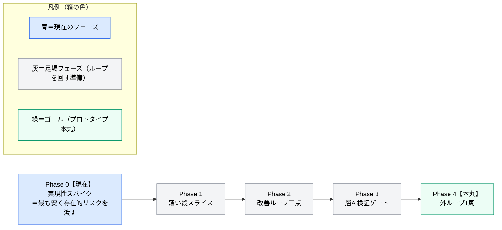
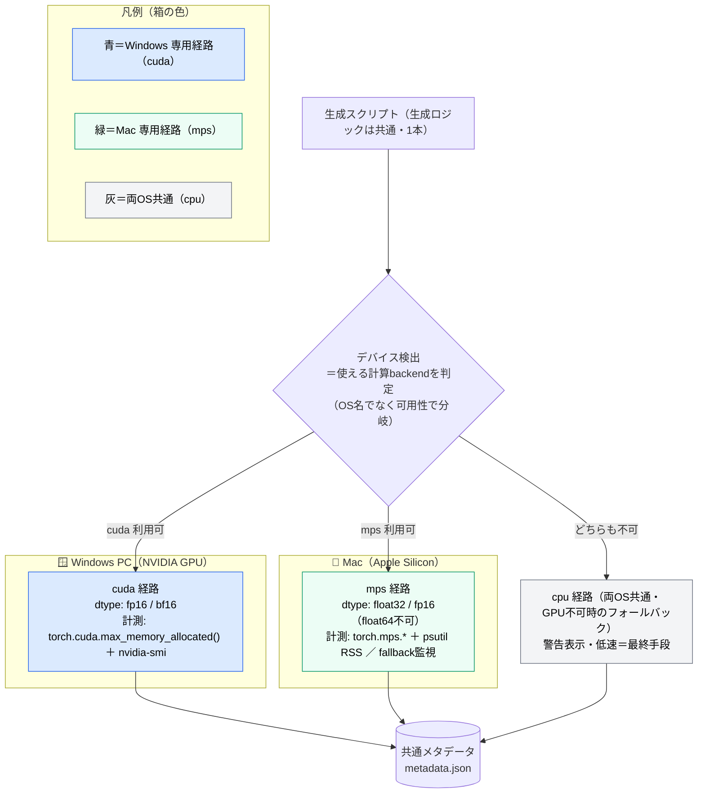
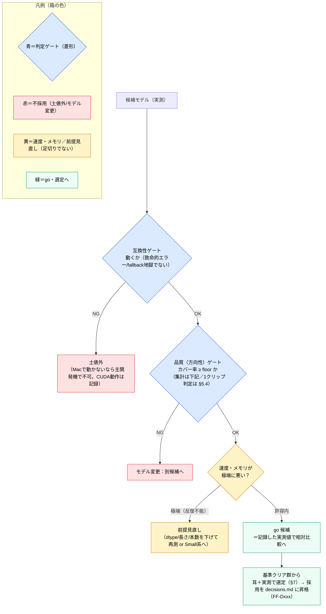
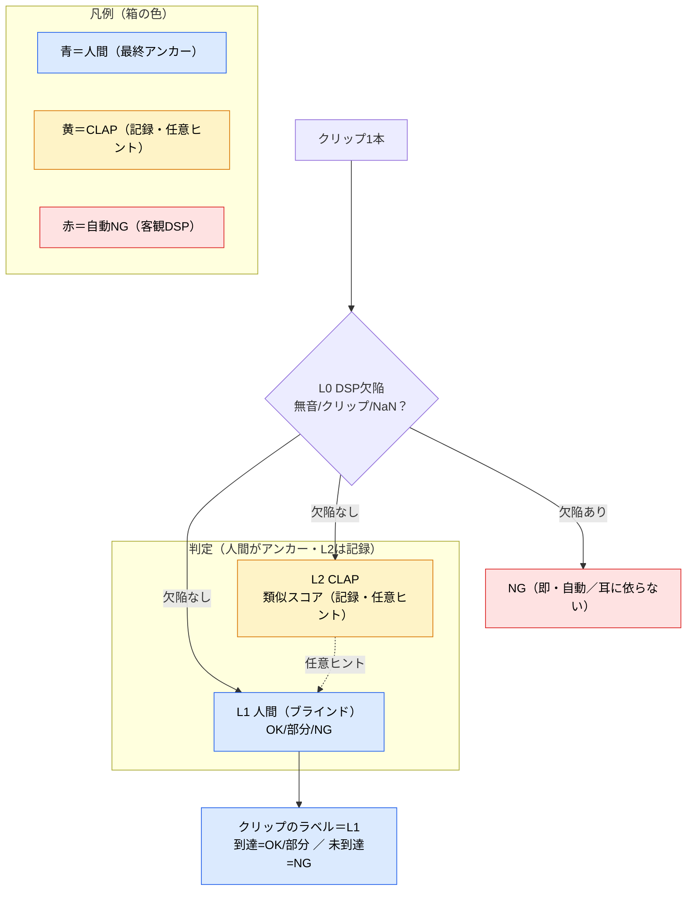
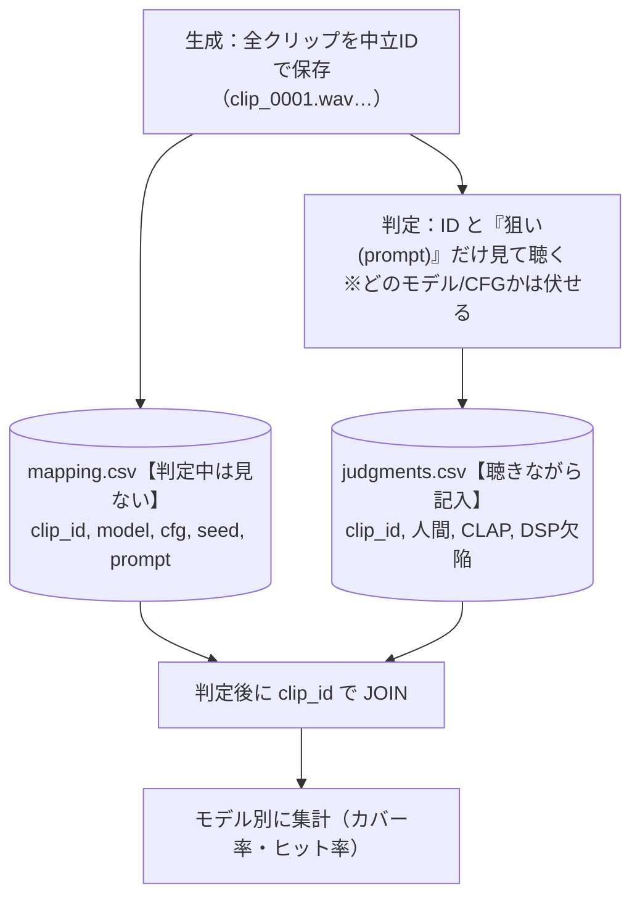
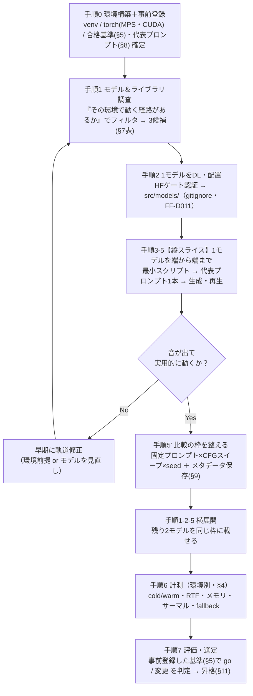
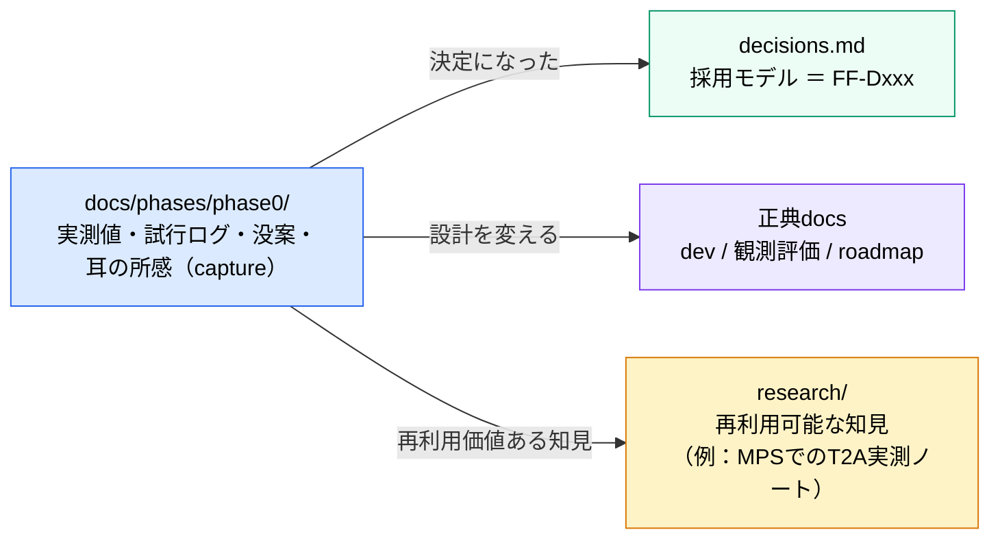

# Phase 0 進め方の方針 — モデル実現性スパイク（アプリ外）

> 作成日: 2026-06-04
> ステータス: **着手中**（2026-06-06）。生成側（環境・SAO 1.0・MPS生成・速度/サーマル・metadata・本番生成基盤）は**検証済み**。残り＝判定基盤＋本番グリッド（→ 「次回の再開ポイント」／§12）
> 用途: Phase 0 を「どの順で・何を測り・どこで go/no-go を切るか」を定める実行計画
> 関連: [prototype-roadmap.md](../../prototype-roadmap.md)（Phase 0 の問い・完了条件・範囲外の出典）/ [phases/README.md](../README.md)（生ログ→昇格の運用）/ [foley-forge-dev.md](../../foley-forge-dev.md)（§2.2 エンジン段階・§5.1/§5.2 プロンプト・CFG）/ [decisions.md](../../decisions.md)（FF-D003/D004/D010/D011）/ [app-design-philosophy.md](../../../research/design-philosophy/app-design-philosophy.md)（§5 定量/定性の分担）/ [local-inference-optimization-strategy.md](../../../research/gpu-optimization/local-inference-optimization-strategy.md)（最適化は Phase 4+）

---

## 次回の再開ポイント（2026-06-06 時点）

> このセッションでの到達と、次にやることの要約。**状態は全コミット済み・クリーン**。

**ここまで（生成側はほぼ完了）**：環境構築・SAO 1.0 取得・MPS生成（存在的リスク突破）・速度/サーマル特性（**25step・連続が最適**）・metadataスキーマ・**本番生成基盤**（`src/spikes/phase0/engine.py`／`generate_grid.py`）を検証。**Q1 は環境音(雨)＋フォーリー(衣擦れ)で方向性OK**。記録：research/debugging×2・research/performance×1。

**次回やること（この順）**：
1. **判定基盤の設計**（§12 残）：~~合格ラインの仮値（§5.3）~~ ~~多角判定パラメータ（§5.4）~~ **済（2026-06-13：合格ライン3軸／DSP閾値／CLAP記録のみ／L3不採用）** ／ 残り＝**判定CSV（mapping/judgments）スキーマ**（§5.4(4)・手順7で確定）。
2. **本番グリッド実行**：`.venv/bin/python src/spikes/phase0/generate_grid.py --full`（8プロンプト×CFG3×seed3＝**72本・~1.5h・連続**・サンドボックス外）。
3. **ブラインド判定**でQ1カバレッジを確定 → **採用モデルを decisions.md（FF-Dxxx）へ昇格**。

> メモ：生成・MPS系は**サンドボックス外**で実行（[mps-blocked-by-sandbox](../../../research/debugging/mps-unavailable-in-sandbox.md)）。CFG は耳で効果あり（7.0 が濃淡クリア）＝スイープの意味あり。

---

## 0. このドキュメントの位置づけ

[roadmap](../../prototype-roadmap.md) の **Phase 0「モデル実現性スパイク」** を、実際に手を動かせる粒度まで具体化した計画書。ここは [phases/README](../README.md) の言う **「捕獲（capture）」の場**であり、ここで確定した事実（採用モデル・実測値）は decisions.md や正典 docs へ **昇格（promote）** させる（→ §11）。

### Phase 0 の North Star 上の位置



> Phase 0 は足場の最初の一段。**「No なら前提が崩れる」存在的リスク（モデルがそもそも使えるか）を、アプリを作る前に最安で潰す**のが狙い（roadmap 背骨原則1：リスク先行）。

---

## 1. Phase 0 が答えるべき問い（roadmap より）

| # | 問い | この計画での確認手段 |
|---|---|---|
| Q1 | 選んだ T2A は、手書きプロンプトで **アニメ寄りSE** を実用レベルで作れるか？ | 代表プロンプト集（§8）× 候補モデル（§7）を生成し、**方向性の到達可否**を耳で判定（§5） |
| Q2 | ローカルGPUでの **生成時間・メモリ** は許容内か？ | 環境別の計測（§4）＝速度(RTF)・メモリ・安定性 |
| Q3 | **CFG のスイートスポット**はどこか？ | 固定プロンプト × CFGスイープ（dev §5.2：CLAPピーク~3.5／安定4–6／破綻10+ を実機で確認） |

**完了条件**：「このモデルでいける／モデルを変える」の判断＋生成1本あたりの**時間・メモリの実測値**（2環境分）。

---

## 2. 前提：2つの計測環境

本スパイクは **2台**で計測する。数字は環境ごとに別物として記録する（転移しない）。

| 項目 | Mac（主開発機） | Windows（第2計測機） |
|---|---|---|
| マシン | MacBook Air | （デスクトップ／ノート） |
| チップ/GPU | Apple **M5**（10コア 4P+6E） | NVIDIA **GeForce RTX 30シリーズ**（型番要確認 ※1） |
| メモリ | **24GB ユニファイドメモリ**（CPU/GPU共有・VRAM分離なし） | システムRAM＋**VRAM 10GB**（独立） |
| 計算バックエンド | **MPS**（Metal）。CUDAなし | **CUDA** |
| 冷却 | **ファンレス**（連続生成でサーマルスロットリングの恐れ） | ファンあり（影響小） |
| OS | macOS 26.5 | Windows |

> ※1：ユーザ申告「RTX 300 10G VRAM」は型番の表記揺れ。**10GB VRAM** から RTX 3080(10GB) 等と推定だが、**正確な型番は手順0で確認**して本表に確定する。

### この2環境がスパイクに与える価値

- **Mac の数字** … 「自分の主開発機で反復作業（生成→聴く→調整）が回る速度か」の go/no-go。roadmap 上 Phase 0–3 の対象は開発者本人なので、これが一次判断。
- **Windows の数字** … 将来のNVIDIAユーザー（OSS公開時）向けの参考値を**安く先取り**。MPS固有の落とし穴の切り分け（「遅いのはMac/MPSのせいか、モデルのせいか」）にも使える対照群。

---

## 3. クロスプラットフォーム方針：1スクリプト＋デバイス分岐

**2本に分けず、1つのスクリプト内でデバイスを検出して分岐**する（生成ロジックは共通、計測アダプタだけ環境別）。理由：コードの二重化＝ドリフトを避ける／dev §2.3・FF-D003 の「エンジン抽象化」を Phase 0 スケールで先取りできる。

分岐は **OS名ではなく「torch が使える計算バックエンドの可用性」** で行う（`torch.cuda.is_available()` → 不可なら `torch.backends.mps.is_available()` → どちらも不可なら cpu）。今回の2台構成では **バックエンドと OS が 1 対 1 で対応**する（cuda＝Windows、mps＝Mac、cpu＝両方）ので、下図は OS で囲んで示す。



> **「cpu経路」と「MPS内部のCPUフォールバック」は別物**（混同注意）：上図の cpu 経路は **デバイス全体が CPU**（GPUが一切使えない時の最終手段）。一方、Mac には **mps は使うが未対応 op だけ CPU に落ちる**現象があり（§4 の `PYTORCH_ENABLE_MPS_FALLBACK`）、これは mps 経路の中での部分的な落下。後者が多発すると激遅になり実用性のシグナルになる。

> **スコープ境界（重要）**：Phase 0 のデバイス分岐は **「計測のため」**であって、最適化ではない。`local-inference-optimization-strategy.md` の **VRAMティア自動検出・OOMフォールバックは Phase 4** の仕事であり、ここでは作らない。Phase 0 は **環境ごとに dtype 等をハードコード**でよい（roadmap 原則4：scopeを切る／同ドキュメント §6.1「Phase 1〜3 はハードコード」）。

---

## 4. 計測対象の再定義（VRAM → 環境別の実リスク）

当初案の「VRAM使用率」は **Apple Silicon では成立しない**（VRAMという独立領域がなく24GBを共有、`torch.cuda` 系API不可）。計測対象を**環境別**かつ**本当に効くリスク**へ組み替える。

| 計測軸 | Mac（MPS） | Windows（CUDA） | 記録する値 |
|---|---|---|---|
| **メモリ** | `torch.mps.*` ＋ `psutil` RSS（→ 定義は §4.1） | `torch.cuda.max_memory_allocated()` ＋ `nvidia-smi`（→ 定義は §4.1） | **ピークメモリ**（モデル~3GB級なので24GB/10GBに対し縛りになりにくい＝優先度は速度より下） |
| **速度** | `time.perf_counter`（cold/warm 別） | 同上（または `torch.cuda.Event`） | **cold**（初回＝ロード＋カーネルコンパイル含む）と **warm**（定常）を分離。**RTF＝生成時間 ÷ 音長**（RTF<1 で実時間より速い） |
| **安定性（サーマル）** | **ファンレス**：warm連続 N 本で速度が落ちないか監視 | ファンあり：影響小 | 連続生成時の生成時間の推移 |
| **op互換** | MPS未対応op → CPUフォールバック警告（`PYTORCH_ENABLE_MPS_FALLBACK=1`で可視化） | 基本問題なし | **fallback の有無・頻度**（多いと激遅＝実用不可のシグナル） |
| **dtype** | **float32必須**（float64不可）。fp16/bf16の可否も確認 | fp16/bf16 | 実際に使えたdtype |

> **Mac で本当に怖いのはVRAMではなく**：(a) MPSで素直に動くか（fallback地獄でないか）、(b) warm時の実速度、(c) ファンレスのスロットリング、の3つ。計測はここに重心を置く。

### 4.1 メモリ計測に使う関数（何を測るか）

メモリは複数のAPIで「異なる切り口」を測る。値の意味を取り違えないよう、各関数の役割を明示する（定義は PyTorch 公式に準拠）。

**Mac（MPS）— `torch.mps.*` ＋ `psutil`**

- `current_allocated_memory()` … 現在 **テンソルが占有**しているGPUメモリ（バイト）。**キャッシュ済みプール分は含まない** ＝ 純粋なテンソル使用量。
- `driver_allocated_memory()` … Metal ドライバがプロセス用に確保した **GPUメモリ総量**（バイト）。キャッシュ込み ＝ **実フットプリントに近い**。
- `recommended_max_memory()` … システムが推奨する **上限ワーキングセットサイズ**（バイト）。これを超えると圧迫／スワップの恐れ ＝ **予算の目安**。
- `empty_cache()`（補助）… キャッシュ済みの未使用メモリを解放。**計測の前後で呼んでノイズを減らす**。
- `psutil` の RSS（Resident Set Size）… プロセスが確保している **実メモリ（OS視点）**。ユニファイドメモリでは GPU 確保分も RAM に乗るため、**プロセス全体のフットプリント**把握に有用。

**Windows（CUDA）— `torch.cuda.*` ＋ `nvidia-smi`**

- `max_memory_allocated()` … プログラム開始（または `reset_peak_memory_stats()` 以降）の **テンソル占有メモリのピーク**（バイト）。
- `reset_peak_memory_stats()` … ピーク計測の **起点をリセット** ＝ 生成区間ごとにピークを測れる（生成直前に呼ぶ）。
- `nvidia-smi`（補助）… プロセス／GPU単位の **VRAM使用量（OS視点）**。ドライバ・他プロセス込みの総量を確認。

---

## 5. 合格基準の事前登録（go/no-go）— **生成して聴く前に決める**

Phase 0 の肝。**結果を見てから基準を作ると後付け正当化になる**。粗くてよいので着手前に登録し、実測後に値だけ較正する（roadmap §4「初期は手で決める」と整合）。

### 5.1 ライン設計の大原則：「全滅」には2種類ある

ガチガチに決めると「どれも採用できない」になりかねない。だが「全部落ちる」には**意味の違う2種類**がある。ここを分けるのがライン設計の肝。

| 「全部落ちた」 | 意味 | 評価 |
|---|---|---|
| ① **基準が厳しすぎて**落ちた | 設計ミス。使えるモデルを技術的な細かさで弾いた | **避けるべき** |
| ② **本当にどれも使い物にならない**ので落ちた | 正当な発見。「T2Aはこのタスク/このマシンにまだ早い」 | **Phase 0 の価値ある結論** |

> **方針**：floor は ① が起きないよう **低く・根拠を持って**置く。そうすれば、もし全滅したらそれは ②＝意味のある結論になる。**合格ラインで優劣を競わせない**ことで、ラインを低く保つ（→ §5.3 の (E)）。

### 5.2 何を判定するか：competence であって taste ではない

philosophy §5・観測評価 §12原則7 の線引きを Phase 0 にも適用する。

| 見るもの | Phase 0 で判定する | 判定者 |
|---|---|---|
| **方向性の到達可否**（「雨の森」と言って雨/森系の音の方向に行くか、破綻・無音・無関係でないか）＝ competence | **する** | 開発者（仕組みの責任者） |
| **綺麗さの優劣**（どちらの雨がより美しいか）＝ taste | **しない**（過適合を招く） | 本来ユーザーのもの。Phase 0 では踏み込まない |

> たまたま当たった1サンプルの美しさで1モデルに肩入れしない。**「代表プロンプト集の何割で“素材として使える方向性”に届くか」**という再現性ベースで見る。

### 5.3 判定の全体像（構造・出口フロー・モデル単位の集計）

ガチガチを避ける仕掛け。**落ちたら土俵外（hard gate）は2つに絞り**、残りは足切りにせず比較材料にする。**数値（floor）は次ステップで軸ごとに確定**（ここでは扱いの構造のみ合意）。

| 軸 | 扱い | 問い／指標 | 仮の合格ライン（**数値は要確定**・floorは低く） |
|---|---|---|---|
| **互換性** | 🔴 **hard gate** | その環境で動くか／致命的エラー・CPUフォールバック頻度 | 致命的エラー無し・fallback限定的 |
| **品質（方向性）** | 🔴 **hard gate（低い床）** | 破綻/無音/無関係でない方向に届くか／代表プロンプト N 本（N=6・§8）中のカバー率（**判定方法は §5.4 の多角判定**） | **カバー率 ≥ 50%（6本中3本以上）**（仮値・2026-06-13 登録。較正は厳格化のみ＝§5.1） |
| **速度** | 🟡 **記録＆比較** | warm時の生成時間／RTF（極端時のみ足切り） | 記録＝warm秒/本・RTF・cold・グリッド総時間。**反復不能アラーム＝warm > 180s/本**で前提見直し（**Phase 0 限定の絶対秒・仮値2026-06-13**。長さの扱いは下の注） |
| **メモリ・安定** | 🟡 **記録＆比較** | ピークメモリ／連続生成の破綻（実破綻時のみ足切り） | 記録＝Mac: driver_allocated・recommended_max・RSS／Win: peak VRAM。**実破綻アラーム＝OOM/クラッシュ/NaN**。仮値: Mac driver < recommended_max（実測~15GB）・Win <10GB。サーマル減速は記録のみ（仮値・2026-06-13） |

→ 通すべき関門は「**動くか？ → 方向に届くか？**」の2つの低い床だけ。速度・メモリは**門番ではなく優劣比較の材料**。

> **【注】速度アラーム（180s/本）は Phase 0 限定の値**：このグリッドのクリップ長（単発3s〜環境10s・§9.1）・25step・SAO 1.0・M5/MPS（ファンレス）に紐づく**移植不可の判断線**。別モデル・別の長さ・別ハード・将来のリアルタイムUXでは**再導出する**（＝普遍定数ではない）。
> - **なぜ絶対秒か**：人間が待つのは実時間で、クリップが 3s でも 10s でも「1本 180s」なら反復の辛さは同じ。だからアラームは**長さで割らず絶対秒**で置く。
> - **長さ公平性は RTF（比較側）が担当**：長い音ほど生成が遅いのは当然なので、モデル間の速度比較は **RTF（生成時間÷音長）で正規化**する（記録セットに含む）。＝長さ補正は「比較」に置き、「アラーム」は絶対秒のまま、と役割を分ける。
> - **計測の前提（未計測ギャップ）**：基準 ~53s は **5s クリップの warm 実測**。**最長 10s の warm は未計測**なので 180s の余裕は推定（5s≈53s から 10s でも 180s 未満の見込み）。**グリッドの最初の数本で確定**し、もし 10s が 180s に迫れば「このグリッドは重い」というシグナルとして扱う。

**(D) 2環境の扱い** — go/no-go の一次判断は主開発機の Mac。

- **Mac（主開発機）** … **一次判断**。「自分の Mac で反復作業が回るか」。
- **Windows** … **参考値として記録**（将来のNVIDIAユーザー向け＋MPS切り分け）。**Win の数字で go を覆さない**。
- 注意：**Mac で動かない（MPS非対応）モデルは、Win で動いても (C) の互換 gate で土俵外**（主開発機で使えないため）。ただし「CUDA では動く」事実は将来用に記録。

**(E) 合格ライン＝足切り、優劣は別** — ラインは最低生存線であって良し悪しの物差しではない。

- 3候補の**どれを採るか（選定）は、基準クリア群の中で**、耳＋記録した実測値（速度・メモリ）で相対比較（§7）。
- floor に識別力を持たせる必要がない（比較が識別を担う）ので、**floor を低く保てる**。

**全体フロー**（まず全体像。各菱形＝ゲートの中身は §5.4 以降で詳述）



> 読み方：上2つの菱形（互換・品質）が hard gate（落ちたら不採用）。3つ目（速度・メモリ）は足切りでなく**比較材料**で、極端な時だけ前提見直し。品質ゲートの「カバー率」は下の集計で定義し、**その材料＝1クリップのラベルの付け方が §5.4**。

**モデル単位の集計（品質ゲートの「カバー率」とは）**

品質ゲートの菱形「カバー率 ≥ floor」を定義する。各クリップのラベル（OK/部分/NG。**付け方は §5.4**）を2段で集計する：

- プロンプト＝**カバー**：その Best-of-N に到達(OK/部分)が1本でもあれば。
- モデル＝**カバー率 ≥ floor ならゲート＝OK（通過）／未満なら NG（モデル変更）**。

| 集計単位 | 定義 | 使い道 |
|---|---|---|
| クリップ単位＝**ヒット率** | 到達(OK+部分) ÷ 全クリップ | 1本ずつの当たり率 → **比較・選定**（(E)） |
| プロンプト単位＝**カバー率** | 到達が1本でもあるプロンプト ÷ 全プロンプト | 数回試せば届くか → **★品質ゲートの判定** |
| モデル単位 | 上記＋速度・メモリ | gate＝カバー率／比較＝ヒット率ほか |

**floor＝カバー率 50%（6本中3本以上）**。計算の具体例（本番グリッド・本体6プロンプト × 各9本〔3CFG × 3seed〕＝54クリップ）。各プロンプトは「**9本中に到達(OK/部分)が1本でもあれば カバー○**」：

| プロンプト（§8.2） | 9本中の到達(OK/部分) | カバー |
|---|---|---|
| ①雨の森（環境音） | 5本 | ○ |
| ②夜の街（環境音） | 3本 | ○ |
| ③土の足音（フォーリー） | 2本 | ○ |
| ④衣擦れ（フォーリー） | 0本 | × |
| ⑤剣の衝突（ハードFX） | 0本 | × |
| ⑥爆発（ハードFX） | 0本 | × |

- **カバー率（★ゲート判定用）** ＝ ○の数 ÷ 6 ＝ **3/6 ＝ 50%** → floor 50% を満たす（ギリギリ）→ **品質ゲート＝合格**。
- **ヒット率（比較・選定用）** ＝ 到達クリップ総数 ÷ 54 ＝ (5+3+2)/54 ＝ **10/54 ≈ 19%**。

> **floor=50% は「○の数」だけを見て“どの分類か”は問わない**：上の例はハードFXが全滅でも、環境音2＋フォーリー1の計3カバーで 50% に達し**合格**（＝偏りを許す）。分類ごとに最低1本を必須化する「**網羅型**」は、ハードFXが全モデル苦手な場合に①（厳しすぎ落ち）を招くため**採らない**（§5.1）。ハードFXの取りこぼしは**ヒット率・カテゴリ別集計**に残し、選定（§5.3(E)）で比較材料として効かせる。

### 5.4 品質（方向性）の判定方法：1クリップのラベル付け【多角判定】

**§5.3 の品質ゲートは「カバー率 ≥ floor」で OK/NG が決まる（カバー率の集計は §5.3）。その材料＝1クリップごとのラベル（OK/部分/NG）をどう付けるか**が本節（＝クリップ単位の話。モデル単位の集計は §5.3）。

品質（方向性）の hard gate を **開発者1人の主観に委ねない**。客観性は「**独立した複数判定の一致**」から生まれる（どれか1つを"正解の神"にしない＝原則8）。**taste（綺麗さ）は誰も判定しない**（§5.2・原則7）。判定するのは competence（方向に届くか）と欠陥（壊れていないか）だけ。

> **【方針転換 2026-06-13】L3（audio-LLM）は Phase 0 で不採用**。理由：(1) competence の判定者は本来「開発者」（§5.2）＝L1 が正当な権者。(2) 最大の確証バイアスは**ブラインド判定((4))**が、客観的な壊れは **L0(DSP)** が既に潰しており、バイアス低減の本丸は LLM 無しで成立。(3) 調査の結果、音声LLMは**非音声SEに弱く**（Gemini 公式が注意書き／GPT は捏造）、**無料Webデモは全滅・ローカルはメモリ綱渡り**＝「弱い信号に高コスト」。
> → **Phase 0 の判定は L0＋L1(ブラインド)＋L2(CLAP記録・任意ヒント) で回す**。以下の L3 関連記述（(1)表 L3行・(3)末・(3b)末・(3c)・(5)）は**参考として残すが Phase 0 では非アクティブ**。本番判定で1人では心許ないと判明したら、その時に L3 を足す（証拠が出てから足す流儀）。

**(1) 判定者：層構成**（L3＝audio-LLM は Phase 0 不採用・上記方針）

| 層 | 判定者 | 何を見る | 役割 |
|---|---|---|---|
| **L0 DSP欠陥** | プログラム（決定論・librosa/pyloudnorm 等） | 無音・クリップ(飽和)・NaN・極端SNR・ほぼ無音 | 耳で**聞き逃す欠陥を客観NG化**。観測評価 層A「liveness」の最小前倒し |
| **L1 人間の耳** | 開発者（ブラインド） | 方向に届くか（§5.2 の境界ルール） | **最終ラベルのアンカー** |
| **L2 CLAP** | LAION-CLAP（ローカル・数値） | プロンプトとの意味的類似 | 第2意見（記録のみ・案B/(3b)）。人間相関が低く絶対判定不可→同一プロンプト内の相対比較に留め、合否・再聴トリガには使わない |
| ~~**L3 audio-LLM**~~ | クラウド/ローカルの音声LLM | 「この音は『狙い』に聞こえるか？ yes/部分/no」 | **Phase 0 不採用**（非音声に弱く無料経路も不安定＝割に合わず・上記方針）。〔参考〕第3意見の構想 |

**(2) クリップ1本のラベル決定ルール**（L0〜L2 を OK/部分/NG の1つに畳む）

純粋な直列でも並列でもない：**L0＝直列の前段ゲート → L1（アンカー）＋L2（記録）＝並列 → ラベル＝L1**（L3 不採用ゆえ自動の再聴トリガなし・多数決ではない）。



- **① 前段ゲート（直列）**：**L0(DSP) が欠陥（無音/クリップ/NaN 等）→ 即 NG**（耳に依らず・客観）。壊れは人間に聴かせる前に弾く。
- **② 並列・独立判定**：欠陥なしのクリップを **L1(人間ブラインド)・L2(CLAP) が互いの結果を見ずに**判定（直列にすると L1 が他に引きずられる＝**アンカリングバイアス**で独立性が死ぬ）。※ここの **L1「人間（ブラインド）」を実装する仕組みが (4)**（どのモデルが作ったか伏せて聴く）。
- **③ ラベル確定（L1 アンカー）**：**L1 の判定をそのクリップのラベルに採用**。Phase 0 では**自動の再聴トリガは置かない**（L3 不採用）。**L2(CLAP) は記録し、人間が気になれば同一プロンプト内の相対順位の外れ値を任意で聴き直す“ヒント”に使う**（合否・正式トリガにはしない・(3b)）。L2 はラベルを**上書きしない**。
- **到達 ＝ OK または 部分**（NG は未到達）。

> **なぜ多数決でないか**：本アプリの正解は人間の感性（philosophy §1）で、**CLAP は人間相関が低い**（§5.4 表 L2）。モデルに人間と同じ投票権を与えて**上書き**させない。L2(CLAP) の役目は「否決」ではなく、人間が任意で参照する**相対ヒント**まで（L3＝LLM は Phase 0 不採用）。＝「開発者1人＝主観的」は、客観DSP（自動NG）＋ブラインド判定で構造的に緩和する。

**(3) 各判定者への OK/部分/NG の翻訳**（§5.2 の定義を、判定者ごとの形に）

- 人間（L1）：耳＋§5.2 の境界（汚いが分かる=OK／一部・材質ズレ=部分／無音・別物=NG）
- DSP（L0）：客観閾値（無音 peak < -60 dBFS、クリップ率 > 0.1%、NaN 有 → 自動NG。較正・詳細は下記 (3a)）
- CLAP（L2）：類似スコア（**絶対は不明・相対は有効**＝同一プロンプト内のみ比較可。記録のみで合否・再聴トリガに使わない＝案B・(3b)）
- audio-LLM（L3）：**Phase 0 不採用**（上記方針）。〔参考〕構想では固定プロンプトで yes/部分/no を返させる

**(3a) L0 DSP欠陥の閾値（仮値・2026-06-13 較正）** — known-good 4本（雨・衣擦れ × CFG2／耳で方向性OK確認済み）の wav 実測で裏取り。自動NGは known-good から**大きく外側**に置き、真の壊れだけに反応させる（L0版の §5.1＝誤NGしない低い床）。

| 欠陥 | 扱い | 仮閾値 | 根拠（known-good 実測） |
|---|---|---|---|
| NaN/Inf | 🔴 自動NG | 1個でも有 → NG | 全本ゼロ |
| 無音（完全） | 🔴 自動NG | peak < -60 dBFS | 良品 peak -11.7〜-18.8 dB／余裕 40dB超 |
| クリップ／飽和 | 🔴 自動NG | クリップ率（\|x\|≥0.999）> 0.1% | 良品 0%（少数の瞬間ピークは許容） |
| ほぼ無音 | 🟡 記録のみ | rms を記録（ゲートにしない） | 良品 rms -36.5〜-45.8 dB＝静かな環境音と紛れる→誤NG回避 |
| 極端SNR | 🟡 記録のみ | crest を記録（ゲートにしない） | 良品 crest 19.5〜34.2 dB。10step崩壊(耳✕)も crest≈15dB と近く分離不能 |

> **較正の出自**：`src/outputs/phase0/20260606T2200_sao10_mps/` の4クリップを wav 実測（peak/rms/クリップ率/NaN/crest）。GPU不要＝サンドボックス内で測定。
> **L0 の境界（重要）**：L0 は客観的な「壊れ」（無音/クリップ/NaN）だけを自動NGにする。「**崩壊して聞こえる＝下手**」は competence ＝ **L1（人間の耳）**の判断（§5.2）。10step崩壊クリップが crest で良品と分離できなかったのが実例＝L0 に taste/competence を負わせない。
> **留保（要再確認）**：今回の known-good は環境音・フォーリーのみ。**ハードFX（剣・爆発）は未生成**で正当に瞬間ピークが立ちやすいため、クリップ率 0.1% の妥当性はグリッドで剣・爆発が出たら再確認（だから 0%即NG にせず余裕を持たせた）。
> **分類別閾値は見送り（2026-06-13 検討）**：ソース分類ごとに閾値を変える案を検討したが**不採用**。L0 を分類別にすると「文脈を踏まえた良し悪し」＝L1 の領分に踏み込み **L0/L1 境界が崩れる**ため。クリップ率は「持続的飽和の率」でハードFXの瞬間ピークは既に吸収でき、未測データに勘で数字を足すことにもなる。＝閾値は**分類非依存**のまま、必要ならグリッド後にデータで再判定する。

**(3b) L2 CLAP の仕組みと扱い** — 「**CLIP の音声版**」。プロンプト文と音声をそれぞれ 512次元ベクトルに符号化し、その**コサイン類似度**で「プロンプトにどれだけ意味的に近い音か（＝指示追従性）」を測る埋め込みモデル。**決定論的**（LLM と違いサンプリングなし＝同じ音×同じプロンプトなら毎回同値）。LAION-CLAP は Freesound 等で学習＝本グリッドの Freesound 風プロンプトとドメインが合う。詳細は [research/llm-performance/evaluation-models-clap-pam.md](../../../research/llm-performance/evaluation-models-clap-pam.md)、CLAP 概念は dev §10。

- **測れるのは指示追従性だけ**：音の綺麗さ（音響品質＝PQ/PAM）は測れない。**Phase 0 では PAM/PQ は使わない**。

**【最重要】絶対は不明・相対は有効** — CLAP の使いどころを決める性質：
- ❌ **絶対値では判定できない**：スコアの基準が**プロンプトごとにずれる**（例＝イメージ：雨は 0.35〜0.45 帯、遠い爆発は 0.20〜0.30 帯に出る）。だから「**全プロンプト共通で 0.5 以上を合格**」のような**絶対ラインは引けない**。そもそも何点が適正かが未較正で不明。
- ✅ **同一プロンプト内の相対は有効**：同じ「雨」の Best-of-N の中でなら「**値が大きい＝CLAP的に追従性が高い（プロンプトに近い）**」という大小関係は意味がある（例：雨の A=0.42 と B=0.31 なら CLAP は「A の方が雨らしい」と言う）。ただしこれは**あくまで CLAP の判断**で、人間が聴いた追従性そのものではない（人間相関が低い・verifier hacking）→ **有力な相対ヒントだが決定権は渡さない**。
- → ゆえに CLAP は**合否を決めない**。使えるのは「同一プロンプト内の相対比較」まで。

**Phase 0 での役割＝記録のみ（案B・2026-06-13 決定）**：上記に加え「**人間相関が低い**（プロジェクト既定見解）」「**verifier hacking**（決定論ゆえ抜け穴が再現性100%で突かれる→最大化しにいかない・原則8）」から、CLAP に**合否権を与えない**。CLAP は**スコアを記録して同一プロンプト内の相対比較・分析に充てるだけ**。**Phase 0 では自動の再聴トリガは置かず**（L3 不採用・上記方針）、CLAP の相対順位は**人間が任意で参照する“ヒント”**に留める。

**スコープ**：ここの CLAP は**オフラインの判定道具**。製品パイプラインの Step6 リランカー（CLAP/PAM）は **Phase 2**・範囲外（§10）。同じ CLAP でも役割が別物。

**(3c) 〔Phase 0 不採用・参考保持〕再聴トリガ（L1〜L3 不一致ルール）** — **L3 を Phase 0 で落としたため本ルールは非アクティブ**（将来 L3 を復活させる場合のみ適用）。以下は設計の記録として残す。どのクリップを人間が聴き直すかのルールで、**ラベルを決めるのではなく、L1 単独主観の見落とし・甘さを独立した L3 で炙り出す**ための仕掛け（最終ラベルは常に L1・(2)③）。

仕組み＝L1 と L3 を「到達／未到達」に畳んで突き合わせ、**境界をまたいで食い違ったクリップだけ再聴**する：
- **到達** ＝ L1 の OK・部分／L3 の yes・部分
- **未到達** ＝ L1 の NG／L3 の no

| L1 ＼ L3 | yes（到達） | 部分（到達） | no（未到達） |
|---|---|---|---|
| **OK（到達）** | 一致 | 一致 | ★**再聴** |
| **部分（到達）** | 一致 | 一致 | ★**再聴** |
| **NG（未到達）** | ★**再聴** | ★**再聴** | 一致 |

→ ★の4マス（一方が到達・他方が未到達）だけ再聴。残り5マス（両者が同じ側）は再聴不要。

- **OK vs 部分 で再聴しない理由**：集計（§5.3）はカバー率・ヒット率とも「**到達（OK+部分）**」でまとめるので、**OK か 部分 かはどの集計にも影響しない**。意味のある境界は「到達／未到達」だけ。
- **再聴後もラベルは L1 が確定**（L3 は上書きしない）。
- **L3 が応答不能/曖昧なとき**はトリガを引かない（L1 のまま・記録だけ）。
- **再聴回数に上限なし**（72本なら多くても十数本想定）。L3 が大半で食い違うなら、それ自体が「L3 が使えない」シグナル。
- **適用は手順7（判定段階）**。ここでは事前登録のみ。

**(4) 記録（ブラインド）** — **(2)② の「L1 人間（ブラインド）」を実装する仕組み**。2つの表で「どのモデルが作ったか伏せて聴く」を実現する（出力＝1クリップのラベル。集計は §5.3）。



> **狙い(prompt)は見せ、作り手(model/CFG)は伏せる** ＝「勝ってほしいモデルに甘くなる」確証バイアスを断つ。判定後の JOIN で初めてモデルが分かる。

**(5) 〔Phase 0 不採用・参考保持〕クラウド audio-LLM の注意（L3）** — L3 は Phase 0 で不採用（上記方針）。以下は将来 L3 を使う場合の注意として残す。

- **音声を直接入力できるモデルを選ぶ**：GPT-4o系・Gemini は可、**Claude は生音声に非対応**（テキスト/画像/PDFのみ）。
- これは **Phase 0 限定の「開発時のオフライン道具」**で、製品（Step2 のLLM・FF-D002）とは別物。ローカル/オフライン志向と衝突しない（原則2：LLM-judge はオフライン用）。
- **再現性**：クラウドモデルは更新で挙動が変わるため、**モデル名・バージョン・実行日**を記録。
- **Goodhart 注意**：これらのスコアを**最大化しにいかない**。competence の第2意見であって最適化目標ではない（原則8）。
- コスト/プライバシー：送るのは生成SEクリップのみ（個人情報なし）。スパイクの一回限りなので許容。

---

## 6. 進め方の手順（修正版・リスク先行）

「3モデル分の環境を組んでから生成」ではなく、**まず1モデルを端から端まで通して存在的リスクを潰し**、通ってから横展開する（roadmap 原則2：縦スライス優先）。



| 手順 | 内容 | 要点・前のやり取りからの修正 |
|---|---|---|
| **0** | 環境構築＋事前登録 | venv（**Python 3.11+**。システムの3.9.6は使わない）。Mac=既定wheel（MPS同梱）／Win=CUDA対応wheel。**合格基準(§5)と代表プロンプト(§8)をここで確定** |
| **1** | モデル＆ライブラリ調査 | 「良いモデル」ではなく**「その環境で動く経路があるモデル」**でフィルタ（＝当初手順3を前倒しし手順1と一体化）。候補は §7 |
| **2** | DL・配置 | Stable Audio系は **HFゲート（ライセンス同意＋トークン）**。配置は `src/models/`（FF-D004：同梱しない／FF-D011：gitignore対象） |
| **3** | 生成スクリプト | デバイス分岐(§3)＋**メタデータ保存を最初から**(§9)。安く、後フェーズの習慣になる |
| **4** | プロンプト用意 | §8。**Freesound風の構造**（源＋動作＋特性＋品質＋ネガティブ）で手書き（dev §5.1／FF-D010） |
| **5** | 生成実行 | 単発でなく **固定プロンプト × CFGスイープ × 数seed** のグリッド（Q3のスイートスポット確認） |
| **6** | 計測 | §4。**cold/warm分離**・2環境 |
| **7** | 評価・選定 | §5の基準で判定。**CLAP/PQは作らない**（範囲外）。耳＋実測値のみ |

---

## 7. モデル候補（3つ）

Web調査を踏まえた作業候補。**最終決定は手順1**（特に Apple Silicon で動く経路の確認後）。

| 候補 | 規模/特徴 | Phase 0 での役割 | 確認事項 |
|---|---|---|---|
| **Stable Audio Open 1.0** | ~1.2B / 最長47s / 44.1kHz stereo。Freesound+FMAのCC学習。SE/field recordingで AudioLDM2/AudioGen を上回る報告。dev のリファレンス | **基準線**。diffusers `StableAudioPipeline` | MPSでの実速度・fallback |
| **Stable Audio Open Small** | 341M / ~11s / ARC後訓練。Arm/オンデバイス最適化（スマホで11秒を8秒未満） | **実用速度の本命候補**（M5 Airに最も適合しうる） | **diffusersで動くか／`stable-audio-tools`必須か要確認** |
| **対照群（TangoFlux or AudioLDM2 等）** | 別系統（rectified flow / LDM）。diffuersに `AudioLDM2Pipeline` あり | **1系統に賭けない保険**。異なる失敗モードを見る | SE用途での方向性 |

> 構成意図：**同一ファミリー2つ（1.0 / Small）＋他系統1つ**＝「3モデル比較」の自然な形。1.0で品質基準、Smallで速度、対照群で系統リスクの分散。

---

## 8. 代表プロンプト集（品質判定の母数 N）

全モデルに**同一条件**で当てる固定のプロンプト集。品質判定（§5.4）のカバー率の母数 N＝**本体6本**。アニメSEを **source 軸（＝音源で分類）** で組む（temporal＝単発/継続/環境 は副次タグ。dev Step1 の入力タイプに対応）。

> **なぜ source 軸か**：モデルが何を苦手とするかは「音源」で決まる（環境音は得意／フォーリー・デザインSEは苦手）。temporal 軸で切ると苦手分野が埋もれる。業界のアニメSE分類（環境音/フォーリー/ハードFX/デザインSE）もこの軸。

### 8.1 スコープと診断プローブ

| 区分 | source 分類 | 本体/診断 | 根拠 |
|---|---|---|---|
| 本体 | 環境音・フォーリー・ハードFX | **カバー率の母数 N=6** | スコープ (b)（dev §1.3＝環境音・情景音・フォーリー ＋ de facto アニメSEのハードFX） |
| 診断 | デザインSE/非現実音（魔法・変身） | **本体に含めない・別報告** | T2A 最難関。全モデルNGを避ける。理想は将来 (c) |

**昇格ルール**：デザインSE は診断扱い（本体カバー率に入れない）。ただし採用モデルが**本体と同水準を診断SEでも満たせば、要件（スコープ）に昇格**できる（evidence-based。§5.1「②全滅は価値ある結論／floor で優劣を競わせない」と整合）。

### 8.2 候補シーン

| # | source 分類 | シーン（人間用ラベル） | temporal | 区分 |
|---|---|---|---|---|
| ① | 環境音 | 雨の森（静かな雨＋木々のざわめき） | 環境 | 本体 |
| ② | 環境音 | 夜の街の喧騒（遠くの車・人のざわめき） | 環境 | 本体 |
| ③ | フォーリー | 土の上を走る足音 | 継続 | 本体 |
| ④ | フォーリー | 振り向く時の衣擦れ | 単発 | 本体 |
| ⑤ | ハードFX | 剣の金属衝突 | 単発 | 本体 |
| ⑥ | ハードFX | 爆発（遠距離の轟音） | 単発 | 本体 |
| ⑦ | デザインSE | 魔法の発動（チャージ→放出） | 単発〜継続 | 診断 |
| ⑧ | デザインSE | 変身の「キラーン」（任意） | 単発 | 診断 |

→ **本体 N=6（①〜⑥）＋ 診断 1〜2本（⑦・任意で⑧）**。全モデルに同一セットを当てる。

### 8.3 実プロンプト文（ドラフト作成済み）

①〜⑧の英語プロンプトを **`src/spikes/phase0/prompts.yaml`** に格納（Stable Audio Open 等が学習した英語 Freesound 風＝源＋動作＋特性＋品質＋ネガティブ／FF-D010）。`scene_ja`＝人間用ラベル、**`tier: body/diagnostic`** で §8.1 のカバー率母数（body=6）と診断を区別＝スクリプトが集計を分けられる。**プロンプト文は spike で調整する変数**（初版ドラフト）。`negative_prompt` の効きはモデル依存。

> **保存形式＝YAML の理由**：プロンプトは手で何度も調整する設定値なので、**コメントが書け・編集しやすい**ことを優先（JSON はコメント不可）。プログラム処理だけなら JSON（標準ライブラリ・型が厳密）も妥当だが、本ファイルは手編集主体のため YAML を採用（repo 前例 `models.yaml` と整合）。型の落とし穴（例 `no`→真偽値）は避けて使う（`idx` を使用）。

---

## 9. 生成条件・スクリプト／メタデータ設計

### 9.1 生成条件（スイープ grid）

**Phase 0 はモデル選別であってパラメータ最適化ではない**ため、振る軸は CFG だけ・他は固定（最小 grid）。

| 軸 | 値 | 扱い |
|---|---|---|
| **音の長さ** | temporal別：単発3s／継続6s／環境10s（各 prompt の `duration`・§8） | 固定（全モデル ≤ Small ~11s） |
| **CFG** | **{3.5, 5.0, 7.0}** | **スイープ**（唯一の振る軸。dev §5.2／Q3 スイートスポットも兼ねる） |
| **Best-of-N（seed数）** | **N=3**（3 CFG × 3 seed ＝ 9候補/prompt） | 固定 |
| **seed セット** | **[0, 1, 2]** を全モデル・全CFGで共用 | 固定（同一乱数＝公平） |
| **ステップ数** | **各モデルの推奨デフォルト**（共通固定にしない） | モデル既定 |
| sample rate・チャンネル | モデル native | 記録のみ |

**公平性の原則** — 揃える軸とモデル既定に従う軸で、**公平の向きが逆**なのがポイント:

| 共通にする（揃える） | モデル既定に従う |
|---|---|
| プロンプト・seed セット・CFG・長さ（同一乱数・同一入力で公平） | **ステップ数**（ARC の Small は極少／拡散は ~100／系統で桁違い＝各モデルの土俵で公平） |

**grid 規模**：

```
8プロンプト × CFG3 × seed3 × (モデル別steps) × 3モデル × 2環境 = 432回
→ 1環境 216回（warm ~7秒なら約25分＋cold＋サーマル）
```

> **単一 run で CFG を振る**（Run は分けない）＝ Q1カバー率＋Q2速度＋Q3 CFG を一度に回収。**N=3 が最大の調整つまみ**で、速度は測るまで不明（鶏卵）なので **M5 が遅ければ N=2 に落とす**（→288回）。

### 9.2 メタデータ

品質調整の鉄則（docker比較ドキュメント §15）に従い、**音声と生成条件を必ずペアで保存**する。Phase 0 から始めれば Phase 2 以降の永続化（dev §7）の素地になる。

保存先：`src/outputs/phase0/<run_id>/`（gitignore・FF-D011）。**run/clip の2層**で持ち、**audio/ と metadata/ を分離**して、§5.4 のブラインド判定（判定者は中立名 wav だけ聴く）と「音声と生成条件のペア保存」を両立させる。スキーマの確定形は **`src/spikes/phase0/schema.py`**（dataclass・v0＝最初の生成で較正）。

```
src/outputs/phase0/<run_id>/
  run.json                  # run単位（model/env/grid/dtype/model_load_sec）を1回
  audio/clip_0001.wav  …    # 判定者が聴くのはここだけ（中立連番名）
  metadata/clip_0001.json … # 1クリップの全条件＋実測（model名を含む＝判定中は開かない）
  （手順7で追加）mapping.csv / judgments.csv   # 判定段階で作る（v0では作らない）
```

どの情報を run と clip のどちらに置くかは「全 clip で同じか／1本ごとに違うか」で決める（共通項目を多数の clip で重複させないため）。**個々の項目（全フィールドの型・意味）は正本の `src/spikes/phase0/schema.py`（dataclass）に置き、README には再掲しない**（コード＝正本にしてドリフトを防ぐ・§13）。

> **方向性の判定（人間/CLAP/LLM/DSP欠陥）は、こことは別に §5.4 のブラインド記録（`judgments.csv`）に持つ**。両者は `clip_id` で結合する（判定中はモデル名を伏せるため、生成条件の metadata と判定結果を分離して保存する）。

---

## 10. スコープ（Phase 0 でやらないこと）

roadmap Phase 0「範囲外」に沿う。**やらないことを明示してスコープ膨張を防ぐ**（原則4）。

| やらない | いつやるか |
|---|---|
| **オンラインの Step6 採点器**（製品パイプライン内の CLAP/PQ） | Phase 2。Phase 0 ではパイプラインには組まない（※下記の通り**オフライン判定**としては §5.4 で使う） |
| LLM / 構造化データ / Step3 プロンプトビルダー | Phase 1–2 |
| FastAPI / React / アプリ化 | Phase 1以降 |
| VRAMティア自動検出・OOMフォールバック・量子化・最適化 | **Phase 4+**（local-inference-optimization §6.1） |
| 複数モデルの抽象化レイヤー本実装 | Phase 1以降（Phase 0 は分岐の最小版のみ） |
| **デザインSE/非現実音の本体対応**（魔法・変身） | 今後の課題（理想は (c)）。Phase 0 は**診断プローブのみ**（§8）。診断で基準を満たせば要件に昇格 |

> **例外的に Phase 0 から入れる**：
> 1. **metadata保存**(§8)。安く、後の習慣になるため。
> 2. **品質（方向性）判定のオフライン道具**＝DSP欠陥検出・CLAP（§5.4 の多角判定。**audio-LLM/L3 は Phase 0 不採用＝§5.4 冒頭注**）。「最大リスク＝品質判定の客観性」を潰すための前倒し。**あくまでオフラインの判定専用**で、オンライン採点器（Step6＝Phase 2）とは別物。観測評価 層A liveness の最小版もここに含む。スコープ拡大だが、開発者の合意のうえで採用（最小から作り込みすぎない）。

---

## 11. 成果物と昇格



- **生ログ**（実測CSV/表・没プロンプト・所感）は本ディレクトリ `docs/phases/phase0/` に貯める。
- **採用モデルが決まったら** decisions.md に **FF-Dxxx** として昇格（roadmap §4「どのモデルを候補にするか」の決着）。
- **2環境の実測値**で `local-inference-optimization-strategy.md`（CUDA/VRAM前提）に **Apple Silicon の章**が必要と判明したら research へ昇格。

---

## 12. 未決事項（着手前 or 着手中に確定）

> `- [x]`＝決定済み／`- [ ]`＝未決。決まった項目はチェックして、決定済みと未決を区別する。

- [x] **代表プロンプト集のシーン選定** → **§8 で確定**（source 軸・本体6本＋診断・候補シーン①〜⑧）。
- [x] **品質判定の構造・方法** → **§5.1〜§5.4 で確定**（hard gate／多角判定／集計）。※**具体値は別項（下）で未決**。
- [x] **各シーンの英語プロンプト文の起案** → ドラフト `src/spikes/phase0/prompts.yaml`（§8.3）。**spike で調整**（要レビュー）。
- [x] **合格ラインの具体値**（§5.3）→ **3軸とも仮値登録（2026-06-13）**：①品質floor＝カバー率 50%（6本中3本以上・§5.3 に計算の具体例つき）／②速度＝warm > 180s/本で反復不能アラーム（門番でなく前提見直しトリガ）／③メモリ・安定＝OOM/クラッシュ/NaN で実破綻アラーム（Mac driver < recommended_max・Win <10GB、サーマル減速は記録のみ）。「網羅型（分類必須）」は不採用（§5.1①回避）。較正は厳格化のみ（§5.1）。
- [x] **多角判定の具体パラメータ**（§5.4）→ **確定（2026-06-13）**：DSP閾値＝較正済み((3a))／CLAP＝記録のみ・任意ヒント(案B・(3b))／**L3 audio-LLM＝Phase 0 不採用**（音声LLMが非音声に弱く無料経路も不安定＝割に合わず・§5.4 冒頭注）。判定は **L0＋L1(ブラインド)＋L2(CLAP)** で回す。L3 関連記述((3c)/(5)等)は参考保持。
- [ ] **判定CSV（mapping/judgments）のスキーマ**（§5.4(4)）：**手順7（判定）で確定**。`clip_id` を JOINキーに metadata と結合。判定中は mapping を見ない運用。
- [ ] **モデル最終決定**（§6・§7）：**SAO 1.0 は Mac/MPS で生成確認済み＝基準線は確立**（diffusers `StableAudioPipeline`・float32・最終ステップのガード要）。残りは **Small が diffusers で動くか**（`stable-audio-tools` 必須なら手間が変わる）／対照群を TangoFlux / AudioLDM2 のどちらにするか。
- [ ] **Windows GPU の正確な型番**（§2 ※1）。
- [x] **生成条件**（長さ・CFG・Best-of-N・seed・steps）→ **§9.1 で確定**（grid 432回・単一 run で CFG 掃く・N=3 は速度次第で N=2 に調整可）。
- [x] **metadata スキーマ確定**（§9.2）：spike 出力を「スクリプトが依存できる契約」に確定 → `src/spikes/phase0/schema.py`（dataclass・v0）。**run/clip の2層**＋**audio/metadata 分離**（§5.4 ブラインド対応）。cold/warm は `gen_time_sec`＋`is_cold`、ロードは run の `model_load_sec`。**v0 はドラフト＝最初の生成で較正**。
- [x] **縦スライス通過（手順3–5）**：SAO 1.0 を Mac/MPS で生成 → 「雨の森」が**方向性OK（耳）**＋出力が L0 DSP 健全。**Phase 0 の存在的リスク（Q1：T2A で実用方向のSEが作れるか）を1プロンプトで突破**（残り本体プロンプトでの確認は未）。スモークは `src/spikes/phase0/smoke_generate.py`。
- [ ] **Python/torch の確定バージョン**：**Mac/MPS 側は確定**（Python 3.12 / torch 2.12.0 / diffusers 0.37.1 ＋ transformers・soundfile・numpy・pyyaml・psutil・torchsde・accelerate。MPS 実動作確認済み）。**CUDA 対応 wheel（Windows・第2環境）は未**。
- [x] **速度・グリッド実行可能性（Q2）→ 確定**：作業点 **25step**（実用下限・品質は100stepと大差なし）／**連続実行が最速**（冷却は速度に逆効果。適応制御も無意味＝[research/performance](../../../research/performance/stable-audio-mps-speed-thermal.md)）。本番グリッド72本は **~1.5h で実行可能**。メモリは MPS driver ~15GB/24GB。
- [x] **本番スクリプトへのガード移植 → 完了**：最終ステップ SDEノイズのガードを `src/spikes/phase0/engine.py` に実装（`generate_grid.py` が使用）。詳細は [research/debugging](../../../research/debugging/stable-audio-final-step-nan-recursion.md)。将来は upstream 修正・版固定も検討。
- [x] **本番生成基盤を検証（手順5'）**：`engine.py`（device検出/読込/生成/計測）＋`generate_grid.py`（grid生成）＋`schema.py` でサブセット4本を生成し、run.json／clip JSON／wav・メモリ計測まで正常。Q1 は**環境音(雨)＋フォーリー(衣擦れ)で方向性OK（2ソース）**。残りは本番グリッド(72本)での系統的カバレッジ。

---

## 13. 用語集（Phase 0 の運用語）

ここで定義するのは **Phase 0 で出てくる「環境・計測まわりの運用語」のみ**。アプリ中核語（**CLAP・PQ・CFGスケール・Best-of-N・T2A・SE・フォーリー・proxy・abstain** 等）は**重複定義してドリフトさせない**ため、[dev §10「用語」](../../foley-forge-dev.md) と [観測・評価設計 第I部](../../observation-and-evaluation-design.md) を参照する。

| 用語 | 説明 |
|---|---|
| **スパイク（spike）** | 本実装の前に、特定の技術的疑問を最小コードで確かめる**使い捨ての検証**。Phase 0 全体がこれ |
| **縦スライス（vertical slice）** | 横に全機能を作らず、入口から出口まで**薄く1本通す**作り方（roadmap 原則2）。Phase 0 では「1モデルを端から端まで通す」 |
| **スイートスポット（sweet spot）** | パラメータ（特に CFG）の、**品質が最も良くなる値の範囲**。dev §5.2＝CLAPピーク~3.5／音響品質が安定する4–6／アーティファクト発生10+ |
| **CFG（guidance scale）** | プロンプト追従度を制御する生成パラメータ。各ステップで**どれだけプロンプトに寄せるか**（追従の強さ）。値の意味は dev §10 を参照。ステップ数とは別物 |
| **ステップ数（推論ステップ / num_inference_steps）** | 拡散・flow 系モデルが**ノイズから出力を反復的に作る回数**（＝何回かけて仕上げるか）。多いほど高品質だが遅い（品質↔速度のつまみ）。系統で適正値が桁違い（拡散 ~100／ARC の Small は極少／rectified flow ~50）→ §9.1 で共通固定せず**モデル既定**に従う |
| **RTF（Real-Time Factor／実時間比）** | **生成時間 ÷ 音の長さ**。**RTF<1 で実時間より速い**（例：10秒の音を5秒で生成＝RTF 0.5）。速度の主指標 |
| **cold / warm** | **cold**＝初回生成（モデルロード＋カーネル／シェーダのコンパイルを含む・遅い）。**warm**＝2回目以降の定常生成。**分けて測る** |
| **ユニファイドメモリ（unified memory）** | Apple Silicon で CPU と GPU が**同一の物理メモリ（24GB）を共有**する方式。独立 VRAM が無い＝「VRAM計測」が成立しない理由 |
| **VRAM** | NVIDIA GPU 等が持つ**専用ビデオメモリ**。Windows 機（10GB）が該当 |
| **MPS（Metal Performance Shaders）** | PyTorch が **Apple GPU** を使うためのバックエンド。Mac の計算経路 |
| **CUDA** | NVIDIA GPU 向けの計算基盤。Windows 機の計算経路（**Apple Silicon には無い**） |
| **CPUフォールバック** | ①**デバイス全体が CPU**（GPU不可時の最終手段）／②**MPS で未対応 op だけ CPU に落ちる**（`PYTORCH_ENABLE_MPS_FALLBACK`）。②が多発すると激遅（§3 の注記） |
| **dtype / fp16・bf16・float32・float64** | 数値精度。fp16/bf16＝**省メモリ・高速**。MPS は **float64 不可・float32 が基本** |
| **RSS（Resident Set Size）** | プロセスが実際に使う**物理メモリ量（OS視点）**。`psutil` で取得（§4.1） |
| **ARC（Adversarial Relativistic-Contrastive post-training）** | Stable Audio Open Small の**高速化後訓練**手法。蒸留に頼らず少ステップ生成を実現 |
| **HFゲート（gated model）** | Hugging Face で**ライセンス同意＋トークン認証**しないと DL できないモデル。Stable Audio 系が該当（§6・手順2） |
| **competence / taste** | **competence**＝破綻せず動く能力（**開発者**が判定）／**taste**＝良し悪しの感性（**ユーザー**のもの）。判定の線引きは §5.2 |
| **カバー率 / ヒット率** | 同じ方向性ラベルの数え方（モデル単位の集計）。**カバー率**＝Best-of-N に到達が1本でもあるプロンプトの割合（gate用）／**ヒット率**＝全クリップ中の到達割合（比較用）。§5.3 |
| **多角判定** | 品質（方向性）を L0 DSP欠陥＋L1 人間＋L2 CLAP の独立判定で見る方式（客観性＝独立判定の一致）。※当初は L3 audio-LLM を含む 3+1 層構想だったが **Phase 0 では L3 不採用**（§5.4 冒頭注）。§5.4 |
| **LLM-as-judge** | LLM に出力の良し悪し（ここでは「狙いに聞こえるか」）を判定させる手法。高性能モデルほど有効。本アプリでは**オフライン・competence限定**で使う（原則2） |
| **LAION-CLAP** | L2 で使う具体的な CLAP モデル（LAION 提供・約460万 音声-テキストペアで学習）。Phase 0 では音とプロンプトの意味的類似（指示追従性）を測る**第2意見**に使う。仕組み・扱いは §5.4(3b)、CLAP 概念の定義は dev §10 を参照（§13 では再定義しない） |
| **DSP欠陥検出** | 信号処理で無音・クリップ・NaN 等の**客観的な「壊れ」**を検出すること（決定論）。観測評価 層A「liveness」に対応 |
| **peak（ピーク）** | 波形の絶対値の最大＝瞬間最大振幅。**dBFS** で表す。L0 の「無音」判定に使用（§5.4(3a)） |
| **rms（実効値）** | サンプルの二乗平均平方根＝**平均的な音量感**。peak が瞬間最大なのに対し rms は平均の大きさ。dB 表示 |
| **dBFS** | フルスケール（=1.0）基準のデジタル振幅単位。**0 dBFS が最大、負ほど小さい音**。peak/rms をこの単位で記録 |
| **クリップ率** | 振幅がフルスケール近く（\|x\|≥0.999）に達したサンプルの割合。高い＝飽和歪み。L0 の自動NG（§5.4(3a)） |
| **crest factor** | peak − rms（dB）＝波形の尖り具合（ダイナミクス）。小さいほど平坦（ノイズ的）。L0 では記録のみ |
| **ブラインド判定** | どのモデル/CFGが作ったかを伏せて聴く運用（狙いのプロンプトは見せる）。確証バイアス対策。§5.4 |

> 将来、運用語がフェーズ横断で増えたら中央の `docs/glossary.md` への集約も検討するが、現時点では対象が Phase 0 のみのため本セクションに留める（YAGNI）。

---

## 14. 参考

### 内部
- [prototype-roadmap.md](../../prototype-roadmap.md) — Phase 0 の問い・完了条件・範囲外
- [phases/README.md](../README.md) — capture→promote 運用
- [foley-forge-dev.md](../../foley-forge-dev.md) — §2.2 diffusers直叩き ／ §5.1 Freesound風プロンプト ／ §5.2 CFG ／ Step5 モデル管理
- [decisions.md](../../decisions.md) — FF-D003(複数モデル)／FF-D004(同梱しない)／FF-D010(プロンプト構造)／FF-D011(src/構成・gitignore)
- [app-design-philosophy.md](../../../research/design-philosophy/app-design-philosophy.md) — §5 定量(開発者)/定性(ユーザー)の分担
- [local-inference-optimization-strategy.md](../../../research/gpu-optimization/local-inference-optimization-strategy.md) — 最適化はPhase 4+（**CUDA/VRAM前提＝Apple Siliconは要追補**）
- [docker_vs_non_docker_tta_development.md](../../../research/development/docker_vs_non_docker_tta_development.md) — §15 metadata保存形式

### 外部（裏取り）
- Stable Audio Open 1.0：[HF](https://huggingface.co/stabilityai/stable-audio-open-1.0) ／ Small：[HF](https://huggingface.co/stabilityai/stable-audio-open-small)・[Stability×Arm発表](https://stability.ai/news-updates/stability-ai-and-arm-release-stable-audio-open-small-enabling-real-world-deployment-for-on-device-audio-control)
- diffusers：[MPS(Apple Silicon)最適化](https://huggingface.co/docs/diffusers/en/optimization/mps) ／ [AudioLDM2 pipeline](https://huggingface.co/docs/diffusers/api/pipelines/audioldm2)
- PyTorch：[torch.mps メモリAPI](https://docs.pytorch.org/docs/stable/mps.html)
- [TangoFlux 概要](https://sonusahani.com/blogs/tangoflux-ai-text-to-audio)
