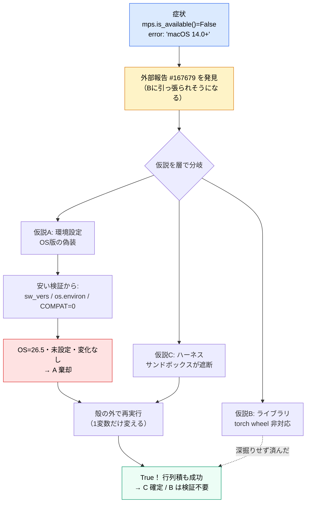
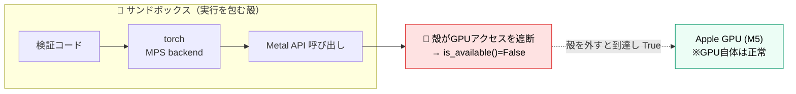

# ライブラリが「使えない」と言う時の切り分け — MPS × サンドボックス事例

> 作成日: 2026-06-05
> ステータス: 事例ノート（エンジニアリング学習用）
> 用途: 「ツールが壊れている」ように見える問題の**切り分け方法論**を、実際に遭遇した事例で学ぶ
> 関連: [phases/phase0/README.md](../../docs/phases/phase0/README.md)（§2 計測環境・§3 デバイス分岐）/ memory `mps-blocked-by-sandbox` / [PyTorch Issue #167679](https://github.com/pytorch/pytorch/issues/167679)

---

## 0. TL;DR（30秒で結論）

Phase 0 の環境構築中、`torch.backends.mps.is_available()` が **False**（Mac GPU が使えない）になった。エラーは「macOS 14.0+ で対応」だが実機は macOS 26.5——**メッセージは真因を指していなかった**。

| 観点 | 内容 |
|---|---|
| **症状** | `mps.is_available() == False`／`RuntimeError: The MPS backend is supported on macOS 14.0+` |
| **誤診しかけたもの** | 「macOS 26 (Tahoe) は torch が非対応」（GitHub の実在バグ報告に引っ張られた） |
| **真因** | **実行を包むサンドボックスが Metal/GPU アクセスを遮断**していた |
| **決め手** | サンドボックスの**外**で同じコードを実行 → `True` になり実際に行列積も成功 |
| **対処** | MPS を使う処理はサンドボックス外で実行する |

> 一番の教訓：**「ツール（torch）が壊れている」と結論する前に、「それを包んでいる殻（サンドボックス／コンテナ／ラッパ）」を疑え。**

---

## 1. 背景：なぜ MPS が要るのか

- FoleyForge の主開発機は **MacBook Air（Apple M5 / macOS 26.5 / 24GBユニファイドメモリ）**。
- Phase 0 の存在的リスクは「**このMacで T2A 生成が実用的に動くか**」。その前提が **MPS（Apple GPU の PyTorch バックエンド）が使えること**。
- なので環境構築の最初に「`mps.is_available()` が True か」を**最安で**確認しようとした（torch だけ 84MB 入れて検査。diffusers やモデル数GBは後）。

> ここで既に1つ良い習慣：**リスクの高い前提を、最も安いテストで先に潰す**（cheapest test first）。おかげで「モデル数GBを落としてから動かない」を避けられた。

---

## 2. 症状：観測されたこと

サンドボックス内で torch を検査すると：

```text
mps built?     : True      ← torch は MPS 対応ビルド
mps available? : False     ← なのに「使えない」
RuntimeError: The MPS backend is supported on macOS 14.0+.
              Current OS version can be queried using `sw_vers`
```

**矛盾**：エラーは「macOS 14.0 以上で対応」と言うのに、実機は **26.5**（14 どころか遥かに上）。
→ **「OSバージョンの判定が壊れている」** か、**「メッセージが真因を指していない」** のどちらか。ここで思考を止めず仮説に落とす。

---

## 3. 危うかった点：外部のバグ報告に引っ張られる（アンカリング）

検索すると、症状にぴったりの報告が見つかった：

> PyTorch Issue #167679 — *MPS built but not available on macOS 26 (Tahoe)*

OS（26系）も症状（built=True / available=False）も一致。**「やっぱり macOS 26 の torch バグだ」と結論したくなる。**

⚠️ **これがアンカリング（先入観の固定）。** 一致して見える外部報告は強力な引力を持つが、**それは「仮説の1つ」であって「答え」ではない**。実際この後、真因は別（サンドボックス）だった。報告は「torch版を変える/待つ」という**重い対処**に直結するので、飛びつくと無駄な時間を失う。

> 教訓：**外部のバグ報告は仮説リストに加えるだけ。自分の環境で再現実験して確かめるまで採用しない。**

---

## 4. 切り分けの設計：仮説を立て、1つずつ潰す（差分診断）

「動かない」を**層**で分解して仮説化する。どの層が原因かで対処がまるで違う。

| # | 仮説 | どの層か | 根拠 | 検証方法 | 仮説が真なら |
|---|---|---|---|---|---|
| **A** | OSが自分の版を**偽装**して報告（`SYSTEM_VERSION_COMPAT` で「10.16」等）→ torch が「14未満」と誤判定 | **環境設定** | エラーが版判定を示唆 | `sw_vers`／`os.environ`／`COMPAT=0`で再試行 | 版が低く見えている・変数を直すと直る |
| **B** | torch の wheel が **macOS 26 を認識できない**ビルド | **ライブラリ** | Issue #167679 が一致 | 版を変える/nightly/ソースビルド（重い） | 版を変えると挙動が変わる |
| **C** | 実行を包む**サンドボックスが GPU を遮断** | **ハーネス（殻）** | 出力に `OMP: Can't set size of /tmp file`＝殻が干渉中の痕跡 | **殻の外**で同じコードを実行 | 殻の外なら True になる |

> **鉄則：1度に1変数だけ変える。** 複数を同時に変えると、どれが効いたか分からなくなる。
> **順番のコツ：安い検証から。** A（コマンド数発）→ C（殻のON/OFF）→ B（再ビルドは最後）。

---

## 5. 検証と結果（証拠）

| 実験 | 要点 | 結果 | 分かったこと |
|---|---|---|---|
| ① OSの自己申告 | `sw_vers` | `ProductVersion: 26.5` | OSは**正しく** 26.5 と言っている |
| ② 偽装変数 | `os.environ['SYSTEM_VERSION_COMPAT']` | `None`（未設定） | 偽装は**かかっていない** |
| ③ 偽装を強制OFF | `SYSTEM_VERSION_COMPAT=0` で再判定 | `False`（変化なし） | **仮説A 棄却** |
| ④ Pythonの版認識 | `platform.mac_ver()` | `26.5` | Python層もOSを正しく認識 |
| ⑤ **殻の外で再判定** | サンドボックス外で `is_available()` | **`True`** | **仮説C 確定**（Bは検証不要に） |
| ⑥ 実使用の確証 | 殻の外で `mps` 上の 1024×1024 行列積 | `device=mps:0`・成功 | MPSは**実際に動く** |

③で仮説Aが消え、⑤で**殻を外しただけで True** になった瞬間に決着。**B（torch版）を深掘りする必要すらなくなった**——Cが全てを説明したから。

---

## 6. 切り分けの流れ（図）



---

## 7. どこで遮断されていたか（層の図）

呼び出しの鎖は「コード → torch → Metal → GPU」。**サンドボックスはこのプロセスを包み、Metal/GPU への到達を断っていた**。GPU 自体は正常。



> torch が出した「macOS 14.0+」というメッセージは、Metal にアクセスできず可用性チェックが失敗した結果**たまたま表示された定型文**で、真因（GPU到達不可）を正しく説明していなかった。
> ※「なぜその文言になるか」の**内部機構までは未確認**（torch の MPS 初期化ソースを読めば分かる）。だが**経験的真因（殻ON=False / 殻OFF=True）は確定**しており、行動するにはこれで十分。**完全解明とコストのバランス**も実務判断の一部。

---

## 8. 根本原因と対処

- **根本原因**：Claude Code のサンドボックスが **Metal/GPU アクセスを遮断**。`mps.is_available()` が殻の中だけ False になる。
- **対処**：MPS を使う確認・生成スクリプトは**サンドボックス外**で実行する（このプロジェクトでは `dangerouslyDisableSandbox` 相当）。
- **副産物の学び**：`Bash(env*)`/`Bash(printenv*)` が deny 設定で弾かれていたため、環境変数の確認は `env` でなく **Python の `os.environ`** で行った（ツールが封じられたら別経路で同じ情報を取る）。

---

## 9. 持ち帰る教訓（どの案件でも効く）

1. **最安の再現を先に（risk-first）**：torch だけ 84MB で前提を検査 → 数GBの無駄打ちを回避。「怖い未知ほど安く先に潰す」。
2. **エラーメッセージを字義通り信じない**：「macOS 14.0+」は真因（GPU遮断）を指していなかった。メッセージは*手がかり*であって*結論*ではない。
3. **外部のバグ報告はアンカーになる**：一致して見えても「仮説の1つ」。自分で再現実験するまで採用しない。
4. **層で考える**：`アプリ / ライブラリ / OS / 実行を包む殻（harness・sandbox・container・CI）`。**最後の「殻」を忘れがち**——「自分のコードでもツールでもないのに動かない」時はここを疑う。
5. **1度に1変数**：殻のON/OFF、環境変数のON/OFF…差分を1つずつ。複数同時に変えない。
6. **安い検証から順に**：設定確認（数秒）→ 殻の切替（数秒）→ 再ビルド（重い）。重い対処は最後。
7. **経験的真因で行動できるなら深入りしない**：内部機構の完全解明は、必要になってから。コスト対効果。
8. **ツールが封じられたら別経路**：`env` がdenyなら `os.environ`。目的（情報取得）は同じでも手段は替えがきく。

> まとめの一文：**「動かない」の主語を、コード → ライブラリ → OS → 殻 と外側へずらしながら、1変数ずつ最安の実験で確かめる。**

---

## 10. 付録：実際のコマンドと出力（証拠ログ）

```bash
# ① torch だけ最小導入（cheapest test first）
$ uv add torch
 + torch==2.12.0

# ② サンドボックス内で検査 → 矛盾した False
$ python -c "import torch; print(torch.backends.mps.is_built(), torch.backends.mps.is_available())"
True False
# RuntimeError: The MPS backend is supported on macOS 14.0+. ...

# ③ 仮説A（OS版偽装）の検証
$ sw_vers
ProductVersion: 26.5            # OSは正しい
$ python -c "import os; print(os.environ.get('SYSTEM_VERSION_COMPAT'))"
None                           # 偽装なし
$ SYSTEM_VERSION_COMPAT=0 python -c "import torch; print(torch.backends.mps.is_available())"
False                          # 変化なし → 仮説A 棄却

# ④ 仮説C（殻が遮断）の検証 = 殻の外で同じコード
$ python -c "import torch; print(torch.backends.mps.is_available())"   # ← サンドボックス外
True                           # 殻を外しただけで True！

# ⑤ 実使用の確証（殻の外）
$ python -c "import torch; x=torch.randn(1024,1024,device='mps'); print(x.device, (x@x).sum().item())"
mps:0 36812.28                 # 実際にGPUで計算成功
```
