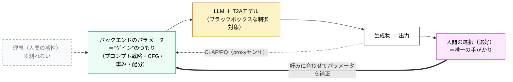
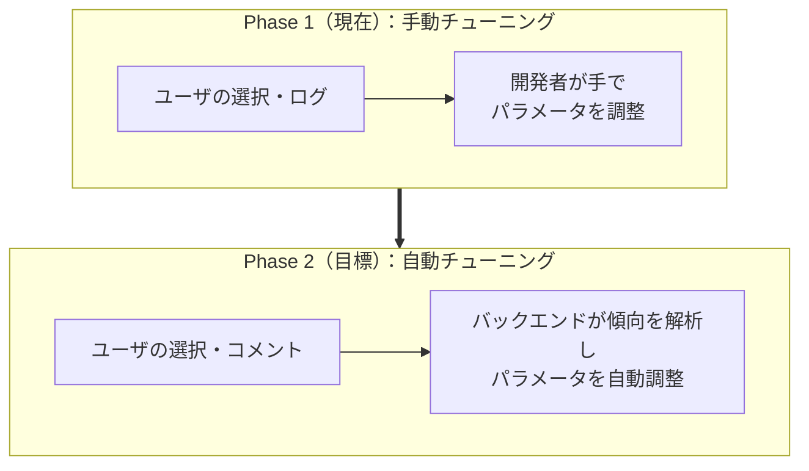

# FoleyForge 設計哲学メモ —— 人間の感性を正解とする、フィードバック発想の設計

> 出典: `design-notes.md` 2026/6/1「思ったこと（哲学）」を整理したもの。発端は筆者（開発者）の制御工学のバックグラウンド。
> 位置づけ: 開発の**指針となる思想メモ**。仕様書ではない。実装の細部は別ドキュメント（`docs/`）に従う。
> 読み方: 「こう作る」より「**なぜそう作るのか／何を大事にするのか**」を残すためのメモ。

---

## ⚠️ 最初に：これは「アナロジー（発想の借用）」である

このメモには制御工学の言葉（理想値・ゲイン・追従・フィードバック）が出てくるが、

> **本アプリを制御系として実装するという意味ではない。**
> 制御工学の**思想だけを借りて**、本アプリの設計判断のよりどころにする、という話。

アナロジーは途中で必ず崩れる（後述 §3.2）。崩れる場所こそが、本アプリ固有の難しさであり、面白さでもある。

---

## 0. このメモの地図

```
人間の感性が正解（§1）
      ├─ 2つの創造性：人間（入力・選択）× AI（その間）（§2）
      ├─ 制御工学からの発想（アナロジー）（§3）
      │     └─ ただし「誤差が測れない」→ 選好で回す（§3.2 / §3.3）
      ├─ ゲイン調整の2フェーズ：手動 → 自動（§4）
      ├─ 品質デバッグの分担：定量＝開発者／定性＝ユーザ（§5）
      ├─ AIの創造性の居場所：追従 vs 探索（§6）
      └─ 最終目標：モデルを差し替えても追従（§7）
→ 開発への落とし込み（§8）／残る論点（§9）
```

---

## 1. 核心の主張：最終正解は「人間の感性」

本アプリの生成物は、**最終的に人間の感性によって選ばれたものが正解**である。

- この感性は「**なんとなくいい**」という、言語化も数値化もできないもの。
- だから本アプリは「正解を計算して当てる」アプリではなく、「**人間が正解を選べるように候補を差し出す**」アプリ。

| よくある設計 | 本アプリの設計 |
|---|---|
| 評価が最高の生成物を**1つ**出す | 良い候補を**複数**出し、**人間が選ぶ** |
| 正解は数値（スコア最大） | 正解は人間の感性（数値化しない） |

> これは `design-notes.md` 5/28 の気づき（「評価の高いものを1つ、ではなく、いくつか出してユーザが選ぶ方が良い」）の延長線上にある。

---

## 2. 2つの創造性 —— 人間とAIの役割分担

人間の創造性は **2か所** で入り込み、その**間**にAIの創造性の余地を作る。


| 段階 | 主役 | 創造性の中身 | 設計上の含意 |
|---|---|---|---|
| ① 入力 | 人間 | 「こういうシーン」という曖昧な発想 | **曖昧さを潰さない**（厳しすぎる入力検証はNG。曖昧さは創作の余地） |
| ② 生成 | AI | 人間が思いつかない多様な音の提案 | **多様性を確保**（1案に収束させない） |
| ③ 選択 | 人間 | 「これだ」という感性の判断 | **選択を最重要データとして捉える**（後述の正解ラベル） |

> 生成過程でAIの創造力を使い、最後に人間の創造力を使う。この立ち位置を「非常に良い」と感じたのが出発点（`design-notes.md` 5/30）。

---

## 3. 制御工学からの「発想の借用」（アナロジー）

### 3.1 対応関係

制御系の「**目標値に出力を追従させる**」という発想を借りる。



| 制御工学の概念 | 本アプリでの対応 |
|---|---|
| 理想値（目標値 r） | 人間の頭の中の理想の音 |
| 出力値（y） | 生成物 |
| 制御対象（プラント） | LLM ＋ T2Aモデル（ブラックボックス） |
| ゲイン（調整つまみ） | バックエンドのパラメータ（プロンプト戦略・CFG・CLAP/PQ重み・配分） |
| フィードバック | ユーザの選択・コメント |

**借りる発想の本質**：制御対象が**ブラックボックスでも、ゲインを調整すれば出力を理想に近づけられる**。中身を完全に理解しなくても、外から追い込める——この姿勢を本アプリに持ち込む。

### 3.2 ただし、決定的に違う点（アナロジーの限界）

ここがアナロジーの**崩れる場所**であり、本アプリ固有の核心。

| 項目 | 産業の制御系 | 本アプリ |
|---|---|---|
| 理想値 r | **数値化・観測できる** | **非数値**（人間の感性） |
| 出力 y の良さ | **数値化・観測できる** | 真の良さは**非数値** |
| 誤差 e = r − y | **計算できる** | **計算できない** |
| 追従の手段 | 数式（誤差を使った計算） | ？（後述） |

→ 古典制御は「誤差を数値で測って詰める」。本アプリは**その誤差そのものが測れない**。だから「制御系そのもの」にはならない。

### 3.3 だからどうするか：誤差ではなく「選好」で回す

決定的な気づき（`design-notes.md` 6/1）：

> **人間の感性を数値化する必要はない。**

数値化できない誤差を測る代わりに、**「人間がどれを選んだか（選好）」を観測する**。選好は、絶対量が測れなくても観測できる（"AよりBが好き"は分かる）。

| 測ろうとするもの | できるか | 代わりに使うもの |
|---|---|---|
| 理想と出力の誤差（絶対量） | ✗ | **選好（どれを選んだか）** |
| 出力の真の品質（数値） | ✗ | **proxy（CLAP/PQ）＝センサの近似値** |

2つの注意：

1. **proxy（CLAP/PQ）は"真の正解"ではなくセンサ**。これだけで追い込むと、proxyには完璧に合うが人間の感性からズレる（指標の抜け穴を突く＝Goodhart／verifier hacking）。
2. だから **proxyで内側を速く回し、人間の選好で外側を補正する**（→ 観測・評価設計 `docs/observation-and-evaluation-design.md` の二重ループに対応）。

---

## 4. ゲイン（パラメータ）調整の2フェーズ

「ゲインを誰が調整するか」を、産業の制御系と同じく**人間 → 自動**の順で進める。



| | Phase 1（現在） | Phase 2（目標） |
|---|---|---|
| 誰が調整 | 開発者が手動 | システムが自動 |
| 入力信号 | ユーザの選択・ログ | 選択 ＋ コメント |
| 位置づけ | まず確実に | 手動が頭打ちになってから |

> **重要**：自動調整するのは**ゲイン（パラメータ）だけ**。モデルの重みは変えない（＝training-free のまま）。だから「自動調整＝学習（fine-tuning）」ではない。詳細は [`learning-vs-training-free.md`](../llm-performance/learning-vs-training-free.md)。

> **更新（2026-06-02・FF-D008）**：この「手動→自動」の発想は、観測・評価設計 §10.1 で**2軸に分離**して精密化した——**グローバルゲインの手動チューニングは恒久**（終わらない／上の Phase1 で止まらない）で、**個人のローカルゲインだけ**を Tier0（固定）→Tier1（例ベースのプリセット・ユーザ主導）→Tier2（加算的に自動）で段階導入する。**自動（Tier2）は初期保留**（[FF-D008](../../docs/decisions.md)）。形態は §10.3 の**加算的探索**（グローバルゲインは固定し、ローカルゲインを“追加候補”として足す＝ベースラインを壊さない）。

---

## 5. 品質のデバッグは誰の仕事か（定量と定性の分離）

`design-notes.md` 6/1 の主張：**出力物の"品質"のデバッグは、開発者の仕事ではない。**

理由：合わせるべきは **開発者の感性ではなく、ユーザの感性**だから。開発者が「良し悪し」を判定すると、ユーザの感性を汚染してしまう。

ただし**1点だけ精密化**：開発者が触らないのは「品質そのものの判定」。「**品質を生む仕組み**」は開発者が責任を持つ。

| 対象 | 例 | 誰の仕事 |
|---|---|---|
| **定量（客観的な欠陥）** | 無音・ノイズ・クリップ・破綻 | **開発者がデバッグする** |
| **仕組み（品質を生む機械）** | proxyの較正・多様性の確保・選好の捕捉 | **開発者が作る・調整する** |
| **定性（良し悪し＝感性）** | 「なんとなくいい」 | **ユーザのもの。開発者は触れない** |

> 落とし込み：ユーザが選択／コメントする → バックエンドが傾向を解析 → パラメータを（将来は自動で）調整。**デバッグの主役をユーザに移す**設計。

---

## 6. AIの創造性の居場所 —— 追従と探索

「AIの創造性の余地を作る」を、もう一段かみ砕くと **追従（exploitation）と探索（exploration）のバランス**になる。

| | 追従（exploitation） | 探索（exploration） |
|---|---|---|
| 中身 | 過去にユーザが選んだ傾向に寄せる | あえて違う・新しい候補も出す |
| 効果 | 外さない | **ユーザが思いつかない良い音に出会える** |
| 行き過ぎると | 退屈な収束（毎回同じ） | ユーザ無視（的外れ連発） |

- いまの**3戦略（指示追従／バランス／音響美）は探索の装置**。
- **注意**：Tier2 の自動調整（将来）で「採用率」だけを上げにいくと、無難な音に収束して**探索＝AIの創造性が潰れる**（degenerate feedback loop）。多様性は「守るべき目標」として明示的に残す。加算的探索（§10.3）はグローバル床を常在させることでこれを構造的に防ぐ。

---

## 7. 最終目標：モデルを差し替えても追従する

最終的に目指すのは——

> **モデル（LLM・T2A）を差し替えても、ユーザの理想に追従する生成物を出せるアプリ。**

制御の言葉で言えば「**制御対象（プラント）が変わっても、ゲインを調整し直せば追従できる**」という頑健性。これは既存の設計判断と整合する：

- 生成エンジンの抽象化（コントローラとプラントの分離）
- T2Aモデルの複数切替（FF-D003）

> 留意点：ゲインや proxy の較正は**モデルごとに異なる**。モデルを差し替えたら、ゲインは持ち越せず**再調整（再較正）が要る**。「追従できる枠組み」は再利用できるが、「ゲインの値」は使い回せない。

---

## 8. 開発への落とし込み（指針サマリ）

| 哲学 | 具体的な設計スタンス |
|---|---|
| 正解は人間の感性 | スコア最大の1つではなく、**複数候補を出して人間に選ばせる** |
| 感性は数値化しない | 誤差は測らず**選好（選択）**で回す。proxyは数値化するが正解扱いしない |
| 開発者は定性を評価しない | **中間ステップに主観品質ゲートを置かない**。開発者は欠陥（定量）と仕組みだけ見る |
| 2つの創造性 | 入力検証は軽く（曖昧さを残す）／多様性を確保／選択を最重要データに |
| AIの創造性＝探索 | 自動調整で**多様性を潰さない**制約を入れる |
| 手動→自動（段階導入） | グローバルは恒久手動。個人のローカルは Tier0→1→2（**自動＝Tier2 は FF-D008 で初期保留**。手動が頭打ちの証拠が出てから） |
| モデル差し替えても追従 | コントローラ（評価・調整の枠組み）とプラント（モデル）を分離。**ゲインはモデルごとに再較正** |

詳しい観測・評価の配置は [`docs/observation-and-evaluation-design.md`](../../docs/observation-and-evaluation-design.md) を参照。

---

## 9. 残る論点（今後深掘りする候補）

| 論点 | 問い |
|---|---|
| 理想値は事前に存在するか | ユーザは「聴いて初めて分かる」ことが多い。理想は**対話で共創**されるのでは？ ならAI創造性は"探索ノイズ"ではなく"理想を定義する手助け" |
| 好みの非定常性 | ユーザの好みは日・気分・シーンで揺れる。**動く目標**をどう追うか |
| 誰の感性に追従するか | 現状は1人で良い。OSS多人数化すると好みが衝突し、**全体ゲインが"誰のものでもない平均"**に堕ちる。個人別ゲインが要るか |
| 自動調整は今要るか | **決定済み（[FF-D008](../../docs/decisions.md)）**：初期は保留。手動が頭打ちの証拠が出てから Tier2（加算的に自動）へ。形態は §10.3 の加算的探索 |
| コメントの外部送信 | 「サーバー送信」はローカル完結・オフライン・プライバシー方針と衝突。ローカル集計を既定に、外部送信はオプトイン |

---

## 10. 関連ドキュメント

- [`design-notes.md`](../../design-notes.md) — 出典（2026/6/1「思ったこと（哲学）」）
- [`docs/observation-and-evaluation-design.md`](../../docs/observation-and-evaluation-design.md) — この哲学を観測・評価の配置に落とした設計
- [`research/llm-performance/learning-vs-training-free.md`](../llm-performance/learning-vs-training-free.md) — 「自動調整≠学習」の根拠（training-free）
- [`docs/foley-forge-dev.md`](../../docs/foley-forge-dev.md) — 全体方針
