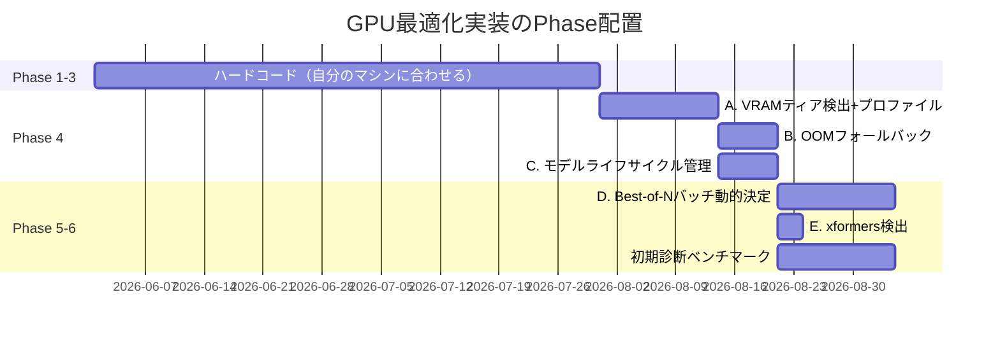

# ローカル推論の最適化戦略

> 作成日: 2026-05-28
> ステータス: 設計参考資料（リサーチノート）
> 対象: FoleyForge バックエンド設計者

---

## 0. このドキュメントの位置付け

FoleyForgeは「ユーザのPC上でStable Audio Openを動かす」ローカル推論型アプリです。
本ドキュメントは、**ComfyUIを採用せず自作バックエンドを選択した際に、GPU最適化の観点で何を失い、何を自分で実装すべきか**を整理したリサーチノートです。

開発時に常時参照するというよりは、以下のような場面で立ち戻る背景資料として使うことを想定しています。

- バックエンドの推論レイヤーを設計するとき
- ユーザのVRAM容量による挙動分岐を実装するとき
- 配布形態（Phase 6）でハードウェア要件を整理するとき
- 「ComfyUIを使った方が楽だったのでは？」という疑問が出たとき

関連ドキュメント:
- [foley-forge-dev.md](../../docs/foley-forge-dev.md) — アプリ全体の設計
- [tta_local_web_architecture.md](../../docs/tta_local_web_architecture.md) — 動作環境・配布方針

---

## 1. 議論の出発点

### 1.1 問い

> 推論はユーザのPC上で行うが、ユーザのPCのGPUリソースはバラバラ。
> ComfyUIはLLMや拡散モデルの実行環境最適化が組み込まれている。
> 自作バックエンドだとその恩恵を受けられないので、自分で実装するしかないのでは？

### 1.2 前提

| 項目 | 内容 |
|------|------|
| 音声生成モデル | Stable Audio Open（約1.2Bパラメータ、fp16で約3GB VRAM） |
| 推論フレームワーク | PyTorch + Hugging Face Diffusers |
| バックエンド言語 | Python（FastAPI想定） |
| 想定ユーザー | Phase 1〜3: 開発者本人、Phase 6: 一般ユーザー |
| GPU環境 | NVIDIA CUDA / Apple MPS / CPUフォールバック |

---

## 2. 結論サマリ（先出し）

**結論**: ComfyUIの最適化の大半は PyTorch + diffusers が提供する機能の薄いラッパーであり、自作バックエンドでもほぼ同等の恩恵を受けられる。**ただし「ハードウェア検出→自動設定の層」と「OOM時のフォールバック」だけは自作が必要**で、ここがUXを左右する。

| 観点 | 判断 |
|------|------|
| ComfyUI非採用は妥当か | **妥当**。失うものは限定的。 |
| 低レベル最適化（アテンション、精度、オフロード）の自作 | **不要**。diffusers経由で無料。 |
| ハードウェア検出 + プロファイル選択 | **自作必須**。ただし1〜2日で実装可能。 |
| OOMフォールバック | **自作必須**。数十行で書ける。 |
| カスタムVRAMアロケータ等のComfyUI独自最適化 | **不要**。Stable Audio Openは軽量なので恩恵が薄い。 |
| 実装すべきPhase | Phase 4以降（モデル管理導入時）。Phase 1〜3はハードコードでOK。 |

---

## 3. ComfyUIが提供する最適化の正体

ComfyUIの「最適化」は単一の機能ではなく、複数の層が積み重なって出来ています。
**それぞれの提供元を分解すると、自作バックエンドで何を失うかが見えます**。

### 3.1 層別の整理

| 層 | 内容 | 提供元 | 自作バックエンドでの扱い |
|----|------|--------|----------------------|
| ① 低レベルカーネル | SDPA / FlashAttention / xformers | **PyTorch本体・xformers** | 無料で利用可 |
| ② 精度最適化 | fp16 / bf16 / fp8 / NVFP4量子化 | **PyTorch + bitsandbytes / TorchAO** | 無料で利用可 |
| ③ メモリオフロード | `enable_model_cpu_offload()` / `enable_sequential_cpu_offload()` / VAEタイリング | **diffusers本体** | 1行で利用可 |
| ④ Dynamic VRAM | カスタムPyTorchアロケータ、メモリ圧迫時の自動退避 | **ComfyUI独自（2026年1月導入）** | 失う（ただし軽量モデルでは効果限定的） |
| ⑤ Async offload + pinned memory | サンプリング速度10〜50%改善（条件付き） | **ComfyUI独自（2026年）** | 失う（メモリspill時のみ効果） |
| ⑥ ハードウェア自動設定 | ユーザのVRAM/GPU/OSを検出して①〜⑤を自動選択 | **ComfyUI独自** | **自作必須** |
| ⑦ ワークフロー単位のモデルライフサイクル管理 | 未使用モデルを自動アンロード | ComfyUI独自 | 自作必須（ただし単純） |

### 3.2 視覚化

```
┌─────────────────────────────────────────────────────────┐
│                     アプリケーション層                   │
│           （ComfyUI or FoleyForge自作バックエンド）       │
├─────────────────────────────────────────────────────────┤
│  ⑥ ハードウェア自動設定  ← ★ここが自作必要               │
│  ⑦ モデルライフサイクル管理 ← ★ここも自作必要            │
├─────────────────────────────────────────────────────────┤
│  ④ Dynamic VRAM（ComfyUI独自）                          │
│  ⑤ Async offload + pinned memory（ComfyUI独自）         │
│        ↑ 自作バックエンドが「失うもの」                  │
├─────────────────────────────────────────────────────────┤
│  ③ メモリオフロード（diffusersが提供）                  │
│  ② 精度最適化（PyTorchが提供）                          │
│  ① 低レベルカーネル（PyTorch本体）                      │
│        ↑ 自作バックエンドでも「タダで手に入る」          │
└─────────────────────────────────────────────────────────┘
```

### 3.3 重要な観察

ComfyUIの最大の価値は**①〜⑤の低レベル最適化そのものではなく、⑥「ユーザのマシンを検出して適切な設定を選ぶ自動化」**にあります。
逆に言えば、**自作バックエンドでも⑥を真面目に作れば、ComfyUIに比べた体感差はかなり小さい**ということです。

---

## 4. Stable Audio Open 固有の事情

ここがFoleyForgeにとって有利な点です。**画像生成系でComfyUIを捨てるのと、音声生成系で捨てるのは難易度が違います**。

### 4.1 モデルサイズの軽さ

| モデル | パラメータ数 | fp16時のVRAM目安 |
|--------|--------------|------------------|
| Stable Audio Open 1.0 | 約1.2B | **約3GB** |
| SDXL | 約2.6B | 約8GB |
| FLUX.1 | 約12B | 約24GB（オフロード前提） |

→ **8GB VRAMあればオフロードなしで余裕で載る**。ComfyUIの派手な最適化（Dynamic VRAM等）は、メモリ圧迫時に効くものが多いので、そもそも出番が少ない。

### 4.2 音声は1次元データ

- 画像系のような巨大VAEタイリングが不要
- ControlNet / LoRA エコシステムの複雑性がない
- バッチ次元と時間次元の単純な2軸で済む

### 4.3 タスクが固定

- ComfyUIは汎用ワークフローエンジンなので「任意のグラフ」を最適化する必要があるが、FoleyForgeは「Stable Audio Open で N 個生成する」という固定タスク
- → **タスク特化の最適化が可能**（後述の8章）

---

## 5. 自作バックエンドで実装すべきもの

### 5.1 優先度マトリクス

```
                            UX影響
                              ↑
       【高優先度・必須】       │     【中優先度・あると嬉しい】
   ━━━━━━━━━━━━━━━━━━━━━━━━━━━╋━━━━━━━━━━━━━━━━━━━━━━━━━━━
   A. VRAMティア検出+プロファイル │  D. Best-of-Nバッチ動的決定
   B. OOMフォールバック         │  E. アテンション実装の選択
   C. モデルライフサイクル管理   │
                              │
                              │     【低優先度・やらない】
                              │   F. カスタムVRAMアロケータ
                              │   G. NVFP4量子化
                              │
                              └──────────────────────────→ 実装難度
```

### 5.2 高優先度（必須）

#### A. ハードウェア検出 → 設定プロファイル選択 🔴

**目的**: ユーザのVRAM容量に応じて、precision/offload/batchを自動選択する。
**理由**: ComfyUIに対する体感差を最も埋める要素。これを書けば「ComfyUI並みに勝手に動く」感が出る。
**実装規模**: 半日〜1日。

**ティア定義（例）**:

| ティア | VRAM | dtype | オフロード | 推論バッチ |
|--------|------|-------|-----------|-----------|
| Tier 0 (GPU無し) | — | fp32 | — | 1（警告表示） |
| Tier 1 (極小) | <6GB | fp16 | sequential | 1 |
| Tier 2 (小) | 6〜8GB | fp16 | model_cpu | 1 |
| Tier 3 (中) | 8〜12GB | fp16 | なし | 2 |
| Tier 4 (大) | ≥12GB | bf16 | なし | 4 |

**疑似コード**:

```python
import torch
from dataclasses import dataclass
from enum import Enum

class Tier(Enum):
    CPU = 0
    XS = 1   # <6GB
    S  = 2   # 6-8GB
    M  = 3   # 8-12GB
    L  = 4   # >=12GB

@dataclass
class HardwareProfile:
    tier: Tier
    device: str
    dtype: torch.dtype
    offload: str | None       # None | "model" | "sequential"
    inference_batch: int

def detect_hardware() -> HardwareProfile:
    if torch.cuda.is_available():
        vram_gb = torch.cuda.get_device_properties(0).total_memory / (1024**3)
        if vram_gb >= 12:
            return HardwareProfile(Tier.L, "cuda", torch.bfloat16, None, 4)
        elif vram_gb >= 8:
            return HardwareProfile(Tier.M, "cuda", torch.float16, None, 2)
        elif vram_gb >= 6:
            return HardwareProfile(Tier.S, "cuda", torch.float16, "model", 1)
        else:
            return HardwareProfile(Tier.XS, "cuda", torch.float16, "sequential", 1)
    elif torch.backends.mps.is_available():
        # Apple Silicon は別途プロファイル設計が必要
        return HardwareProfile(Tier.M, "mps", torch.float16, None, 1)
    else:
        return HardwareProfile(Tier.CPU, "cpu", torch.float32, None, 1)
```

`configs/models.yaml` の `required_vram_gb` と合わせて、起動時に「このマシンで動くか/どのモードで動くか」を判定できる構造にする。

#### B. OOMフォールバック 🔴

**目的**: 推論で `torch.cuda.OutOfMemoryError` が出た時、自動的に1段階下のプロファイルでリトライする。
**理由**: ComfyUIがユーザに最も親切な部分はこれ。これがないと、エラー時にユーザが手で設定変更を強いられる。
**実装規模**: 数十行。

**疑似コード**:

```python
class TierDowngrader:
    DOWNGRADE_PATH = [Tier.L, Tier.M, Tier.S, Tier.XS]

    def downgrade(self, current: Tier) -> Tier | None:
        idx = self.DOWNGRADE_PATH.index(current)
        return self.DOWNGRADE_PATH[idx + 1] if idx + 1 < len(self.DOWNGRADE_PATH) else None

def safe_generate(prompt, profile, max_retries=2):
    for attempt in range(max_retries + 1):
        try:
            return run_inference(prompt, profile)
        except torch.cuda.OutOfMemoryError:
            torch.cuda.empty_cache()
            next_tier = TierDowngrader().downgrade(profile.tier)
            if next_tier is None:
                raise
            profile = build_profile(next_tier)
            log.warning(f"OOM. Downgrading to {next_tier.name}")
    raise RuntimeError("Max retries exceeded")
```

**注意点**: ダウングレード後の設定は永続化しない（次回起動時はまたTier検出からやり直し）。`outputs/diagnostic.log` に記録してユーザに「あなたのマシンでは Tier M が安定です」とフィードバックできるとなお良い。

#### C. モデルライフサイクル管理 🔴

**目的**: FastAPIプロセスでモデルを一度ロードしてキープし、リクエストごとに再ロードしない。
**理由**: 当たり前のようで、書かないと毎リクエストで5〜10秒のロード時間が発生する。
**実装規模**: 数十行。FastAPI標準の `lifespan` を使えば自然に書ける。

**疑似コード**:

```python
from contextlib import asynccontextmanager
from fastapi import FastAPI

@asynccontextmanager
async def lifespan(app: FastAPI):
    profile = detect_hardware()
    log.info(f"Detected hardware: {profile}")

    pipeline = load_stable_audio_open(profile)
    if profile.offload == "model":
        pipeline.enable_model_cpu_offload()
    elif profile.offload == "sequential":
        pipeline.enable_sequential_cpu_offload()

    app.state.pipeline = pipeline
    app.state.profile = profile
    yield
    del app.state.pipeline
    torch.cuda.empty_cache()

app = FastAPI(lifespan=lifespan)
```

### 5.3 中優先度（あると嬉しい）

#### D. Best-of-N生成のバッチ化動的決定 🟡

**目的**: Step 5の並列生成（3戦略 × N個）を、VRAM容量に応じて適切なバッチサイズに分割する。
**理由**: FoleyForgeの品質向上戦略の根幹なので、最初から設計に組み込む価値がある。

```
全15生成（3戦略 × 5）を、Tierに応じて分割:
  Tier L: 1バッチで15個 (大きい場合は4個ずつなど)
  Tier M: 2個ずつ ×8バッチ
  Tier S: 1個ずつ ×15バッチ（最も遅い）
```

UX上、「総生成時間の見積もり」を返してUIに表示できると親切。

#### E. アテンション実装の選択 🟡

**実装方針**: 基本は `torch.nn.functional.scaled_dot_product_attention`（SDPA）に任せる。
これはPyTorch 2.0+でデフォルト有効で、十分高速。xformersは「インストール済みなら使う」程度のオプショナル対応で良い。

```python
try:
    import xformers
    pipeline.enable_xformers_memory_efficient_attention()
except ImportError:
    pass  # SDPAで十分
```

### 5.4 低優先度（やらない）

| 項目 | やらない理由 |
|------|------------|
| F. カスタムPyTorchアロケータ | Dynamic VRAM相当の実装は数千行規模。Stable Audio Open程度のサイズでは効果が薄い。 |
| G. NVFP4量子化 | NVIDIA Blackwellアーキ専用。普及するまで時期尚早。 |
| H. 独自のFlashAttention統合 | PyTorch SDPAで十分。差分の実装コストが見合わない。 |
| I. マルチGPU並列 | 想定ユーザー（個人開発者）にとってオーバースペック。 |

---

## 6. UX観点：Phase別の戦略

FoleyForgeには2つの相反する性質があります。

- `foley-forge-dev.md`: 「対象ユーザー: 開発者本人」「公開範囲: 非公開」
- `tta_local_web_architecture.md`: 一般ユーザー配布・モデルダウンロード・OS別起動スクリプト等を議論

このギャップはPhase毎に最適化への投資量を変えることで吸収できます。

### 6.1 Phase別の実装方針



| Phase | 投資する最適化 | 投資しないもの |
|-------|--------------|-------------|
| Phase 1〜2（モデル単体動作確認、FastAPI化） | **ハードコード**（自分のマシン前提でfp16固定など） | A, B, D, E |
| Phase 3（React UI） | 同上 | 同上 |
| Phase 4（モデル管理導入） | **A, B, C を実装**（`models.yaml`との統合タイミング） | D, E, F以降 |
| Phase 5（起動スクリプト） | C を仕上げ | D, E |
| Phase 6（配布形態整備） | **D, E + 初期診断ツール**を実装 | F以降 |

### 6.2 早すぎる最適化の罠

FoleyForgeの本質的価値は、ドメインロジック（構造化データ、3戦略のプロンプト生成、CLAP/PQ評価、Best-of-Nリランキング）です。
最適化に時間を使うのはこれらが固まってからで十分。**Phase 1〜3で最適化に手を出すのは早すぎる最適化**です。

---

## 7. ComfyUIにできず、FoleyForgeにできること

ここは見落とされがちですが、**自作バックエンドだからこそ作れるUX**があります。これがComfyUI非採用の正当化につながります。

### 7.1 タスク固定ゆえのベンチマーク表示

ComfyUIは汎用なので「あなたのマシンで何が動くか」を事前に教えられません。
FoleyForgeはタスクが「Stable Audio Open でSE生成」に固定されているので、**起動時に1回ベンチマークを走らせて「1つあたり約Xs秒」を表示できる**。

```
起動時診断:
  GPU: NVIDIA RTX 3060 (12GB)
  Tier: M (fp16, no offload)
  推定生成時間: 5秒/個 (10秒の音声)
  Best-of-N (15個) の推定総時間: 約75秒
```

### 7.2 Best-of-N戦略の動的調整

ComfyUIではN個生成は「ノードを並べる」操作なのでハードウェアに連動できないが、
自作バックエンドなら**ユーザのGPU性能に応じてN=15→N=8に動的に調整**できます。

```
高性能GPU: N=15で十分な多様性
低性能GPU: N=8に減らして体感速度優先
```

これは品質向上戦略（多様性のある候補提示）と、UX（待ち時間）のトレードオフを、
**ユーザの認知負荷なしにバックエンドが判断する**設計に直結します。

### 7.3 構造化ログとの統合

ComfyUIワークフローは外部から見ると不透明なグラフですが、自作バックエンドなら
**「Tier情報・実生成時間・OOMリトライ回数」を構造化ログにそのまま記録**できます。
これは [foley-forge-dev.md の7章「永続化されるデータ」](../../docs/foley-forge-dev.md) と統合可能。

---

## 8. 最終判断とトレードオフ

### 8.1 失うものと得るもの

| 失うもの | 得るもの |
|---------|---------|
| Dynamic VRAM（メモリ圧迫時の自動退避） | 品質向上戦略の統合的設計 |
| Async offload + pinned memory（spill時10〜50%） | タスク特化のUX（ベンチマーク表示等） |
| ComfyUI周辺エコシステム（カスタムノード） | ドメインデータ（構造化データ・実験ログ）との一体化 |
| ワークフローの可視化UI | フロントエンドのUX独自設計の自由 |

### 8.2 自作のコスト見積もり

Phase 4〜6で必要な最適化実装の総量:

| 項目 | 実装規模 |
|------|---------|
| A. VRAMティア検出+プロファイル選択 | 半日〜1日 |
| B. OOMフォールバック | 半日 |
| C. モデルライフサイクル管理 | 半日 |
| D. Best-of-Nバッチ動的決定 | 1〜2日 |
| E. xformers検出 | 1時間 |
| 初期診断ベンチマーク | 1〜2日 |
| **合計** | **約1週間** |

これに対して、ComfyUIを採用した場合に失う「品質向上戦略の統合的設計」を別ルートで実現するコストは、はるかに大きい。

### 8.3 結論

**ComfyUIを捨てる判断は正しい。** 最適化レイヤーは1週間程度の追加投資で十分埋められ、
それと引き換えに得られる「ドメイン特化のUX・品質向上戦略の統合」の方が、FoleyForgeにとって本質的価値が大きい。

---

## 9. 実装時のチェックリスト

Phase 4着手時に以下を確認:

- [ ] `torch.cuda.get_device_properties()` でVRAM容量を取得できるか
- [ ] Apple MPS環境での挙動確認（メモリAPIがCUDAと異なる）
- [ ] `pipeline.enable_model_cpu_offload()` を有効にした際の生成時間ベースライン測定
- [ ] OOM時の `torch.cuda.empty_cache()` 呼び出し漏れがないか
- [ ] FastAPI `lifespan` でモデルロードを行い、リクエスト毎にロードしていないか
- [ ] `configs/models.yaml` の `required_vram_gb` と検出ロジックの整合性
- [ ] CPUフォールバック時にユーザへの警告を表示しているか（推論時間が長い旨）

---

## 10. 参考リンク

ComfyUI関連:
- [Dynamic VRAM in ComfyUI: Saving Local Models from RAMmageddon](https://blog.comfy.org/p/dynamic-vram-in-comfyui-saving-local) — ComfyUIのDynamic VRAM解説（2026年）
- [New ComfyUI Optimizations for NVIDIA GPUs](https://blog.comfy.org/p/new-comfyui-optimizations-for-nvidia) — NVFP4量子化、Async Offload、Pinned Memory（2026年1月）
- [Memory and Device Management | ComfyUI DeepWiki](https://deepwiki.com/Comfy-Org/ComfyUI/2.6-memory-and-device-management) — ComfyUIメモリ管理の内部設計

Diffusers関連:
- [Reduce memory usage — Hugging Face Diffusers](https://huggingface.co/docs/diffusers/optimization/memory) — `enable_model_cpu_offload` / `enable_sequential_cpu_offload` 等のドキュメント
- [diffusers/optimization/memory.md (GitHub)](https://github.com/huggingface/diffusers/blob/main/docs/source/en/optimization/memory.md)

Stable Audio Open関連:
- [stabilityai/stable-audio-open-1.0 — Hugging Face](https://huggingface.co/stabilityai/stable-audio-open-1.0) — モデルカード
- [stabilityai/stable-audio-open-1.0 · VRAM Estimation](https://huggingface.co/stabilityai/stable-audio-open-1.0/discussions/3) — VRAM要件の議論

---

## 改訂履歴

| 日付 | 内容 |
|------|------|
| 2026-05-28 | 初版作成（ComfyUI非採用に伴うGPU最適化の整理） |
