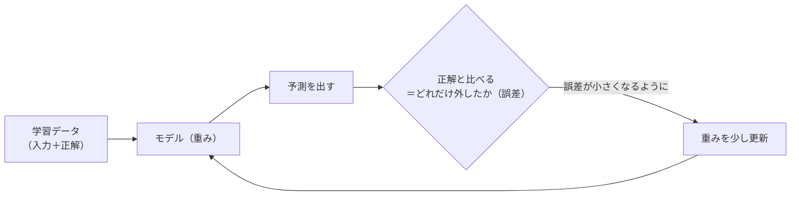
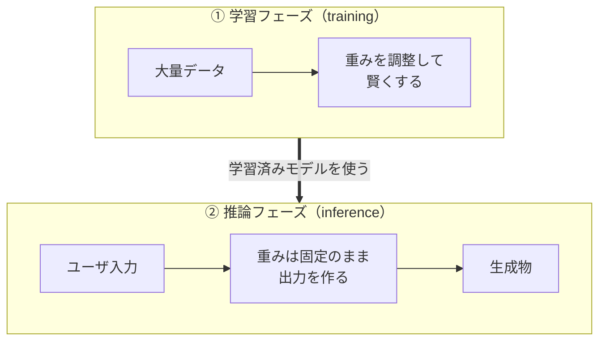
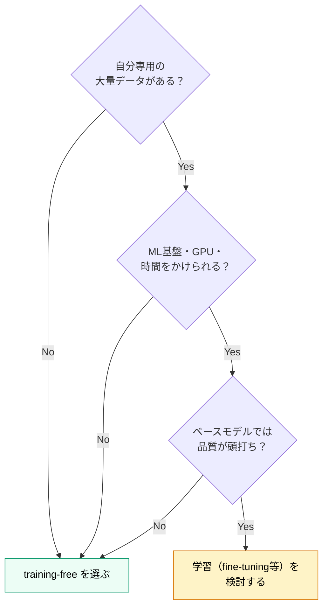

# 学習するシステム vs 学習しないシステム（training-free）

> FoleyForge 品質向上戦略の補足・学習用ドキュメント
> 対象読者: 機械学習を初めて学ぶ人
> 目的: 「モデルが学習する/しない」とは何かを、図と表でやさしく理解する

---

## 0. このドキュメントについて

FoleyForge は「**ファインチューニングなしで品質を上げる**」方針（＝training-free）を採用している。
でも「学習する/しない」と言われても、初めてだとピンと来ない。このドキュメントは、その土台になる概念を**ゼロから**説明する。

ずっと使う**料理人のたとえ**を最初に置いておく。

| たとえ | 機械学習での意味 |
|---|---|
| 料理人 | **モデル** |
| 料理人が体で覚えた腕・勘 | **重み（パラメータ）** |
| 練習して腕を上げる | **学習（training）** |
| 実際に注文を受けて料理を出す | **推論（inference）** |
| 注文の出し方・調味料の配分を工夫する | **推論時の工夫**（プロンプト・パラメータ） |
| 何皿か作って一番良いものを出す | **Best-of-N** |

---

## 1. 大前提：「モデル」と「重み」とは

### 1.1 モデル＝入力から出力を作る関数

**モデル**とは、入力を受け取って出力を作る巨大な「関数」のこと。

```
入力（プロンプト）　→　[ モデル ]　→　出力（音・文章・画像）
```

### 1.2 重み（パラメータ）＝モデルの中身の数値

モデルの中には、**重み（weights＝パラメータ）**と呼ばれる、たくさんの数値が入っている（最近のモデルなら数百万〜数十億個）。

この数値の組み合わせが、「どんな入力にどんな出力を返すか」を決めている。

> 料理人のたとえ：**重み＝料理人が体で覚えた腕・勘**。同じ「トマトを煮る」でも、腕（重み）が違えば仕上がりが違う。

### 1.3 用語の注意：「パラメータ」は2種類ある（重要）

「パラメータ」という言葉は2つの意味で使われ、混乱しやすい。本ドキュメントでは区別する。

| 呼び方 | 中身 | 誰が決めるか | 学習で変わる？ |
|---|---|---|---|
| **重み（パラメータ）** | モデル内部の数値（腕・勘） | **学習が**自動で決める | **変わる** |
| **設定値（ハイパーパラメータ）** | CFG・推論ステップ数・温度など、外から与える設定 | **人間が**手で決める | 変わらない |

→ 「学習する/しない」の話で問題になるのは、**①重み**のほう。設定値（②）は学習とは別の、人間が回すツマミ。

---

## 2. 「学習（training）」とは何か

### 2.1 一言で

**学習＝大量のデータを使って、重み（①）を少しずつ良い値に調整していくこと。**

### 2.2 学習のしくみ（ループ）

学習は、おおまかに次のループを何百万回も繰り返す。



- 予測が正解から外れていたら、**外れを小さくする方向に重みをほんの少し動かす**。
- これをデータ全体で何度も繰り返すと、だんだん良い予測を返すようになる。これが「賢くなる」の正体。

> 料理人のたとえ：作った料理を味見して、レシピ通りでなければ次から塩を少し減らす……を繰り返して腕（重み）を上げていく。

---

## 3. 2つのフェーズ：学習（training）と推論（inference）

ここが初学者のつまずきポイント。モデルの人生には**2つの時期**がある。



| フェーズ | 何をする | 重みは | いつ |
|---|---|---|---|
| **① 学習（training）** | データで重みを調整し賢くする | **変わる** | アプリを作る前（または改善時） |
| **② 推論（inference）** | できあがったモデルで出力を作る | **固定** | ユーザが使っているとき |

ポイント：**普通、ユーザが使っている瞬間（推論）には重みは変わらない。** Stable Audio などの公開モデルは、誰かが①を終えた状態で配布されていて、私たちは②だけ使う。

---

## 4. 「学習するシステム」と「学習しないシステム」

### 4.1 定義

| | 学習するシステム | 学習しないシステム（training-free） |
|---|---|---|
| **やること** | 自分のデータで**重み①を作り変える** | 重み①は**凍結したまま**使う |
| **品質の上げ方** | モデル自体を鍛え直す | **推論時の工夫**＋**人間による設定調整**で引き出す |

### 4.2 改善はどこから来るか（図で対比）


> 大事な気づき：**training-free でも品質は良くなっていく。** ただし「モデルが学習して」ではなく、「**人間（開発者）が設定②を手で改善して**」良くなる。重みは最後まで変えない。

---

## 5. 「学習するシステム」の種類

ひとくちに「学習する」と言っても段階がある。

| 種類 | 何をするか | コスト | FoleyForgeでの"学習版"の例 |
|---|---|---|---|
| **スクラッチ学習** | ゼロから巨大データで重みを学習 | 非常に大 | （個人開発では非現実的） |
| **ファインチューニング** | 学習済みモデルを、自分のデータで**追加学習**し特化させる | 中〜大 | 集めた（プロンプト, 採用された音）でT2AモデルをアニメSE特化に |
| **RLHF（人間の好みで強化学習）** | 人間の「良い/悪い」を報酬にして重みを更新 | 大 | 採用/不採用を報酬にモデルを強化学習 |
| **継続学習／オンライン学習** | 稼働中に届くデータで**重みを更新し続ける** | 大＋運用難 | ログが貯まるたびモデルを自動再学習 |

FoleyForge は design philosophy「ファインチューニングなしで品質を上げる」により、**上記はどれも採らない**。

---

## 6. 「学習しない（training-free）」で品質を上げる方法

重みを変えなくても、品質を上げる手段はある。FoleyForge の中核（approach-1〜3）がまさにこれ。

| 工夫 | 中身 | 対応ドキュメント |
|---|---|---|
| **プロンプト augmentation** | 曖昧な入力を、モデルが分かる良いプロンプトに書き換える | [approach-1](./approach-1-prompt-augmentation.md) |
| **推論時パラメータ最適化** | CFG・ステップ数などの設定値（②）を用途別に調整 | [approach-2](./approach-2-inference-parameters.md) |
| **Best-of-N＋リランキング** | たくさん生成して、良いものを選ぶ | [approach-3](./approach-3-best-of-n-reranking.md) |
| **検索拡張（RAG）** | 既存素材を参考に生成（※一部は学習を伴う） | [approach-4](./approach-4-retrieval-augmented.md)（将来拡張） |

> どれも「料理人の腕（重み）」は鍛え直さず、「注文の仕方・調味料・何皿か作って選ぶ」で美味しくする工夫。

---

## 7. メリット・デメリット比較

| 観点 | 学習しない（training-free）＝FoleyForge | 学習する（fine-tuning 等） |
|---|---|---|
| 実装コスト | **軽い**（学習基盤・長時間GPU不要） | 重い（GPU・時間・MLエンジニアリング） |
| 必要データ量 | **少なくても始められる** | 大量に要る（少ないと過学習で劣化） |
| 品質の上限 | ベースモデルに**縛られる** | **上限を上げられる**（ドメイン特化） |
| ドメイン特化 | 弱い（工夫で近づけるのみ） | **強い**（モデル自体に染み込む） |
| モデル差し替え | **容易**（重み不変＝抽象化と相性◎） | 困難（特定モデルに固着） |
| 安定性・再現性 | **高い**（挙動がブレない、デバッグ容易） | 退行リスク（学習で悪化・再現性低下） |
| ライセンス/配布 | **楽**（学習データの権利を抱えない） | 複雑（学習データの権利・再配布） |
| 自動で賢くなるか | ならない（改善は開発者が手で） | 設計次第で**可能** |

ひとことで：

- **学習しない** … 軽い・速い・安定・差し替え自由。ただし**ベースモデルの実力が天井**。
- **学習する** … 天井を上げられる。ただし**コスト・データ・運用・退行リスク**が重い。

---

## 8. どう選ぶか（判断の目安）



→ まずは training-free で始め、**「データが貯まり」「工夫しても頭打ち」になって初めて**学習を検討する、が定石。

---

## 9. FoleyForge での選択

FoleyForge は **training-free を採用**する。理由は、判断の目安すべてに当てはまるから。

| 理由 | 内容 |
|---|---|
| 個人開発 | ML学習基盤・大量データ・長時間GPUをかけられない |
| モデル差し替え前提（FF-D003） | 重みを変えないので、別のT2Aモデルにすぐ交換できる |
| 品質向上の手札がある | approach-1〜3 という training-free の強力な手段が揃っている |
| 安定性重視 | 重み固定で挙動がブレず、悪い結果の原因を設定/プロンプトに絞れる |

そして——**training-free でも改善は続く**。それは「開発者がオフラインでログを見て設定②を手で調整する」ループ（[観測・評価設計ドキュメント](../../docs/observation-and-evaluation-design.md) §10 の外ループ）による。重みは変えないまま、システムは良くなっていく。

---

## 10. まとめ

| 質問 | 答え |
|---|---|
| 重みとは？ | モデル内部の数値（料理人の腕）。出力を決める |
| 学習とは？ | データで重みを調整し、賢くすること |
| 学習と推論の違いは？ | 学習＝重みを変える時期 / 推論＝重み固定で使う時期 |
| training-free とは？ | 重みを一切作り変えないこと |
| training-free で品質は上がる？ | 上がる。推論時の工夫＋開発者の手による設定調整で |
| FoleyForge は？ | training-free。個人開発・モデル差し替え・安定性に適合 |

---

## 11. 用語集

| 用語 | 意味 |
|---|---|
| モデル | 入力から出力を作る巨大な関数 |
| 重み（パラメータ） | モデル内部の数値。学習で調整される（＝料理人の腕） |
| ハイパーパラメータ（設定値） | CFG・ステップ数など、人間が外から与える設定。学習では変わらない |
| 学習（training） | データで重みを調整するフェーズ |
| 推論（inference） | 学習済みモデルで出力を作るフェーズ。重みは固定 |
| ファインチューニング | 学習済みモデルを自分のデータで追加学習し特化させる |
| RLHF | 人間の好みを報酬にして重みを更新する学習 |
| 継続学習／オンライン学習 | 稼働中に重みを更新し続ける方式 |
| training-free（訓練不要） | 重みを作り変えず、推論時の工夫で品質を上げる方針 |
| 過学習 | 学習データに合わせすぎて、未知の入力で性能が落ちる現象 |

---

## 12. 関連ドキュメント

- [README.md](./README.md) — 4つの品質向上アプローチの全体像（training-free が共通前提）
- [approach-1〜3](./approach-1-prompt-augmentation.md) — training-free で品質を上げる具体手法
- [docs/observation-and-evaluation-design.md](../../docs/observation-and-evaluation-design.md) — training-free を前提とした観測・評価の設計（§2.1 / §10）
- [docs/foley-forge-dev.md](../../docs/foley-forge-dev.md) — 全体方針（design philosophy「ファインチューニングなしで品質を上げる」）
